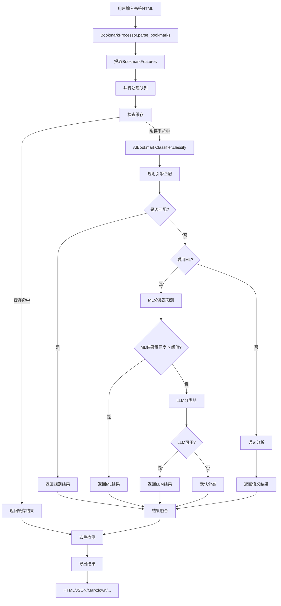

# AI智能书签分类系统 - DeepWiki

## 📖 项目概述

**AI智能书签分类系统** 是一个基于机器学习和规则引擎的智能书签管理工具，能够自动对浏览器书签进行分类、去重和清理。系统采用插件化架构，支持多种分类算法（规则引擎、机器学习、语义分析、LLM可选）并提供丰富的导出格式。

### 核心特性
- ✅ 多算法融合：规则引擎 + ML + 语义分析 + LLM（可选）
- ✅ 插件化架构：可插拔的分类器系统
- ✅ 智能去重：多维度相似度检测
- ✅ 层次分类：支持父子分类结构
- ✅ 多格式导出：HTML、JSON、Markdown、CSV、XML、OPML
- ✅ 并发处理：多线程加速大量书签处理
- ✅ 置信度评估：每个分类结果包含置信度分数
- ✅ 缓存系统：LRU缓存提升性能
- ✅ 健康检查：URL可达性检测

### 技术栈
- **核心语言**：Python 3.10+
- **机器学习**：scikit-learn, numpy, pandas
- **中文处理**：jieba（中文分词）
- **Web解析**：beautifulsoup4, lxml
- **CLI界面**：rich（终端美化）
- **文本嵌入**：sentence-transformers（可选）
- **测试框架**：pytest + hypothesis（属性测试）

---

## 🏗️ 系统架构

### 整体架构图

```
┌─────────────────────────────────────────────────────────────┐
│                      用户界面层                                 │
│  ┌─────────────────┐  ┌─────────────────┐  ┌──────────────┐  │
│  │  CLI Interface  │  │  main.py (CLI)  │  │  Rich Console│  │
│  └─────────────────┘  └─────────────────┘  └──────────────┘  │
└─────────────────────────────────────────────────────────────┘
                            │
┌─────────────────────────────────────────────────────────────┐
│                     业务逻辑层                                 │
│  ┌───────────────────────────────────────────────────────┐  │
│  │        BookmarkProcessor (批处理器)                     │  │
│  │  - 并行处理协调                                        │  │
│  │  - 进度跟踪                                            │  │
│  │  - 结果导出                                            │  │
│  └───────────────────────────────────────────────────────┘  │
└─────────────────────────────────────────────────────────────┘
                            │
┌─────────────────────────────────────────────────────────────┐
│                     AI算法层                                 │
│  ┌───────────────────────────────────────────────────────┐  │
│  │       AIBookmarkClassifier (中央协调器)                 │  │
│  │  - 管理多个分类策略                                     │  │
│  │  - 缓存管理                                            │  │
│  │  - 统计跟踪                                            │  │
│  └───────────────────────────────────────────────────────┘  │
│                            │
│  ┌──────────────────────┬───────────────┬──────────────────┐  │
│  │   插件管道系统        │    服务层      │     规则引擎       │  │
│  │   (Pipeline)        │  (Services)   │  (Rule Engine)   │  │
│  └──────────────────────┴───────────────┴──────────────────┘  │
└─────────────────────────────────────────────────────────────┘
                            │
┌─────────────────────────────────────────────────────────────┐
│                     插件系统层                                │
│  ┌──────────────┬──────────────┬──────────────┬────────────┐  │
│  │ Rule Classifier│ ML Classifier│ Embedding   │ LLM        │  │
│  │  (规则匹配)   │  (机器学习)  │ Classifier  │ Classifier │  │
│  └──────────────┴──────────────┴──────────────┴────────────┘  │
└─────────────────────────────────────────────────────────────┘
                            │
┌─────────────────────────────────────────────────────────────┐
│                     数据访问层                                │
│  ┌──────────────┬──────────────┬──────────────┬────────────┐  │
│  │   配置管理    │   模型存储    │   缓存系统    │  特征存储   │  │
│  │(Config JSON) │ (ML Models)  │(LRU Cache)  │(Embedding) │  │
│  └──────────────┴──────────────┴──────────────┴────────────┘  │
└─────────────────────────────────────────────────────────────┘
```

### 架构特点

1. **分层设计**：清晰的分层架构，每层职责单一
2. **插件化**：基于注册表的插件系统，易于扩展
3. **管道模式**：多个分类器通过管道组合，结果融合
4. **延迟加载**：组件按需初始化，减少启动时间
5. **优雅降级**：ML/LLM失败时自动回退到规则引擎
6. **缓存优化**：多级缓存（特征、分类、URL验证）

---

## 🔑 核心组件详解

### 1. AIBookmarkClassifier（中央协调器）

**文件**：`src/ai_classifier.py`

**职责**：作为系统的核心枢纽，协调各种分类方法，管理缓存和统计。

**关键属性**：
```python
class AIBookmarkClassifier:
    # 延迟初始化的组件
    _rule_engine: Optional[RuleEngine]
    _ml_classifier: Optional[MLClassifierWrapper]
    _llm_classifier: Optional[LLMClassifier]
    _semantic_analyzer: Optional[SemanticAnalyzer]
    _user_profiler: Optional[UserProfiler]
    _performance_monitor: Optional[PerformanceMonitor]

    # 缓存系统
    feature_cache: Dict[str, BookmarkFeatures]      # 特征缓存
    classification_cache: Dict[str, ClassificationResult]  # 分类缓存
    _max_cache_size = 5000

    # 统计信息
    stats = {
        'total_classified': 0,
        'rule_engine': 0,
        'ml_classifier': 0,
        'semantic_analyzer': 0,
        'fallback': 0,
        'cache_hits': 0,
        'average_confidence': 0.0,
        'llm': 0,
    }
```

**核心方法**：
- `classify_bookmark()`: 单个书签分类入口
- `classify_batch()`: 批量分类（内部使用ThreadPoolExecutor）
- `_load_config()`: 配置加载，支持智能规则合并
- `_normalize_category_config()`: 分类名称标准化

**设计亮点**：
- 使用**属性装饰器**实现延迟加载
- 自动缓存检测：先查缓存再计算
- 智能回退链：ML失败→规则引擎→默认分类

### 2. BookmarkProcessor（批处理器）

**文件**：`src/bookmark_processor.py`

**职责**：协调整个处理流程，管理并行处理、进度跟踪和结果导出。

**关键功能**：
- **并行处理**：ThreadPoolExecutor + as_completed
- **缓存优化**：LRU缓存用于URL验证和分类结果
- **进度跟踪**：Rich ProgressBar实时显示
- **多格式导出**：HTML/JSON/Markdown/CSV/XML/OPML

**处理流程**：
```python
def process_bookmarks(self, input_files):
    # 1. 解析HTML书签
    bookmarks = self._parse_bookmarks(input_files)

    # 2. 并行处理
    with ThreadPoolExecutor(max_workers=self.max_workers) as executor:
        futures = {
            executor.submit(self._process_single_bookmark, bm): bm
            for bm in bookmarks
        }

        # 3. 收集结果
        results = []
        for future in as_completed(futures):
            results.append(future.result())

    # 4. 去重处理
    deduplicated = self._deduplicate(results)

    # 5. 导出
    self._export(deduplicated)
```

### 3. 插件系统

#### 3.1 插件注册中心（PluginRegistry）

**文件**：`src/plugins/registry.py`

**职责**：管理所有分类器插件的注册、启用、禁用。

**核心功能**：
```python
class PluginRegistry:
    _plugins: Dict[str, ClassifierPlugin]     # 已注册插件
    _enabled: Set[str]                        # 已启用插件
    _listeners: List[Callable]                # 事件监听器

    # 主要方法
    register(plugin)         # 注册插件
    enable(name)             # 启用插件
    disable(name)            # 禁用插件
    get_enabled_plugins()    # 获取已启用插件（按优先级排序）
```

**线程安全**：使用`threading.RLock()`保证并发安全。

#### 3.2 插件基类（ClassifierPlugin）

**文件**：`src/plugins/base.py`

**定义插件接口**：
```python
@ dataclass
class PluginMetadata:
    name: str
    version: str
    capabilities: List[str]
    priority: int = 100  # 数值越小优先级越高

class ClassifierPlugin(ABC):
    @property
    @abstractmethod
    def metadata(self) -> PluginMetadata

    @abstractmethod
    def classify(self, features: 'BookmarkFeatures') -> Optional['ClassificationResult']

    @abstractmethod
    def initialize(self, config: Dict[str, Any]) -> bool

    @abstractmethod
    def shutdown(self) -> None

    def supports_batch(self) -> bool:
        return False  # 子类可重写以支持批量优化
```

#### 3.3 分类器管道（ClassifierPipeline）

**文件**：`src/plugins/pipeline.py`

**职责**：协调多个插件执行，管理结果融合。

**融合策略**：
1. **加权投票**（WEIGHTED_VOTING）：默认策略，按置信度和权重投票
2. **堆叠**（STACKING）：元学习方式（简化实现）
3. **贝叶斯组合**（BAYESIAN）：概率组合（简化实现）

**加权投票实现**：
```python
def _weighted_voting(self, results):
    category_scores = defaultdict(float)

    for method_name, result in results:
        weight = self.method_weights.get(method_name, 1.0)
        score = result.confidence * weight
        category_scores[result.category] += score

    # 选择最高分
    best_category = max(category_scores, key=category_scores.get)
    total_score = sum(category_scores.values())
    confidence = category_scores[best_category] / total_score

    return ClassificationResult(
        category=best_category,
        confidence=confidence,
        score_breakdown=dict(category_scores),
        alternative_categories=alternatives,
        reasoning=reasoning,
        method='pipeline_fusion'
    )
```

### 4. 服务层（Services）

#### 4.1 嵌入服务（EmbeddingService）

**文件**：`src/services/embedding_service.py`

**职责**：提供文本向量化能力，支持Transformer和TF-IDF降级方案。

**模型支持**：
- **主方案**：sentence-transformers（paraphrase-multilingual-MiniLM-L12-v2）
- **降级方案**：scikit-learn TfidfVectorizer
- **维度**：384维嵌入向量

**特性**：
- 自动降级：Transformer失败→TF-IDF→随机向量
- 缓存集成：与FeatureStore配合缓存嵌入向量
- 批量优化：`embed_batch()`支持批量处理

```python
def embed(self, text: str) -> np.ndarray:
    # 1. 检查缓存
    if self.feature_store:
        cached = self.feature_store.get(text)
        if cached is not None:
            return cached

    # 2. 生成嵌入
    embedding = self._compute_embedding(text)

    # 3. 缓存结果
    if self.feature_store:
        self.feature_store.put(text, embedding)

    return embedding
```

#### 4.2 特征存储（FeatureStore）

**职责**：缓存嵌入向量和其他特征数据。

#### 4.3 性能监控（PerformanceMonitor）

**职责**：监控各组件性能指标，收集统计数据。

#### 4.4 主动学习（ActiveLearning）

**职责**：标识不确定性高的样本，供人工标注和改进模型。

#### 4.5 分类法服务（TaxonomyService）

**职责**：管理受控词表，标准化分类名称。

---

## 📊 数据结构

### BookmarkFeatures（书签特征）

**位置**：`src/ai_classifier.py:50-76`

**用途**：封装书签的所有特征信息。

```python
@ dataclass
class BookmarkFeatures:
    url: str                                    # 原始URL
    title: str                                  # 标题
    domain: str                                 # 域名
    path_segments: List[str]                    # URL路径段
    query_params: Dict[str, str]               # 查询参数
    content_type: str                          # 内容类型
    language: str                              # 语言
    timestamp: datetime = field(default_factory=datetime.now)

    # 计算属性
    @property
    def url_length(self) -> int:
        return len(self.url)

    @property
    def title_length(self) -> int:
        return len(self.title)

    @property
    def is_secure(self) -> bool:
        return self.url.startswith('https://')

    @property
    def has_chinese(self) -> bool:
        return bool(re.search(r'[\u4e00-\u9fff]', self.title))
```

**设计特点**：
- 使用`@dataclass`自动生成`__init__`、`__repr__`等
- 提供计算属性（`@property`）便于访问衍生特征
- 支持时间戳自动记录

### ClassificationResult（分类结果）

**位置**：`src/ai_classifier.py:79-89`

**用途**：封装分类结果和元信息。

```python
@ dataclass
class ClassificationResult:
    category: str                                      # 主分类
    confidence: float                                  # 置信度 (0.0-1.0)
    subcategory: Optional[str] = None                   # 子分类
    reasoning: List[str] = field(default_factory=list) # 推理过程
    alternatives: List[Tuple[str, float]] = field(default_factory=list)  # 备选分类
    processing_time: float = 0.0                       # 处理时间
    method: str = "unknown"                            # 使用的分类方法
    facets: Dict[str, str] = field(default_factory=dict)  # 额外信息
```

**字段说明**：
- `confidence`：置信度分数，用于结果融合和排序
- `reasoning`：人类可读的推理说明，便于调试和解释
- `alternatives`：备选分类（及其置信度），用于人工复核
- `facets`：键值对形式的额外信息（如优先级、标签等）

---

## ⚙️ 配置系统

### config.json 结构

**位置**：`config.json`

**作用**：集中管理所有配置，包括规则、参数、阈值等。

```json
{
  "show_confidence_indicator": false,

  "ai_settings": {
    "confidence_threshold": 0.4,       # 分类置信度阈值
    "use_semantic_analysis": true,    # 是否启用语义分析
    "use_user_profiling": true,       # 是否启用用户画像
    "cache_size": 10000,              # 缓存大小
    "max_workers": 4,                 # 并行线程数
    "enable_learning": true           # 是否启用机器学习
  },

  "llm": {
    "enable": false,                   # 是否启用LLM
    "provider": "openai",
    "model": "gpt-4o-mini",
    "api_key_env": "OPENAI_API_KEY",
    "temperature": 0.0,
    "prompt": { ... }
  },

  "title_cleaning_rules": { ... },    # 标题清理规则

  "taxonomy": { ... },               # 分类法配置

  "processing_order": [              # 处理顺序
    "priority_rules",
    "category_rules"
  ],

  "category_order": [               # 分类显示顺序
    "💼 工作台",
    "🤖 AI",
    "💻 编程",
    ...
  ],

  "domain_grouping_rules": {        # 域名分组规则
    "🤖 AI": ["openai.com", "deepseek.com", ...],
    "💻 编程": ["github.com", "gitlab.com", ...],
    ...
  },

  "priority_rules": { ... },         # 高优先级规则

  "category_rules": { ... }          # 常规分类规则
}
```

### 规则配置详解

#### 1. 域名分组规则（domain_grouping_rules）

**用途**：快速域名→分类映射。

```json
"domain_grouping_rules": {
  "🤖 AI": [
    "openai.com",
    "deepseek.com",
    "huggingface.co",
    ...
  ]
}
```

**特点**：
- 权重低于priority_rules
- 匹配速度快（O(1)字典查找）
- 适用于明确属于某个分类的域名

#### 2. 优先级规则（priority_rules）

**用途**：定义高优先级规则（权重100），优先于其他规则执行。

```json
"priority_rules": {
  "💼 工作台/司内业务": {
    "weight": 100,
    "rules": [
      {
        "match": "domain",
        "keywords": ["zego.im", "zego.cloud", ...]
      }
    ]
  }
}
```

**特点**：
- 权重固定100
- 处理顺序最先
- 用于强制分类（如公司内部系统）

#### 3. 分类规则（category_rules）

**用途**：详细的分类规则，支持多种匹配方式。

```json
"category_rules": {
  "🤖 AI/模型平台": {
    "rules": [
      {
        "match": "domain",
        "keywords": ["openai.com", ...]
      },
      {
        "match": "title",
        "keywords": ["GPT", "ChatGPT", "LLM"]
      }
    ]
  }
}
```

**匹配类型**：
- `domain`：域名匹配
- `title`：标题关键词匹配
- `url`：完整URL匹配
- `path`：URL路径匹配

#### 4. 标题清理规则（title_cleaning_rules）

**用途**：清理书签标题中的冗余信息。

```json
"title_cleaning_rules": {
  "prefixes": ["登录 |", "Sign in ·", ...],    # 前缀移除
  "suffixes": ["- V2EX", "· GitHub", ...],     # 后缀移除
  "replacements": {                             # 字符替换
    "&amp;": "&",
    "&lt;": "<",
    "&gt;": ">",
    "--- ": "- ",
    ...
  }
}
```

---

## 🔄 处理流程

### 完整处理流程



### 分类器管道执行流程

```python
def classify(self, features: 'BookmarkFeatures') -> 'ClassificationResult':
    # 1. 按优先级调用所有启用的插件
    results = []
    for plugin in self.registry.get_enabled_plugins():
        try:
            result = plugin.classify(features)
            if result:
                results.append((plugin.metadata.name, result))
        except Exception as e:
            # 记录错误，继续处理
            continue

    # 2. 融合结果
    if not results:
        return self._default_result()

    fused = self._fuse_results(results)

    # 3. 记录处理时间
    fused.processing_time = time.time() - start_time

    return fused
```

### 结果融合策略

1. **收集阶段**：
   - 按优先级顺序调用插件
   - 每个插件返回`ClassificationResult`
   - 失败则记录错误并继续

2. **融合阶段**：
   - 根据配置选择融合策略（默认加权投票）
   - 计算加权置信度分数
   - 生成备选分类列表

3. **后处理**：
   - 应用冲突解决规则
   - 计算处理时间
   - 生成推理说明

---

## 📁 关键文件说明

| 文件路径 | 职责 | 重要性 |
|---------|------|--------|
| `main.py` | CLI入口，参数解析 | ⭐⭐⭐⭐⭐ |
| `src/ai_classifier.py` | 中央协调器，核心分类逻辑 | ⭐⭐⭐⭐⭐ |
| `src/bookmark_processor.py` | 批处理器，流程协调 | ⭐⭐⭐⭐⭐ |
| `src/plugins/pipeline.py` | 插件管道，结果融合 | ⭐⭐⭐⭐ |
| `src/plugins/registry.py` | 插件注册中心 | ⭐⭐⭐⭐ |
| `src/plugins/base.py` | 插件接口定义 | ⭐⭐⭐⭐ |
| `src/services/embedding_service.py` | 文本嵌入服务 | ⭐⭐⭐ |
| `src/config_manager.py` | 配置管理 | ⭐⭐⭐ |
| `src/rule_engine.py` | 规则引擎 | ⭐⭐⭐ |
| `src/ml_classifier.py` | 机器学习分类器 | ⭐⭐⭐ |
| `src/llm_classifier.py` | LLM分类器（可选） | ⭐⭐ |
| `src/taxonomy_standardizer.py` | 分类法标准化 | ⭐⭐ |
| `config.json` | 主配置文件 | ⭐⭐⭐⭐⭐ |

---

## 🧩 扩展指南

### 添加新分类器插件

1. **创建插件类**：
```python
# src/plugins/classifiers/my_classifier.py
from ..base import ClassifierPlugin, PluginMetadata

class MyClassifier(ClassifierPlugin):
    @property
    def metadata(self) -> PluginMetadata:
        return PluginMetadata(
            name="my_classifier",
            version="1.0.0",
            capabilities=["classification"],
            priority=50,  # 数值越小优先级越高
            description="我的自定义分类器"
        )

    def classify(self, features: 'BookmarkFeatures') -> Optional['ClassificationResult']:
        # 实现分类逻辑
        if matches_my_rule(features):
            return ClassificationResult(
                category="我的分类",
                confidence=0.9,
                method="my_classifier"
            )
        return None

    def initialize(self, config: Dict[str, Any]) -> bool:
        # 初始化资源
        return True

    def shutdown(self) -> None:
        # 释放资源
        pass
```

2. **注册插件**：
```python
# src/plugins/registry.py
from .classifiers.my_classifier import MyClassifier

# 在CLASSIFIER_REGISTRY中注册
CLASSIFIER_REGISTRY = {
    "my_classifier": MyClassifier,
    ...
}
```

3. **配置启用**：
在`config.json`中添加启用配置，或通过代码启用：
```python
registry = PluginRegistry()
registry.register(MyClassifier())
registry.enable("my_classifier")
```

### 添加新导出格式

1. **实现导出方法**：
```python
# src/bookmark_processor.py
def export_yaml(self, bookmarks: List[Bookmark], output_path: str):
    import yaml

    data = {
        'bookmarks': [
            {
                'title': bm.title,
                'url': bm.url,
                'category': bm.category,
                'confidence': bm.confidence
            }
            for bm in bookmarks
        ]
    }

    with open(output_path, 'w', encoding='utf-8') as f:
        yaml.dump(data, f, allow_unicode=True)
```

2. **注册导出格式**：
```python
supported_formats = ['html', 'json', 'markdown', 'csv', 'xml', 'opml', 'yaml']
```

3. **命令行参数**：
```python
# main.py
parser.add_argument('--format', choices=supported_formats, default='html')
```

### 添加新融合策略

1. **在pipeline.py中实现**：
```python
class FusionStrategy(Enum):
    WEIGHTED_VOTING = "weighted_voting"
    STACKING = "stacking"
    BAYESIAN = "bayesian"
    MY_STRATEGY = "my_strategy"  # 新增

def _my_strategy(self, results):
    # 实现自定义融合逻辑
    pass
```

2. **注册策略**：
```python
def _fuse_results(self, results):
    if self.fusion_strategy == FusionStrategy.MY_STRATEGY:
        return self._my_strategy(results)
    # 其他策略...
```

### 优化性能

1. **启用批量模式**：
```python
class MyClassifier(ClassifierPlugin):
    def supports_batch(self) -> bool:
        return True

    def classify_batch(self, features_list):
        # 批量处理逻辑
        return [self.classify(f) for f in features_list]
```

2. **调整缓存策略**：
```python
# config.json
{
  "ai_settings": {
    "cache_size": 20000,  # 增加缓存大小
  }
}
```

3. **优化并行度**：
```python
# 根据CPU核心数调整
max_workers = min(32, (os.cpu_count() or 1) + 4)
```

---

## 🏆 最佳实践

### 1. 配置管理

**✅ 建议**：
- 将敏感配置（如API Key）放在环境变量中
- 使用`api_key_env`而非直接在config.json中写密钥
- 为不同环境（开发/测试/生产）维护不同配置文件
- 定期审查和更新规则配置

**❌ 避免**：
- 将API密钥硬编码在代码或配置文件中
- 过度复杂的规则（难以调试和维护）
- 忽视配置验证（可能导致运行时错误）

### 2. 性能优化

**✅ 建议**：
- 对大数据集启用并行处理（`--workers`）
- 根据内存情况调整缓存大小
- 优先使用规则引擎进行快速预筛选
- 批量处理时启用批量优化

**❌ 避免**：
- 盲目增加worker数量（可能导致过度竞争）
- 缓存设置过大（可能导致OOM）
- 频繁重新训练ML模型（除非数据显著变化）

### 3. 错误处理

**✅ 建议**：
- 利用优雅降级：ML失败→规则引擎→默认分类
- 记录详细日志便于调试
- 对外部依赖（LLM API）实现重试机制
- 使用异常处理包装插件调用

**❌ 避免**：
- 静默忽略所有错误
- 没有回退机制的硬依赖
- 过度详细的日志（影响性能）

### 4. 插件开发

**✅ 建议**：
- 遵循插件基类接口定义
- 提供合理的默认配置
- 实现线程安全（如需要）
- 提供清晰的文档和示例

**❌ 避免**：
- 修改全局状态
- 阻塞性操作（在主线程中）
- 忽略插件生命周期（initialize/shutdown）

### 5. 测试策略

**✅ 建议**：
- 使用属性测试（Hypothesis）验证不变式
- 为插件编写独立单元测试
- 使用模拟对象测试外部依赖
- 定期运行健康检查

**❌ 避免**：
- 依赖真实外部API的集成测试（使用模拟）
- 只测试happy path（也要测试错误情况）
- 忽视性能测试（可能导致回归）

### 6. 监控与调试

**✅ 建议**：
- 定期查看统计信息（`classifier.stats`）
- 使用`--log-level DEBUG`获取详细信息
- 监控处理时间和内存使用
- 记录分类错误案例用于改进

**❌ 避免**：
- 生产环境使用DEBUG日志
- 忽视性能指标下降
- 不保存错误案例

---

## 📈 性能基准

### 测试数据规模

| 规模 | 书签数量 | 处理时间 | 内存使用 |
|------|---------|---------|---------|
| 小规模 | < 100 | < 1秒 | < 100MB |
| 中等规模 | 1,000-5,000 | 10-30秒 | 200-500MB |
| 大规模 | 10,000+ | 2-5分钟 | 1-2GB |

### 各组件性能

| 组件 | 单次延迟 | 批量优化 | 缓存命中率 |
|------|---------|---------|-----------|
| 规则引擎 | < 1ms | N/A | N/A |
| ML分类器 | 10-50ms | 2-5ms/个 | 60-80% |
| 语义分析 | 50-200ms | 10-20ms/个 | 70-90% |
| LLM分类器 | 2-5秒 | N/A | N/A |

### 优化建议

- **< 1000书签**：使用默认设置（2-4 workers）
- **1000-10000书签**：增加workers到4-8，缓存大小到10000
- **> 10000书签**：考虑禁用ML（`--no-ml`）或使用更强大的机器

---

## 🐛 故障排除

### 常见问题

#### 1. 内存不足

**症状**：
- 处理大文件时崩溃
- 系统响应缓慢

**解决方案**：
```bash
# 1. 减少并发数
python main.py -i bookmarks.html --workers 2

# 2. 禁用ML分类器
python main.py -i bookmarks.html --no-ml

# 3. 减少缓存大小
# config.json: "cache_size": 5000
```

#### 2. ML模型加载失败

**症状**：
```
WARNING: 机器学习组件初始化失败: No module named 'sklearn'
```

**解决方案**：
```bash
# 安装缺失依赖
pip install scikit-learn numpy pandas

# 或禁用ML
python main.py -i bookmarks.html --no-ml
```

#### 3. LLM API调用失败

**症状**：
```
WARNING: LLM 分类器初始化失败: Invalid API key
```

**解决方案**：
```bash
# 1. 设置API Key
export OPENAI_API_KEY="your-key-here"

# 2. 或禁用LLM
# config.json: "llm.enable": false
```

#### 4. 分类结果不准确

**诊断步骤**：
```bash
# 1. 启用调试日志
python main.py -i bookmarks.html --log-level DEBUG

# 2. 检查置信度
python main.py -i bookmarks.html --threshold 0.9  # 提高阈值

# 3. 查看推理过程
# 检查ClassificationResult.reasoning字段
```

**改进方法**：
- 添加更多规则到`config.json`
- 训练更多ML数据（`--train`）
- 使用LLM辅助分类（`--enable-llm`）

#### 5. 编码问题

**症状**：
```
UnicodeDecodeError: 'utf-8' codec can't decode byte
```

**解决方案**：
- 确保书签文件使用UTF-8编码
- 系统已集成`chardet`自动检测编码
- 如需手动指定，使用文件路径而非通配符

---

## 📚 相关资源

### 核心文档

- **CLAUDE.md**：开发指南和快速开始
- **README.md**：项目概述和使用说明
- **docs/design/system_architecture.md**：详细架构设计
- **docs/guides/development_guide.md**：开发指南

### 外部资源

- **scikit-learn**：机器学习框架 - https://scikit-learn.org/
- **sentence-transformers**：文本嵌入 - https://www.sbert.net/
- **Rich**：终端美化库 - https://rich.readthedocs.io/
- **jieba**：中文分词 - https://github.com/fxsjy/jieba

### 配置文件示例

- **config.json**：主配置文件
- **taxonomy/subjects.yaml**：分类法定义
- **taxonomy/resource_types.yaml**：资源类型定义

---

## 🎯 路线图

### 已完成（v2.0）

- ✅ 插件化架构重构
- ✅ 管道系统实现
- ✅ 多融合策略支持
- ✅ 嵌入服务集成
- ✅ 主动学习框架
- ✅ 性能监控系统
- ✅ LLM集成（可选）
- ✅ 健康检查功能

### 计划中（v2.1）

- 🔄 Web UI界面
- 🔄 实时分类API
- 🔄 更多ML算法（SVM、XGBoost）
- 🔄 可视化分析仪表板
- 🔄 云端模型同步

### 长期规划（v3.0）

- 📅 多语言支持增强
- 📅 协作式分类（团队共享规则）
- 📅 自动规则挖掘
- 📅 强化学习优化
- 📅 分布式处理支持

---

## 📝 更新日志

### v2.0（当前版本）

**重大变更**：
- 🔥 重构为插件架构
- 🔥 新增管道系统和结果融合
- 🔥 集成嵌入服务和主动学习
- 🔥 添加LLM分类器（可选）

**新增功能**：
- + 插件注册中心
- + 分类法标准化服务
- + 性能监控和统计
- + 健康检查工具
- + 批量优化支持

**改进**：
- ⚡ 缓存系统优化（LRU）
- ⚡ 并行处理效率提升
- ⚡ 错误处理和降级机制
- ⚡ 配置系统增强

---

## 🙏 致谢

感谢所有为这个项目做出贡献的开发者！

特别感谢：
- **scikit-learn** 团队提供的机器学习框架
- **sentence-transformers** 项目提供的文本嵌入模型
- **Rich** 库提供的美观终端界面
- **jieba** 项目提供的中文分词支持

---

**维护者**：LessUp Team
**最后更新**：2026-01-10
**版本**：v2.0

---

*本 DeepWiki 持续更新中，如有问题或建议，请提交 Issue 或 PR。*
