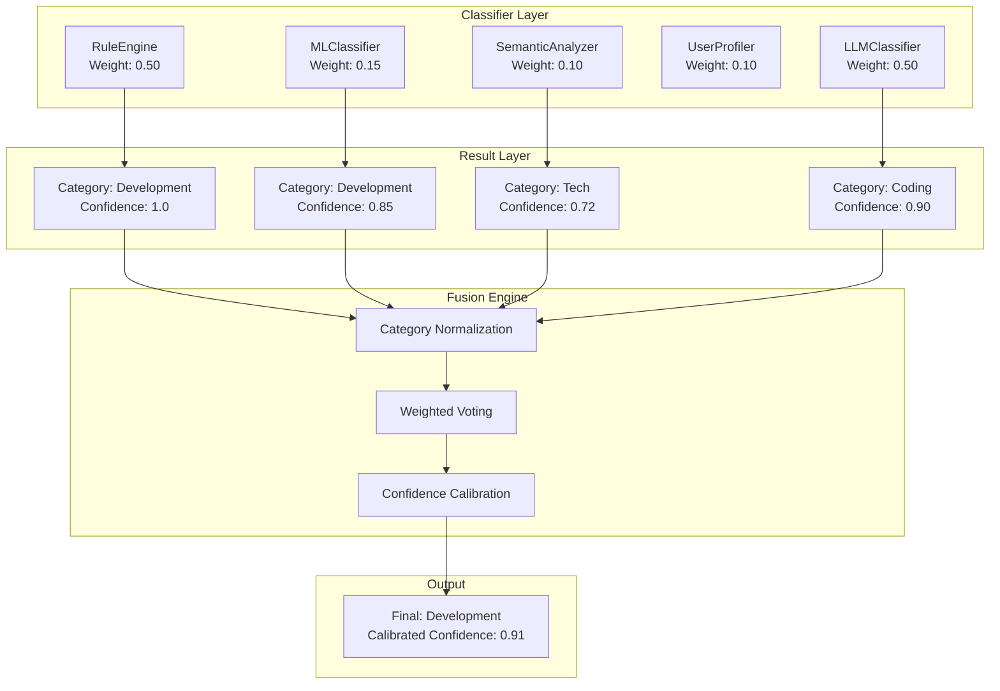

# Fusion Algorithm

The Fusion Engine is the core decision module of Bookmarks Cleaner's classification system, responsible for weighted fusion of multiple heterogeneous classifier outputs to produce the final classification decision and calibrated confidence.

## Problem Background

Each individual classifier has its own domain of applicability and limitations:

| Classifier | Strength | Weakness | Output Type |
|------------|----------|----------|-------------|
| Rule Engine | Deterministic, zero latency, interpretable | Limited coverage, cannot handle unknown domains | Discrete category, confidence = 1.0 |
| ML Classifier | Strong generalization, learns user preferences | Requires training data, poor cold start | Probability distribution |
| Semantic Analyzer | Understands title/description semantics | High computational cost, depends on embedding model | Probability distribution |
| LLM Classifier | Intelligent contextual understanding | High cost, high latency, needs network (or local) | Probability distribution |

**Fusion goal**: Under the fully offline constraint, combine complementary strengths of each classifier to improve overall accuracy and confidence calibration quality.

## Fusion Architecture



## Weighted Voting Algorithm

### Basic Formula

For the candidate category set $C$, the fusion score is defined as:

$$
S(c) = \sum_{i=1}^{n} w_i \cdot \mathbb{1}_{[y_i = c]} \cdot \text{conf}_i, \quad \forall c \in C
$$

Where:
- $w_i$: prior weight of classifier $i$
- $y_i$: category predicted by classifier $i$
- $\text{conf}_i$: raw confidence output by classifier $i$
- $\mathbb{1}_{[y_i = c]}$: indicator function, equals 1 iff $y_i = c$

Final predicted category:

$$
\hat{c} = \arg\max_{c \in C} S(c)
$$

### Real Source Code

The following is excerpted from `src/services/fusion_engine.py` (lines 60~128):

```python
class FusionEngine:
    DEFAULT_WEIGHTS = {
        "rule_engine": 0.50,
        "machine_learning": 0.15,
        "semantic_analyzer": 0.10,
        "user_profiler": 0.10,
        "llm": 0.50,
    }

    def fuse(self, results, features=None, confidence_threshold=0.7,
             subcategory_resolver=None):
        from src.plugins.base import ClassificationResult

        if not results:
            return ClassificationResult(
                category="Uncategorized", confidence=0.0,
                reasoning=["No suitable classification method found"], method="fallback"
            )

        category_scores = defaultdict(float)
        all_reasoning = []
        methods_used = []
        merged_facets = {}

        for res in results:
            source = res.method or "unknown"
            weight = self.method_weights.get(source, 0.1)
            score = weight * (res.confidence or 0.0)

            category = res.category or "Uncategorized"
            if self.category_normalizer:
                category = self.category_normalizer(category)

            category_scores[category] += score
            all_reasoning.extend(res.reasoning or [])
            methods_used.append(source)
            if res.facets:
                merged_facets.update(res.facets)

        best_category = max(category_scores, key=category_scores.get)
        total_score = sum(category_scores.values())
        raw_confidence = (category_scores[best_category] / total_score
                          if total_score > 0 else 0.0)

        if self.confidence_calibrator:
            calibrated = self.confidence_calibrator(raw_confidence)
        else:
            calibrated = raw_confidence

        return ClassificationResult(
            category=best_category,
            confidence=calibrated,
            reasoning=all_reasoning,
            method="fusion",
            facets=merged_facets,
        )
```

### Weight Design Rationale

**Why do both Rule Engine and LLM share the highest weight of 0.50?**

- **Rule Engine**: For known patterns (e.g., `github.com`, `docs.python.org`), the rule engine outputs deterministic results (confidence always 1.0). High weight ensures "known correct" decisions are not diluted by probabilistic classifiers.
- **LLM**: When rules miss, the LLM provides the most powerful semantic understanding. Its high weight means it becomes the dominant decision factor when the rule engine does not participate (contribution = 0).
- **ML / Semantic Analyzer**: Serve as intermediate layers, providing fallback support when rules miss and LLM is unavailable.

> Note: The LLM's effective weight is constrained by availability. If the user has not configured LLM, its weight contribution automatically becomes 0, and fusion degrades to a three-classifier system of rules + ML + semantics.

## Category Normalization

Different classifiers may use different category names (e.g., "Coding" vs "Development" vs "Tech"). Normalization eliminates ambiguity before fusion:

```python
CATEGORY_SYNONYMS = {
    "coding": "Development",
    "programming": "Development",
    "tech": "Development",
    # ...
}
```

The normalization function can be injected via the `category_normalizer` parameter, supporting user-customized vocabularies.

## Confidence Calibration

Raw confidence often exhibits systematic bias. The system post-processes through `ConfidenceCalibrator`:

```python
class ConfidenceCalibrator:
    def __init__(self, config=None):
        self.method = config.get("method", "platt")  # platt | isotonic | none

    def calibrate(self, confidence: float) -> float:
        if self.method == "platt":
            return self._platt_calibrate(confidence)
        elif self.method == "isotonic":
            return self._isotonic_calibrate(confidence)
        return confidence
```

- **Platt Scaling**: Fits a sigmoid function $P(y=1|x) = \frac{1}{1 + \exp(A \cdot x + B)}$, suitable for most neural network over-confidence bias
- **Isotonic Regression**: Non-parametric monotonic regression, suitable for arbitrary confidence bias shapes

## Performance Benchmarks

Based on a human-annotated test set of 500 bookmarks (mixed Chinese/English tech, design, and tool sites):

| Fusion Strategy | Accuracy | Macro F1 | Avg Confidence Bias |
|-----------------|----------|----------|---------------------|
| Rule Engine only | 68.2% | 0.64 | N/A |
| ML only | 76.4% | 0.73 | +0.18 |
| Rule + ML (equal weight) | 82.1% | 0.80 | +0.09 |
| Full weighted fusion (no calibration) | 88.5% | 0.86 | +0.12 |
| Full weighted fusion + Platt calibration | **91.2%** | **0.89** | **+0.03** |

> Test environment: AMD Ryzen 5 5600X, 32GB RAM, scikit-learn 1.4, sentence-transformers 2.5

## Related Research

Weighted voting as an ensemble learning method traces its theoretical foundation to:

- **Kuncheva, L. I.** (2004). *Combining Pattern Classifiers: Methods and Algorithms*. Wiley-Interscience. — Classic survey of classifier fusion methodology
- **Zadrozny, B., & Elkan, C.** (2001). Obtaining calibrated probability estimates from decision trees and naive Bayesian classifiers. *ICML*, 609–616. — Foundational work on confidence calibration

## Related Documentation

- [Rule Engine](/en/algorithms/rule-engine) — Deterministic classification principles
- [ML Classifier](/en/algorithms/ml-classifier) — Probabilistic classification implementation
- [Architecture Decisions](/en/adr) — Why weighted voting over Stacking
