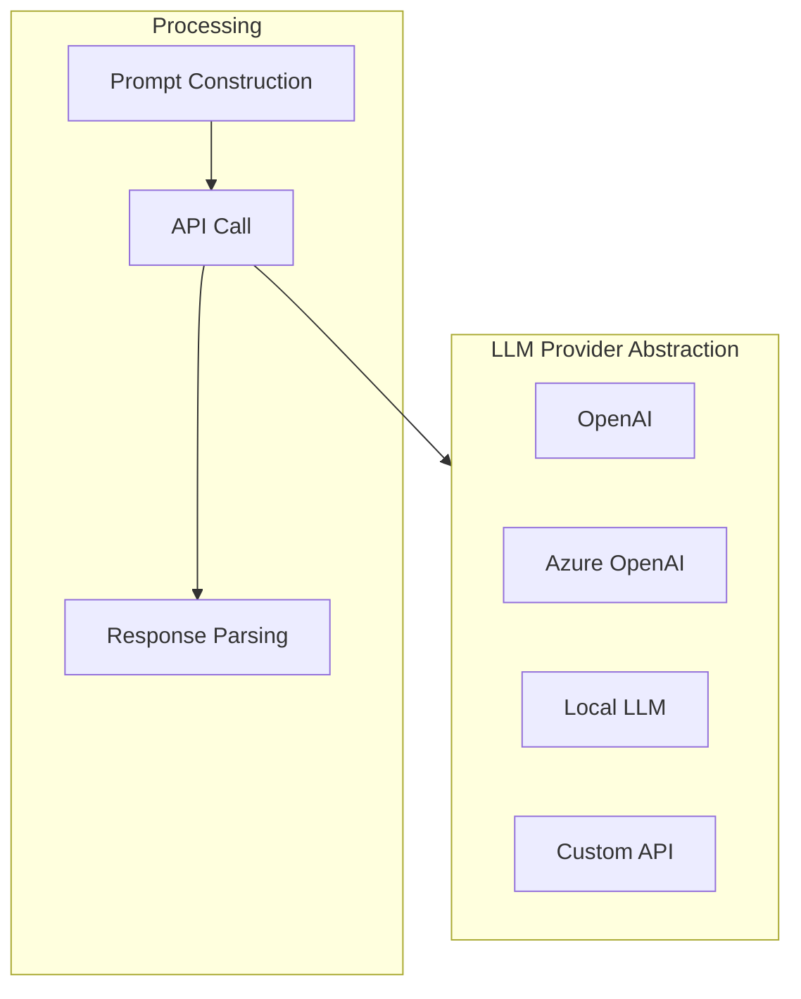

# LLM Integration

Bookmarks Cleaner supports optional **Large Language Model (LLM) enhanced classification** for more intelligent categorization.

## Architecture



## Provider Abstraction

```python
class LLMProvider(ABC):
    @abstractmethod
    def complete(self, prompt: str, **kwargs) -> str:
        pass
```

## Cost Optimization

| Strategy | Description | Cost Savings |
|----------|-------------|--------------|
| Rule-first | Skip LLM if rules match | 60-80% |
| Caching | Use cache for same bookmarks | 20-30% |
| Low-confidence trigger | Only call LLM for low confidence | 40-50% |
| Small model | Use gpt-4o-mini | 90%+ |

## Configuration

```json
{
  "llm_settings": {
    "enabled": true,
    "provider": "openai",
    "model": "gpt-4o-mini",
    "fallback_on_error": true
  }
}
```

## Related Docs

- [Fusion Algorithm](/en/algorithms/fusion) - LLM and classifier fusion
- [Configuration Reference](/en/reference/config) - LLM configuration
