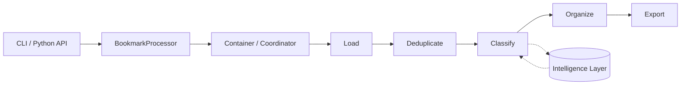
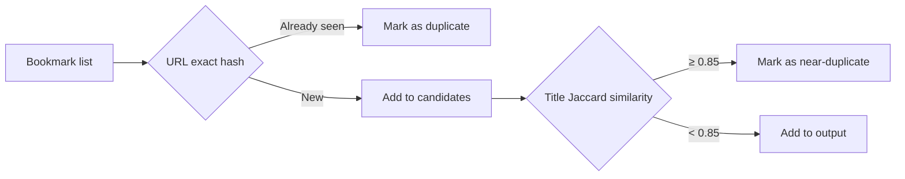
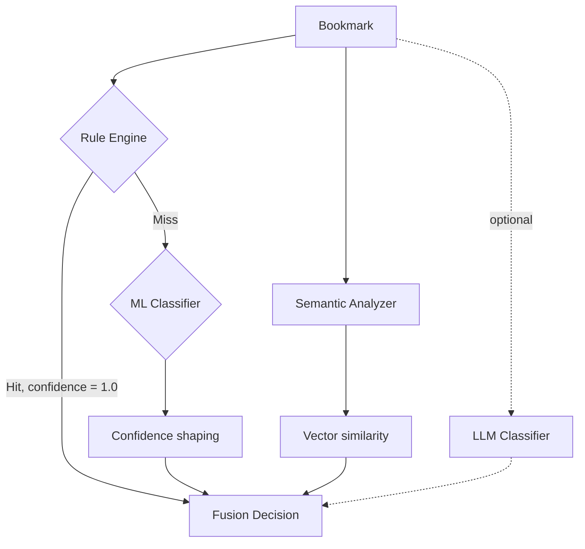
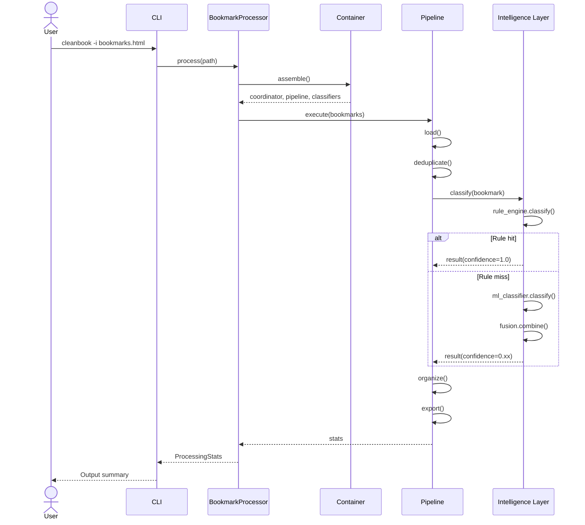

# Pipeline Architecture

Bookmarks Cleaner treats the processing flow as a runtime pipeline rather than a collection of scattered utility functions. This distinction is critical because the system's observability, extensibility, and fallback behavior all depend on these clearly named handoff points.

<PipelineVisualizer />

## Runtime Layers

### Entry and Orchestration

The runtime starts from the CLI or a thin Python entry point. `BookmarkProcessor` serves as the facade, while the container and coordinator compose dependencies and schedule execution order. This means the external entry point can remain stable even as the internal execution graph changes.

### Processing Pipeline

The maintained processing stages are:

1. **Load**: Parse browser bookmark export files into a unified internal representation.
2. **Deduplicate**: Eliminate exact or near-duplicate entries before classification to prevent noise from amplifying in downstream stages.
3. **Classify**: Feed bookmarks into the rules-first intelligence classification stack.
4. **Organize**: Convert labels and confidence scores into directory structure decisions.
5. **Export**: Output cleaned HTML, JSON, and Markdown artifacts.



### Intelligence Layer

Classification is deliberately decoupled from the outer pipeline because it is the fastest-changing layer in the system. The rule engine handles known patterns first, then ML, semantic analysis, and optional LLM provide additional signal for uncertain samples, and finally the fusion layer collapses these heterogeneous signals into a decision envelope.

### Output Layer

The output layer is not just serialization — it is also the tool's most important trust interface:

- **HTML** enables human inspection and direct browser import;
- **JSON** enables downstream tool consumption;
- **Markdown** enables narrative reports and in-repo review materials.

## Stage Data Contracts

Each stage has an explicit contract on the shape of its inputs and outputs. These contracts allow the internal implementation of a stage to be replaced independently without breaking the whole pipeline.

### Core Data Types

```python
from dataclasses import dataclass, field
from typing import Optional

@dataclass
class Bookmark:
    """Output of the load stage; base input for all subsequent stages."""
    url: str
    title: str
    description: str = ''
    add_date: Optional[int] = None          # Unix timestamp
    tags: list[str] = field(default_factory=list)

@dataclass
class ClassificationResult:
    """Output of the classify stage; input for the organize stage."""
    bookmark: Bookmark
    category: str
    confidence: float                       # [0.0, 1.0] calibrated
    source: str                             # 'rule' | 'ml' | 'semantic' | 'llm' | 'fusion'
    alternatives: list[tuple[str, float]] = field(default_factory=list)

@dataclass
class OrganizedBookmark:
    """Output of the organize stage; input for the export stage."""
    result: ClassificationResult
    directory_path: list[str]               # ['Development', 'Python', 'Tutorials']
    is_duplicate: bool = False
```

### Stage Data Flow Matrix

| Stage | Input type | Output type | Key operation |
|-------|-----------|-------------|---------------|
| Load | `str` (file path) | `list[Bookmark]` | HTML parsing, URL normalization |
| Deduplicate | `list[Bookmark]` | `list[Bookmark]` | Hash comparison, similarity filtering |
| Classify | `list[Bookmark]` | `list[ClassificationResult]` | Intelligence stack dispatch, fusion |
| Organize | `list[ClassificationResult]` | `list[OrganizedBookmark]` | Directory tree decisions |
| Export | `list[OrganizedBookmark]` | `None` (writes to disk) | Serialization to HTML/JSON/MD |

## Stage Deep Dives

### Load Stage

The load stage is responsible for converting arbitrary-format bookmark export files into a list of `Bookmark` objects that the system can safely process.

```python
class BookmarkLoader:
    """Protocol-based load interface."""

    def load(self, path: str) -> list[Bookmark]:
        suffix = Path(path).suffix.lower()
        if suffix == '.html':
            return self._parse_html(path)
        elif suffix == '.json':
            return self._parse_json(path)
        raise UnsupportedFormatError(f'Unsupported format: {suffix}')

    def _parse_html(self, path: str) -> list[Bookmark]:
        """Parse Netscape bookmark format using BeautifulSoup."""
        content = Path(path).read_text(encoding='utf-8', errors='replace')
        soup = BeautifulSoup(content, 'html.parser')
        return [
            Bookmark(
                url=a['href'],
                title=a.get_text(strip=True),
                add_date=int(a.get('add_date', 0) or 0),
            )
            for a in soup.find_all('a', href=True)
            if a.get('href', '').startswith(('http://', 'https://'))
        ]
```

**Boundary check**: The load stage only processes `http://` and `https://` protocols, rejecting `file://`, `javascript:`, and other non-web bookmarks.

### Deduplicate Stage

Deduplication proceeds in two passes: exact deduplication (URL hashing) and near-deduplication (title similarity).



Near-deduplication uses Jaccard similarity (token set intersection/union after tokenization). The default threshold is 0.85, adjustable via `config.json`.

### Classify Stage

The classify stage is the most complex segment of the pipeline — it is itself a mini multi-strategy decision system. See [Fusion Algorithm](/en/algorithms/fusion) for details.



The rule engine's short-circuit optimization is the performance critical path: once a rule matches, the system skips all probabilistic classifiers, saving approximately 65% of average per-bookmark processing time.

### Organize Stage

The organize stage converts classification labels into directory tree decisions. It implements two sub-strategies:

1. **Depth-first** (default): Traverses category hierarchies layer by layer, producing deep directories.
2. **Breadth-first**: Flattens the directory hierarchy, producing a flat structure.

### Export Stage

The export stage implements three serialization backends:

| Format | Purpose | Implementation notes |
|--------|---------|---------------------|
| HTML | Direct browser import | Maintains Netscape bookmark format compatibility |
| JSON | Machine consumption | Includes confidence, source, and other metadata |
| Markdown | Human review, repo documentation | Tree-structured directories + per-category tables |

## Sequence Diagram: From CLI to Export

The following sequence diagram shows the call chain for a complete processing run:



## Fault Isolation and Fallback

The pipeline is also a fault boundary:

- Input format errors should surface before the intelligence layer starts;
- Optional intelligence module failures should narrow classification capability, not erase the whole run;
- Export failures should occur after "the result has already been formed", not pollute earlier stages retroactively.

### Fault Injection Test Matrix

| Fault scenario | Expected behavior | Test coverage |
|---------------|-------------------|---------------|
| File not found | `FileNotFoundError` at load stage | `test_load_missing_file` |
| Malformed HTML | Skip invalid entries, process remainder | `test_load_malformed_html` |
| ML model file missing | Degrade to rules mode, emit warning | `test_classify_no_ml_model` |
| LLM endpoint timeout | Skip LLM layer, continue fusion | `test_llm_timeout_fallback` |
| All confidence scores zero | Output `category='unknown'` | `test_all_zero_confidence` |
| Disk write failure | Export stage errors; prior results preserved | `test_export_write_error` |

## Why This Shape Matters

Without explicit stages, the repository would eventually revert to god-class mode: all logic calling each other, test costs skyrocketing, any change requiring contributors to re-understand the whole program. The Pipeline today is therefore not just an implementation detail but one of this project's most important maintainability guarantees.

The more clearly boundaries are named, the more safely the codebase can be modified:

- Load bugs should not masquerade as fusion bugs;
- Export issues should not force contributors to re-read classifier implementations;
- Adding a new classifier should not require modifying organize or export logic.

See [Evolution Notes](/en/evolution) for the complete path from god class to the current facade-plus-pipeline shape.
