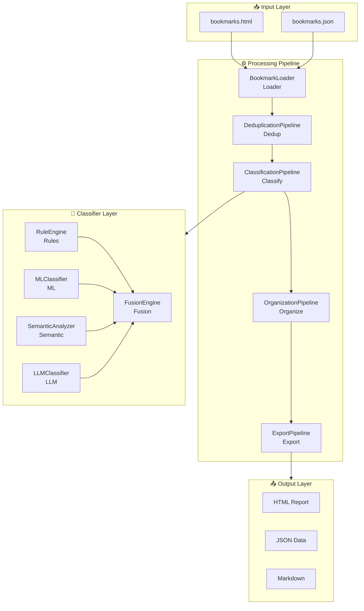

# Pipeline Architecture

Bookmarks Cleaner adopts a **5-stage Pipeline architecture**, orchestrated by `BookmarkProcessorCoordinator` to manage the execution order and data flow.

## Architecture Overview



## 5 Stages Explained

### 1. BookmarkLoader (Loading Stage)

**Responsibility**: Parse browser-exported bookmark files into a unified internal data structure.

```python
class BookmarkLoader:
    def load(self, file_path: str) -> List[Dict]:
        """Load bookmark file, supports HTML/JSON formats"""
        
    def _parse_html(self, content: str) -> List[Dict]:
        """Parse Netscape Bookmark format"""
        
    def _normalize(self, bookmarks: List[Dict]) -> List[Bookmark]:
        """Normalize bookmark data"""
```

**Supported formats**:
- Chrome/Edge HTML export
- Firefox JSON backup
- Safari HTML bookmarks

### 2. DeduplicationPipeline (Deduplication Stage)

**Responsibility**: Identify and handle duplicate bookmarks.

```python
class DeduplicationPipeline:
    def process(self, bookmarks: List[Bookmark]) -> List[Bookmark]:
        """Execute deduplication process"""
```

**Deduplication strategies**:
| Strategy | Description | Complexity |
|----------|-------------|------------|
| URL exact match | Compare normalized URLs | O(n) |
| Domain+path match | Ignore query parameter differences | O(n) |
| Semantic similarity | Calculate title/description similarity | O(n²) |

### 3. ClassificationPipeline (Classification Stage)

**Responsibility**: Assign one or more category labels to each bookmark.

```python
class ClassificationPipeline:
    def __init__(self, classifier: AIBookmarkClassifier):
        self.classifier = classifier
        
    def process(self, bookmarks: List[Bookmark]) -> List[ClassifiedBookmark]:
        """Execute classification process"""
```

### 4. OrganizationPipeline (Organization Stage)

**Responsibility**: Organize bookmark hierarchy based on classification results.

### 5. ExportPipeline (Export Stage)

**Responsibility**: Export processing results to multiple formats.

```python
class ExportPipeline:
    def export(self, organized: Dict, output_dir: str) -> Dict[str, str]:
        """Export processing results"""
```

## Performance Characteristics

| Metric | Value | Description |
|--------|-------|-------------|
| Processing speed | 500+ bookmarks/sec | Single-threaded baseline |
| Concurrent speedup | 4x | 4-thread concurrency |
| Memory usage | < 100MB | 10,000 bookmarks |
| Startup time | < 100ms | Lazy initialization |

## Related Docs

- [DI Container](/en/architecture/container) - Dependency injection
- [Protocols](/en/architecture/protocols) - Interface definitions
- [Fusion Algorithm](/en/algorithms/fusion) - Classifier fusion
