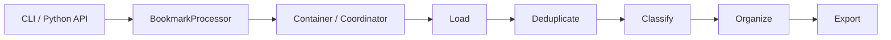

# Pipeline Architecture

Bookmarks Cleaner treats the processing flow as a runtime pipeline rather than a pile of utility functions. That choice matters because every later property, observability, extensibility, and fallback behavior, depends on having named handoff points.

## Runtime Layers

### Entry and orchestration

The runtime begins at the CLI or the thin Python surface. From there, `BookmarkProcessor` acts as the façade, while the container and coordinator own composition and sequencing. This keeps the public entry point stable even when the internal execution graph changes.

### Processing pipeline

The maintained processing stages are:

1. **Load**: parse bookmark exports into a normalized internal representation.
2. **Deduplicate**: collapse exact or near-exact duplicates before classification amplifies noise.
3. **Classify**: send bookmarks through the rules-first intelligence stack.
4. **Organize**: translate labels and confidence into folder structure decisions.
5. **Export**: emit cleaned HTML, JSON, and Markdown artifacts.

### Intelligence layer

Classification is deliberately separated from the outer pipeline because it is the most volatile part of the system. The rule engine handles known patterns first, then ML, semantic analysis, and optional LLM participation contribute signal for uncertain cases. Fusion turns those heterogeneous signals into one decision envelope.

### Output surfaces

The output layer is more than serialization. It is the final trust surface of the tool:

- **HTML** supports human inspection.
- **JSON** supports downstream tooling.
- **Markdown** supports narrative reporting and repository-friendly review.

## Data Handoffs

Each stage narrows or enriches the data:

| Stage | Input shape | Output effect |
|-------|-------------|---------------|
| Load | Raw export file | Normalized bookmark objects |
| Deduplicate | Bookmark objects | Reduced, less noisy set |
| Classify | Clean bookmarks | Labels, confidence, and provenance |
| Organize | Classified bookmarks | Folder placement decisions |
| Export | Structured output model | Auditable artifacts |

This shape matters because it constrains where bugs can hide. A loading bug should not masquerade as a fusion bug. An export issue should not require re-reading classifier code.

## Failure Containment

The pipeline also acts as a fault boundary:

- malformed input should fail before intelligence stages start;
- optional intelligence modules should degrade classification width, not erase the whole run;
- export failures should surface after the processing result already exists conceptually.

The more clearly the pipeline names these boundaries, the easier the codebase is to change safely.

## Why This Shape Matters

Without named stages, the repository tends toward a god-class shape: everything can call everything, tests become expensive, and every change requires whole-program understanding. The current pipeline is therefore not just an implementation detail, but the main maintainability guarantee of the project.
