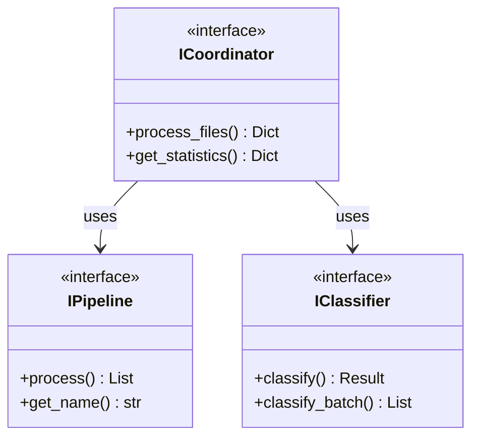

# Protocols

Bookmarks Cleaner uses **Python Protocol** to define core interfaces, enabling structural subtyping for flexible type checking and decoupling.

## What is Protocol

Protocol is a Python 3.8+ type system feature that allows type checking based on method/attribute presence rather than inheritance.

```python
from typing import Protocol

class IProcessor(Protocol):
    """Processor interface"""
    def process(self, data: List[Dict]) -> List[Dict]: ...
```

**Benefits**:
- Any class implementing `process` automatically satisfies `IProcessor`
- No explicit inheritance required
- Supports IDE autocompletion and static type checking

## Core Interfaces



### Coordinator Interface

```python
class ICoordinator(Protocol):
    """Processor coordinator interface"""
    
    def process_files(
        self,
        input_files: List[str],
        output_dir: str,
        train_models: bool,
        limit: int,
        review_queue_path: Optional[str],
    ) -> Dict[str, Any]: ...
```

### Classifier Interface

```python
class IClassifier(Protocol):
    """Classifier interface"""
    
    def classify(self, bookmark: Bookmark) -> ClassificationResult: ...
    
    def classify_batch(
        self, bookmarks: List[Bookmark]
    ) -> List[ClassificationResult]: ...
```

## Related Docs

- [Pipeline Architecture](/en/architecture/pipeline) - Pipeline design pattern
- [DI Container](/en/architecture/container) - IoC container
