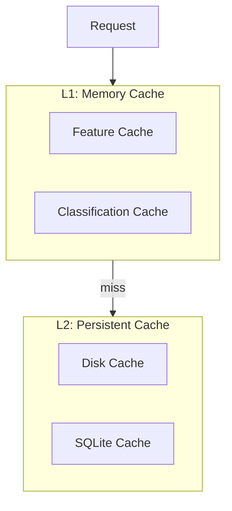

# Caching Strategy

Bookmarks Cleaner implements a multi-level caching system including feature cache, classification result cache, and embedding vector cache.

## Cache Architecture



## Cache Types

### Feature Cache

```python
class FeatureCache:
    def get_or_compute(self, bookmark: Bookmark, compute_fn) -> np.ndarray:
        key = self._make_key(bookmark)
        if key in self._cache:
            return self._cache[key]
        features = compute_fn(bookmark)
        self._cache[key] = features
        return features
```

### Classification Result Cache

```python
from cachetools import TTLCache

cache = TTLCache(maxsize=50000, ttl=24*3600)  # 24 hours
```

## Eviction Policies

| Policy | Use Case |
|--------|----------|
| LRU | Feature cache, classification results |
| LFU | Hot data cache |
| TTL | LLM response cache |

## Cache Statistics

```
Cache Type          Hit Rate    Hits      Misses
━━━━━━━━━━━━━━━━━━━━━━━━━━━━━━━━━━━━━━━━━
Feature Cache       78.5%      7,850     2,150
Classification      65.2%      6,520     3,480
Embedding Cache     92.1%      9,210       790
```

## Related Docs

- [Concurrency](/en/performance/concurrency) - Concurrent optimization
- [Optimization](/en/performance/optimization) - Performance tuning
