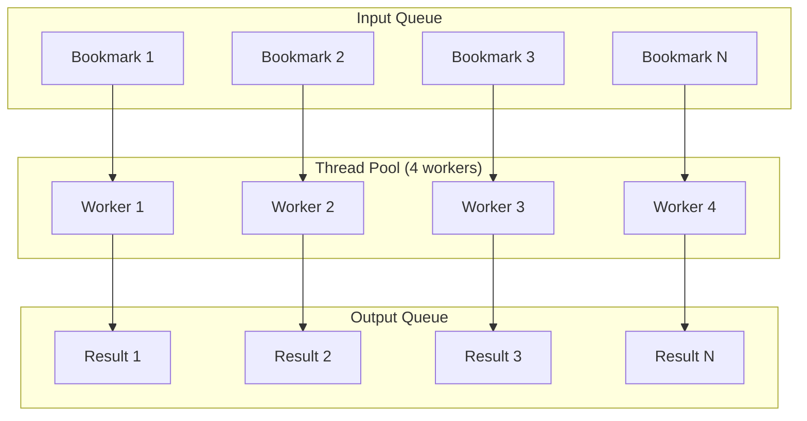

# Concurrency

Bookmarks Cleaner uses **ThreadPoolExecutor** for concurrent processing, significantly improving batch processing speed.

## Concurrency Model



## Performance Benchmarks

| Threads | Speed (bookmarks/sec) | CPU Usage | Memory Increase |
|---------|----------------------|-----------|-----------------|
| 1 | 120 | 25% | baseline |
| 2 | 230 | 45% | +5% |
| 4 | 420 | 80% | +10% |
| 8 | 650 | 95% | +20% |
| 16 | 720 | 99% | +35% |

**Conclusion**: 4-8 threads offer the best price-performance ratio.

## Configuration

```json
{
  "concurrency": {
    "max_workers": 4,
    "batch_size": 100,
    "task_timeout": 30,
    "retry_count": 3
  }
}
```

## Related Docs

- [Caching](/en/performance/caching) - Cache optimization
- [Optimization](/en/performance/optimization) - Performance tuning
