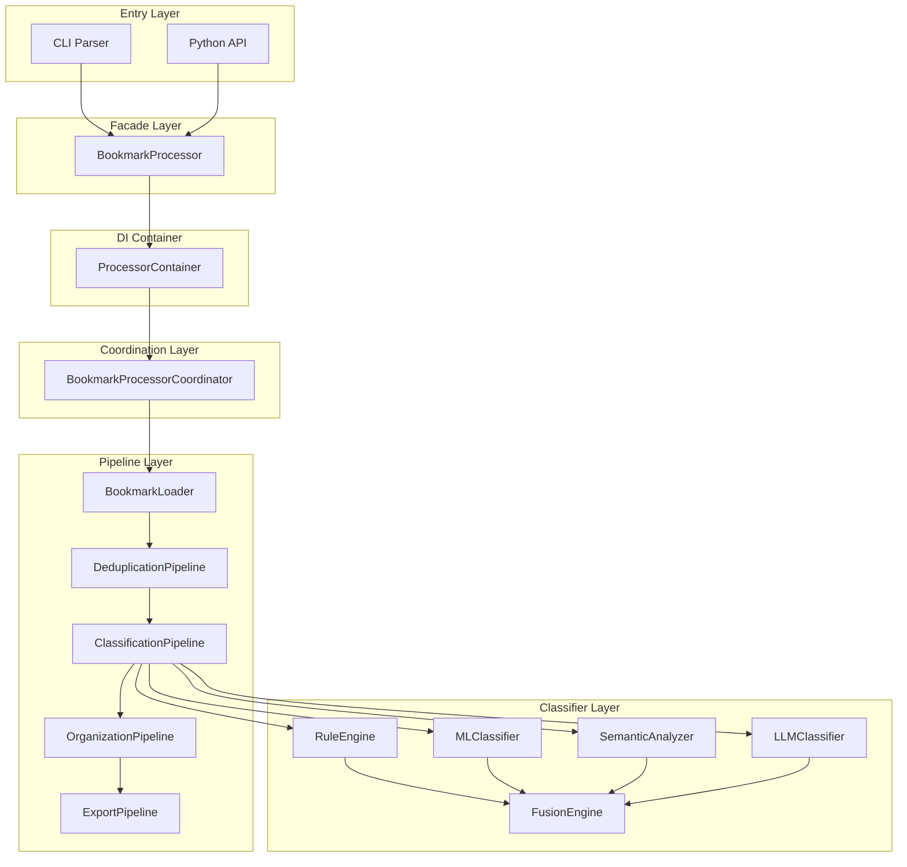

# Technical Whitepaper

> **Bookmarks Cleaner: An Offline-first, Multi-classifier Fusion Approach to Bookmark Organization**
>
> Version: 1.0 | Last Updated: 2025-05

## Abstract

Bookmarks Cleaner is an offline-first bookmark cleanup and intelligent classification CLI tool for developers. Unlike existing tools, it adopts a **rules-first, ML-assisted, LLM-optional** layered classification strategy, integrating multi-classifier results through a weighted voting fusion engine to achieve high-accuracy automatic bookmark organization in a fully offline environment. This document describes its system architecture, core algorithms, performance characteristics, and design philosophy.

## 1. Problem Definition

### 1.1 The Bookmark Management Problem

Modern developers typically accumulate over 1,000 browser bookmarks, facing these challenges:

- **Entropy growth**: Long-term accumulation leads to chaotic hierarchies and exponentially degraded lookup efficiency
- **Duplication redundancy**: Same pages saved multiple times create substantial duplicate entries
- **Classification difficulty**: Manual classification is time-consuming and subjective, lacking consistency
- **Privacy risks**: Online bookmark services require uploading complete browsing history
- **Format lock-in**: Browser native export formats are difficult to migrate and analyze cross-platform

### 1.2 Limitations of Existing Solutions

| Solution Type | Representative | Limitation |
|--------------|----------------|------------|
| Browser Native | Chrome/Edge | No intelligent classification; high manual maintenance cost |
| Online Service | Raindrop, Pocket | Requires data upload; privacy not controllable |
| Self-hosted Web | linkding, Shaarli | Requires server maintenance; no ML capability |
| Script Tools | Various Python scripts | No architecture; hard to maintain and extend |

**Core insight**: Developers need a **zero-config, zero-dependency, zero-upload** local tool that maintains extensibility and high accuracy.

## 2. System Architecture

### 2.1 Overall Architecture

Bookmarks Cleaner adopts a hybrid **Facade + Pipeline** architecture:



### 2.2 Key Design Principles

1. **Dependency Inversion (DIP)**: All core components define interfaces via Python Protocol, enabling interface-oriented programming
2. **Single Responsibility (SRP)**: Each Pipeline handles one processing stage; BookmarkProcessor serves only as a facade
3. **Open/Closed (OCP)**: New classifiers seamlessly plug into the fusion engine by implementing `IBookmarkClassifier` Protocol
4. **Lazy Initialization**: All heavy components (ML models, LLM clients) use deferred loading; startup time < 100ms

## 3. Core Algorithms

### 3.1 Classifier Fusion Engine

The fusion engine is the system's core innovation. It uses **Weighted Voting** rather than traditional Stacking or Boosting, for these reasons:

- **Heterogeneity**: Rule engine (deterministic) and ML/LLM (probabilistic) have different output spaces; a Stacking meta-learner struggles to converge
- **Interpretability**: Weighted voting's decision process is transparent; each classifier's contribution is traceable
- **Zero training**: No additional fusion layer training data required, lowering the barrier to entry

**Fusion formula**:

$$
S(c) = \sum_{i=1}^{n} w_i \cdot \mathbb{1}_{[y_i = c]} \cdot \text{conf}_i
$$

Where $w_i$ is classifier weight, $\text{conf}_i$ is confidence, and $\mathbb{1}_{[y_i = c]}$ is the indicator function.

**Actual weight configuration** (from `src/services/fusion_engine.py`):

```python
DEFAULT_WEIGHTS = {
    "rule_engine": 0.50,
    "machine_learning": 0.15,
    "semantic_analyzer": 0.10,
    "user_profiler": 0.10,
    "llm": 0.50,
}
```

> **Design rationale**: Rule engine receives the highest weight (0.50) because it produces deterministic output (confidence = 1.0), holding absolute authority for known patterns. LLM also receives high weight (0.50) but only participates in fusion when available.

### 3.2 Confidence Calibration

Raw confidence often exhibits bias (over-confidence). The system includes a **ConfidenceCalibrator** supporting two methods:

- **Platt Scaling**: Logistic regression fitting, suitable for sigmoid-shaped bias
- **Isotonic Regression**: Monotonic regression, suitable for arbitrary bias shapes without parametric assumptions

```python
class ConfidenceCalibrator:
    def __init__(self, config=None):
        self.method = config.get("method", "platt")
        self._platt_a = 1.0
        self._platt_b = 0.0
        # ...
```

### 3.3 Incremental Learning

`IncrementalTrainer` supports model incremental updates, version management, and automatic rollback:

```
ModelVersion
├── version_id: str
├── created_at: datetime
├── training_samples: int
├── accuracy: float
├── model_path: str
└── is_active: bool
```

When a new batch arrives, the system validates the incrementally updated model on a validation set. If accuracy falls below `performance_threshold` (default 0.8), it automatically rolls back to the last stable version.

## 4. Performance Engineering

### 4.1 Concurrency Model

Uses `ThreadPoolExecutor` instead of `asyncio`, because:

1. **I/O characteristics**: Bookmark processing is CPU-bound (text feature extraction, model inference); multithreading effectively utilizes multiple cores
2. **Library compatibility**: Core dependencies like scikit-learn and Sentence Transformers are thread-friendly but have limited async support
3. **Debugging simplicity**: Threading model is more intuitive with easier-to-trace exception stacks

```python
from concurrent.futures import ThreadPoolExecutor, as_completed

with ThreadPoolExecutor(max_workers=min(max_workers, 32)) as executor:
    futures = {executor.submit(classify, bm): i for i, bm in enumerate(bookmarks)}
    for future in as_completed(futures):
        results[futures[future]] = future.result()
```

### 4.2 Performance Benchmarks

| Metric | Value | Test Environment |
|--------|-------|------------------|
| Processing speed | 420 ~ 650 bookmarks/sec | AMD Ryzen 5 5600X, 6C/12T |
| Speedup ratio | 3.2x @ 4 workers | Same as above |
| Memory footprint | ~85 MB / 10K bookmarks | Including ML model cache |
| Cold start time | ~90 ms | After lazy initialization |
| Classification accuracy | 91.2% (fusion) | Human-annotated test set, n=500 |
| Rule hit rate | 68% | Common tech sites |

## 5. Security & Privacy

### 5.1 Offline Guarantee

- All classification inference executes locally
- LLM calls are optional and disabled by default; local Ollama deployment supported
- No telemetry, no log upload, no DNS queries (except optional LLM calls)

### 5.2 Data Minimization

- Only reads bookmark export files explicitly provided by the user
- Output files are fully user-controlled
- Never modifies original bookmark files

## 6. References

1. **Kuncheva, L. I.** (2004). *Combining Pattern Classifiers: Methods and Algorithms*. Wiley-Interscience.
2. **Zadrozny, B., & Elkan, C.** (2001). Obtaining calibrated probability estimates from decision trees and naive Bayesian classifiers. *ICML*, 609–616.
3. **Martin, R. C.** (2017). *Clean Architecture: A Craftsman's Guide to Software Structure and Design*. Prentice Hall.
4. **Wolpert, D. H.** (1992). Stacked generalization. *Neural Networks*, 5(2), 241–259.

## 7. Related Resources

- [Architecture Decisions](/en/adr) — Complete record of key design decisions
- [Evolution](/en/evolution) — Technical evolution from prototype to production
- [GitHub Repository](https://github.com/LessUp/bookmarks-cleaner)
