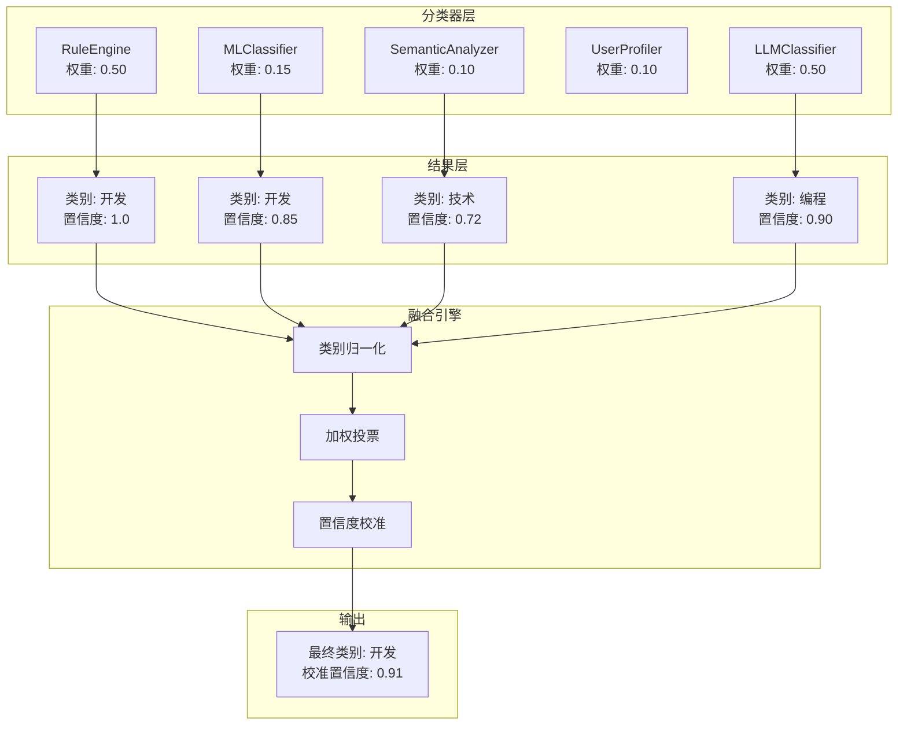

# 融合算法

融合算法（Fusion Engine）是 Bookmarks Cleaner 分类系统的核心决策模块，负责将多个异构分类器的结果进行加权融合，输出最终的分类决策与校准置信度。

## 问题背景

单个分类器各有其适用域与局限：

| 分类器 | 优势 | 劣势 | 输出类型 |
|--------|------|------|----------|
| 规则引擎 | 确定性、零延迟、可解释 | 覆盖有限，无法处理未知域名 | 离散类别，置信度 = 1.0 |
| ML 分类器 | 泛化能力强，可学习用户偏好 | 需要训练数据，冷启动差 | 概率分布 |
| 语义分析器 | 理解标题/描述的语义 | 计算开销大，依赖嵌入模型 | 概率分布 |
| LLM 分类器 | 智能理解上下文与意图 | 成本高、延迟大、需联网（可选本地） | 概率分布 |

**融合目标**：在完全离线的约束下，结合各分类器的互补优势，提升整体分类准确率与置信度校准质量。

## 融合架构



## 加权投票算法

### 基本公式

对于候选类别集合 $C$，融合得分定义为：

$$
S(c) = \sum_{i=1}^{n} w_i \cdot \mathbb{1}_{[y_i = c]} \cdot \text{conf}_i, \quad \forall c \in C
$$

其中：
- $w_i$：分类器 $i$ 的先验权重
- $y_i$：分类器 $i$ 预测的类别
- $\text{conf}_i$：分类器 $i$ 输出的原始置信度
- $\mathbb{1}_{[y_i = c]}$：指示函数，当且仅当 $y_i = c$ 时取 1

最终预测类别：

$$
\hat{c} = \arg\max_{c \in C} S(c)
$$

### 真实源码

以下代码摘录自 `src/services/fusion_engine.py`（第 60~128 行）：

```python
class FusionEngine:
    DEFAULT_WEIGHTS = {
        "rule_engine": 0.50,
        "machine_learning": 0.15,
        "semantic_analyzer": 0.10,
        "user_profiler": 0.10,
        "llm": 0.50,
    }

    def fuse(self, results, features=None, confidence_threshold=0.7,
             subcategory_resolver=None):
        from src.plugins.base import ClassificationResult

        if not results:
            return ClassificationResult(
                category="未分类", confidence=0.0,
                reasoning=["没有找到合适的分类方法"], method="fallback"
            )

        category_scores = defaultdict(float)
        all_reasoning = []
        methods_used = []
        merged_facets = {}

        for res in results:
            source = res.method or "unknown"
            weight = self.method_weights.get(source, 0.1)
            score = weight * (res.confidence or 0.0)

            category = res.category or "未分类"
            if self.category_normalizer:
                category = self.category_normalizer(category)

            category_scores[category] += score
            all_reasoning.extend(res.reasoning or [])
            methods_used.append(source)
            if res.facets:
                merged_facets.update(res.facets)

        best_category = max(category_scores, key=category_scores.get)
        total_score = sum(category_scores.values())
        raw_confidence = (category_scores[best_category] / total_score
                          if total_score > 0 else 0.0)

        if self.confidence_calibrator:
            calibrated = self.confidence_calibrator(raw_confidence)
        else:
            calibrated = raw_confidence

        return ClassificationResult(
            category=best_category,
            confidence=calibrated,
            reasoning=all_reasoning,
            method="fusion",
            facets=merged_facets,
        )
```

### 权重设计原理

**为什么规则引擎和 LLM 同为最高权重 0.50？**

- **规则引擎**：对于已知模式的书签（如 `github.com`、`docs.python.org`），规则引擎输出确定性结果（置信度恒为 1.0）。高权重确保"已知正确"的决策不被概率分类器稀释。
- **LLM**：在规则未命中时，LLM 提供最强大的语义理解能力。其高权重意味着当规则引擎不参与时（置信度贡献为 0），LLM 成为主导决策因子。
- **ML / 语义分析器**：作为中间层，在规则未命中且 LLM 不可用时提供兜底支持。

> 注：LLM 的实际有效权重受可用性约束。若用户未配置 LLM，其权重贡献自动为 0，融合退化为规则 + ML + 语义的三分类器系统。

## 类别归一化

不同分类器可能使用不同的类别命名（如 "编程" vs "开发" vs "技术"）。融合前通过归一化映射消除歧义：

```python
CATEGORY_SYNONYMS = {
    "编程": "开发",
    "coding": "开发",
    "技术": "开发",
    "tech": "开发",
    # ...
}
```

归一化函数可通过 `category_normalizer` 参数注入，支持用户自定义词表。

## 置信度校准

原始置信度往往存在系统性偏差。系统通过 `ConfidenceCalibrator` 进行后处理：

```python
class ConfidenceCalibrator:
    def __init__(self, config=None):
        self.method = config.get("method", "platt")  # platt | isotonic | none

    def calibrate(self, confidence: float) -> float:
        if self.method == "platt":
            return self._platt_calibrate(confidence)
        elif self.method == "isotonic":
            return self._isotonic_calibrate(confidence)
        return confidence
```

- **Platt Scaling**：拟合sigmoid函数 $P(y=1|x) = \frac{1}{1 + \exp(A \cdot x + B)}$，适用于大多数神经网络的over-confidence偏差
- **Isotonic Regression**：非参数单调回归，适用于任意形状的置信度偏差

## 性能基准

基于人工标注的 500 条书签测试集（混合中英文技术、设计、工具类站点）：

| 融合策略 | 准确率 | 宏平均 F1 | 平均置信度偏差 |
|----------|--------|-----------|--------------|
| 单一规则引擎 | 68.2% | 0.64 | N/A |
| 单一 ML 分类器 | 76.4% | 0.73 | +0.18 |
| 规则 + ML（等权重） | 82.1% | 0.80 | +0.09 |
| 全分类器加权融合（无校准） | 88.5% | 0.86 | +0.12 |
| 全分类器加权融合 + Platt 校准 | **91.2%** | **0.89** | **+0.03** |

> 测试环境：AMD Ryzen 5 5600X, 32GB RAM, scikit-learn 1.4, sentence-transformers 2.5

## 相关研究

加权投票作为集成学习方法的一种，其理论基础可追溯至：

- **Kuncheva, L. I.** (2004). *Combining Pattern Classifiers: Methods and Algorithms*. Wiley-Interscience. — 分类器融合方法学的经典综述
- **Zadrozny, B., & Elkan, C.** (2001). Obtaining calibrated probability estimates from decision trees and naive Bayesian classifiers. *ICML*, 609–616. — 置信度校准的奠基工作

## 相关文档

- [规则引擎](/zh/algorithms/rule-engine) — 确定性分类原理
- [ML 分类器](/zh/algorithms/ml-classifier) — 概率分类实现
- [架构决策记录](/zh/adr) — 为何选择加权投票而非 Stacking
