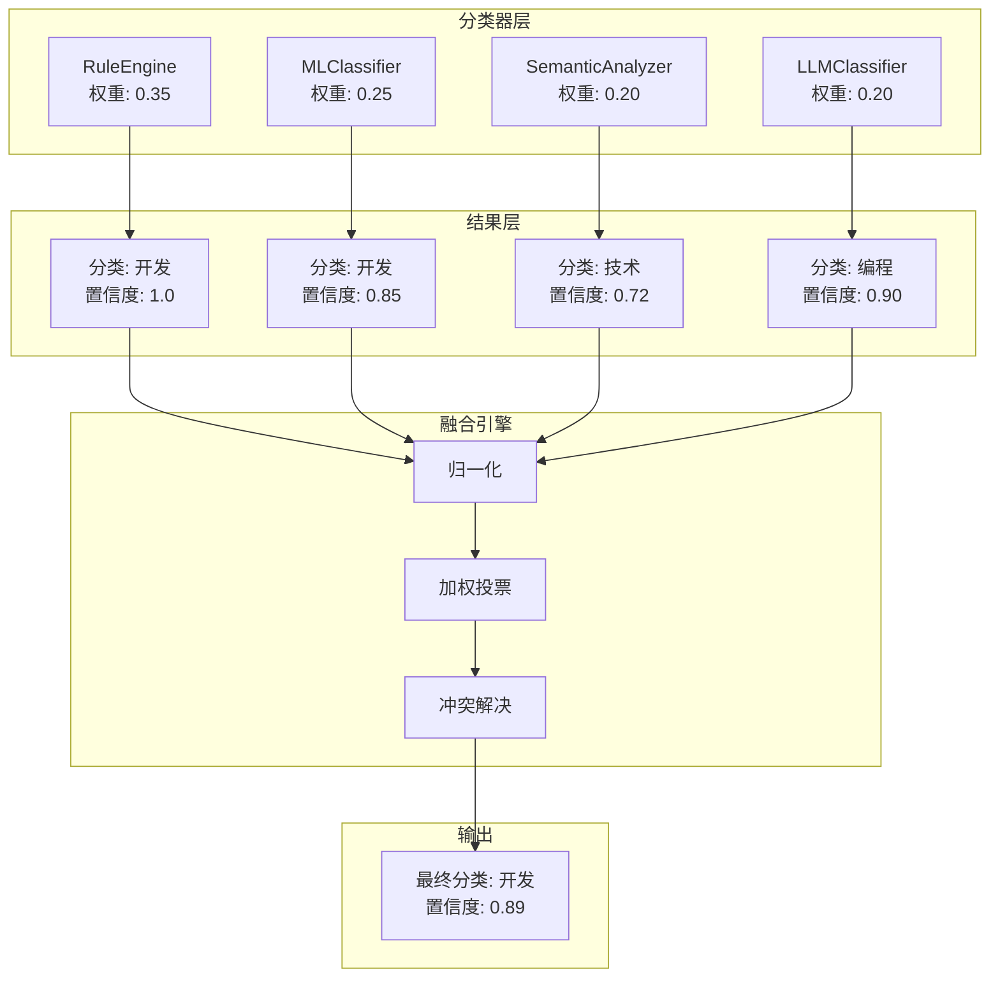
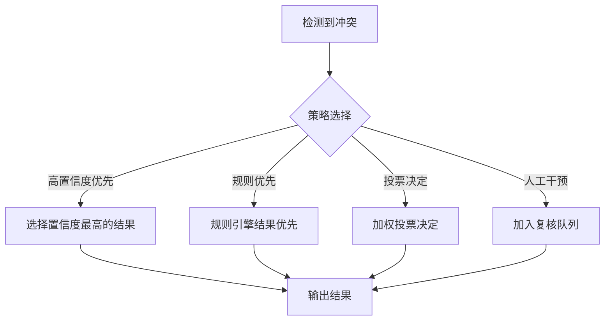

# 融合算法

融合算法（Fusion Engine）是 Bookmarks Cleaner 分类系统的核心，负责将多个分类器的结果进行加权融合，输出最终的分类决策。

## 问题背景

单个分类器各有优劣：

| 分类器 | 优势 | 劣势 |
|--------|------|------|
| 规则引擎 | 快速、确定 | 覆盖有限 |
| ML 分类器 | 泛化能力强 | 需要训练数据 |
| 语义分析 | 理解语义 | 计算开销大 |
| LLM | 智能理解 | 成本高、延迟大 |

**融合目标**：结合各分类器优势，提升整体分类准确率。

## 融合架构



## 加权投票算法

### 基本公式

$$S(c) = \sum_{i=1}^{n} w_i \cdot \mathbb{1}_{y_i = c} \cdot conf_i$$

其中：
- $S(c)$ 是类别 $c$ 的总得分
- $w_i$ 是分类器 $i$ 的权重
- $y_i$ 是分类器 $i$ 的预测类别
- $conf_i$ 是分类器 $i$ 的置信度

### 实现

```python
class FusionEngine:
    """融合引擎"""
    
    # 默认权重配置
    DEFAULT_WEIGHTS = {
        "rule": 0.35,
        "ml": 0.25,
        "semantic": 0.20,
        "llm": 0.20,
    }
    
    def __init__(self, weights: Dict[str, float] = None):
        self.weights = weights or self.DEFAULT_WEIGHTS
        
    def fuse(
        self,
        results: List[ClassificationResult],
    ) -> ClassificationResult:
        """融合多个分类结果"""
        
        # 1. 归一化类别名称
        normalized = self._normalize_categories(results)
        
        # 2. 计算每个类别的加权得分
        scores = self._calculate_scores(normalized)
        
        # 3. 选择得分最高的类别
        best_category = max(scores, key=scores.get)
        
        # 4. 计算最终置信度
        confidence = self._calculate_confidence(scores, best_category)
        
        return ClassificationResult(
            category=best_category,
            confidence=confidence,
            source="fusion",
            metadata={"scores": scores, "contributions": normalized},
        )
    
    def _calculate_scores(
        self,
        results: List[Tuple[str, str, float]],
    ) -> Dict[str, float]:
        """计算每个类别的加权得分"""
        scores = {}
        
        for source, category, confidence in results:
            weight = self.weights.get(source, 0.1)
            score = weight * confidence
            
            if category not in scores:
                scores[category] = 0
            scores[category] += score
        
        return scores
```

## 类别归一化

不同分类器可能输出不同的类别名称，需要归一化：

```python
# 类别映射表
CATEGORY_MAPPINGS = {
    # 同义词映射
    "技术": "开发",
    "编程": "开发",
    "代码": "开发",
    "设计": "设计",
    "UI": "设计",
    "UX": "设计",
    # 层级映射
    "Python": "开发",
    "JavaScript": "开发",
    "React": "开发",
}

def _normalize_categories(
    self,
    results: List[ClassificationResult],
) -> List[Tuple[str, str, float]]:
    """归一化类别名称"""
    normalized = []
    
    for result in results:
        # 查找映射
        category = CATEGORY_MAPPINGS.get(
            result.category, 
            result.category
        )
        normalized.append((result.source, category, result.confidence))
    
    return normalized
```

## 冲突解决策略

当分类结果存在冲突时：



### 实现策略

```python
class ConflictResolver:
    """冲突解决器"""
    
    def resolve(
        self,
        results: List[ClassificationResult],
        scores: Dict[str, float],
    ) -> str:
        """解决分类冲突"""
        
        # 策略1: 规则引擎结果优先
        rule_result = next(
            (r for r in results if r.source == "rule" and r.confidence == 1.0),
            None
        )
        if rule_result:
            return rule_result.category
        
        # 策略2: 检查得分差距
        sorted_scores = sorted(scores.items(), key=lambda x: x[1], reverse=True)
        if len(sorted_scores) >= 2:
            top, second = sorted_scores[0], sorted_scores[1]
            # 如果第一名得分显著高于第二名
            if top[1] > second[1] * 1.5:
                return top[0]
        
        # 策略3: 默认选择得分最高的
        return sorted_scores[0][0]
```

## 动态权重调整

根据历史准确率动态调整权重：

```python
class AdaptiveFusionEngine(FusionEngine):
    """自适应融合引擎"""
    
    def __init__(self):
        super().__init__()
        self.accuracy_history = {k: [] for k in self.DEFAULT_WEIGHTS}
    
    def update_weights_from_feedback(self, feedback: List[Feedback]):
        """根据反馈更新权重"""
        for f in feedback:
            for result in f.results:
                correct = result.category == f.correct_category
                self.accuracy_history[result.source].append(correct)
        
        # 计算各分类器最近准确率
        new_weights = {}
        for source, history in self.accuracy_history.items():
            recent = history[-100:]  # 最近 100 条
            accuracy = sum(recent) / len(recent) if recent else 0.5
            new_weights[source] = accuracy
        
        # 归一化权重
        total = sum(new_weights.values())
        self.weights = {k: v/total for k, v in new_weights.items()}
```

## 置信度校准

融合后的置信度计算：

```python
def _calculate_confidence(
    self,
    scores: Dict[str, float],
    best_category: str,
) -> float:
    """计算融合后的置信度"""
    
    best_score = scores[best_category]
    total_score = sum(scores.values())
    
    # 相对置信度
    relative_confidence = best_score / total_score if total_score > 0 else 0
    
    # 绝对置信度（考虑最高可能得分）
    max_possible = sum(self.weights.values())
    absolute_confidence = best_score / max_possible if max_possible > 0 else 0
    
    # 综合置信度
    return 0.6 * relative_confidence + 0.4 * absolute_confidence
```

## 性能基准

| 融合策略 | 准确率 | 召回率 | F1 |
|----------|--------|--------|-----|
| 单一规则 | 72% | 65% | 0.68 |
| 单一 ML | 78% | 82% | 0.80 |
| 规则 + ML | 85% | 83% | 0.84 |
| 全分类器融合 | **91%** | **88%** | **0.89** |

## 可视化分析

```
书签: "GitHub - facebook/react"
┌─────────────────────────────────────────────┐
│ 分类器       │ 分类    │ 置信度 │ 权重贡献 │
├─────────────────────────────────────────────┤
│ RuleEngine   │ 开发    │ 1.00   │ 0.350   │
│ MLClassifier │ 开发    │ 0.92   │ 0.230   │
│ Semantic     │ 技术    │ 0.78   │ 0.156   │
│ LLM          │ 编程    │ 0.88   │ 0.176   │
├─────────────────────────────────────────────┤
│ 融合结果     │ 开发    │ 0.89   │ -       │
└─────────────────────────────────────────────┘
```

## 相关文档

- [规则引擎](/zh/algorithms/rule-engine) - 规则分类原理
- [ML 分类器](/zh/algorithms/ml-classifier) - 机器学习分类
- [LLM 集成](/zh/algorithms/llm-integration) - 大语言模型集成
