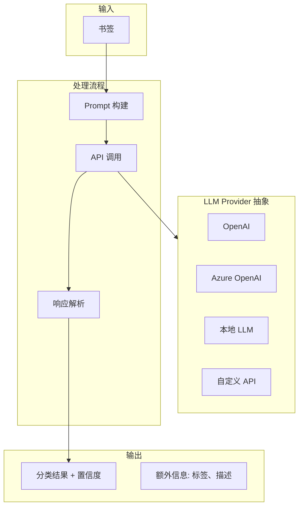

# LLM 集成

Bookmarks Cleaner 支持可选的 **大语言模型（LLM）增强分类**，提供更智能的分类能力和自然语言理解。

## 架构概览



## Provider 抽象

### 统一接口

```python
from abc import ABC, abstractmethod

class LLMProvider(ABC):
    """LLM Provider 抽象基类"""
    
    @abstractmethod
    def complete(self, prompt: str, **kwargs) -> str:
        """生成补全"""
        pass
    
    @abstractmethod
    def embed(self, text: str) -> List[float]:
        """生成嵌入向量"""
        pass
```

### OpenAI Provider

```python
import openai

class OpenAIProvider(LLMProvider):
    """OpenAI Provider"""
    
    def __init__(self, api_key: str, model: str = "gpt-4o-mini"):
        self.client = openai.OpenAI(api_key=api_key)
        self.model = model
    
    def complete(self, prompt: str, **kwargs) -> str:
        response = self.client.chat.completions.create(
            model=self.model,
            messages=[
                {"role": "system", "content": CLASSIFICATION_SYSTEM_PROMPT},
                {"role": "user", "content": prompt},
            ],
            temperature=kwargs.get("temperature", 0.1),
            max_tokens=kwargs.get("max_tokens", 150),
        )
        return response.choices[0].message.content
```

### 本地 LLM Provider

```python
class LocalLLMProvider(LLMProvider):
    """本地 LLM Provider (如 Ollama)"""
    
    def __init__(self, base_url: str = "http://localhost:11434"):
        self.base_url = base_url
    
    def complete(self, prompt: str, **kwargs) -> str:
        import requests
        response = requests.post(
            f"{self.base_url}/api/generate",
            json={
                "model": kwargs.get("model", "llama3"),
                "prompt": prompt,
                "stream": False,
            },
        )
        return response.json()["response"]
```

## Prompt 工程

### 分类 Prompt 模板

```python
CLASSIFICATION_SYSTEM_PROMPT = """你是一个专业的书签分类助手。
你的任务是根据书签的标题、URL和描述，将其分类到最合适的类别。

输出格式（JSON）：
{
  "category": "分类名称",
  "confidence": 0.0-1.0,
  "tags": ["标签1", "标签2"],
  "reason": "分类理由"
}

可用类别：
{categories}

规则：
1. 优先匹配已有类别
2. 如果不确定，给出较低的置信度
3. 添加相关标签以增强可搜索性
"""

CLASSIFICATION_USER_PROMPT = """
书签信息：
- 标题: {title}
- URL: {url}
- 描述: {description}

请分类此书签。
"""
```

### Prompt 构建

```python
class LLMPromptBuilder:
    """LLM Prompt 构建器"""
    
    def __init__(self, categories: List[str]):
        self.categories = categories
    
    def build_prompt(self, bookmark: Bookmark) -> str:
        """构建分类 Prompt"""
        return CLASSIFICATION_USER_PROMPT.format(
            title=bookmark.title or "无标题",
            url=bookmark.url,
            description=bookmark.description or "无描述",
        )
    
    def build_system_prompt(self) -> str:
        """构建系统 Prompt"""
        return CLASSIFICATION_SYSTEM_PROMPT.format(
            categories="\n".join(f"- {c}" for c in self.categories)
        )
```

## LLM 分类器实现

```python
class LLMClassifier:
    """LLM 分类器"""
    
    def __init__(self, provider: LLMProvider, categories: List[str]):
        self.provider = provider
        self.prompt_builder = LLMPromptBuilder(categories)
    
    def classify(self, bookmark: Bookmark) -> ClassificationResult:
        """使用 LLM 进行分类"""
        prompt = self.prompt_builder.build_prompt(bookmark)
        system = self.prompt_builder.build_system_prompt()
        
        try:
            response = self.provider.complete(
                prompt,
                system_prompt=system,
                temperature=0.1,
            )
            return self._parse_response(response)
        except Exception as e:
            self.logger.error(f"LLM classification failed: {e}")
            return ClassificationResult("未分类", 0.0, "llm:error")
    
    def _parse_response(self, response: str) -> ClassificationResult:
        """解析 LLM 响应"""
        import json
        try:
            data = json.loads(response)
            return ClassificationResult(
                category=data["category"],
                confidence=data.get("confidence", 0.8),
                source="llm",
                metadata={
                    "tags": data.get("tags", []),
                    "reason": data.get("reason"),
                }
            )
        except json.JSONDecodeError:
            # 尝试从文本中提取分类
            return self._extract_from_text(response)
```

## 批量处理与缓存

### 响应缓存

```python
import hashlib

class CachedLLMClassifier(LLMClassifier):
    """带缓存的 LLM 分类器"""
    
    def __init__(self, provider: LLMProvider, categories: List[str]):
        super().__init__(provider, categories)
        self.cache = {}
    
    def classify(self, bookmark: Bookmark) -> ClassificationResult:
        # 生成缓存键
        cache_key = self._make_cache_key(bookmark)
        
        # 检查缓存
        if cache_key in self.cache:
            return self.cache[cache_key]
        
        # 调用 LLM
        result = super().classify(bookmark)
        
        # 存入缓存
        self.cache[cache_key] = result
        return result
    
    def _make_cache_key(self, bookmark: Bookmark) -> str:
        content = f"{bookmark.title}|{bookmark.url}|{bookmark.description}"
        return hashlib.md5(content.encode()).hexdigest()
```

### 批量分类

```python
class BatchLLMClassifier(LLMClassifier):
    """批量 LLM 分类器"""
    
    def classify_batch(
        self,
        bookmarks: List[Bookmark],
        batch_size: int = 10,
    ) -> List[ClassificationResult]:
        """批量分类"""
        results = []
        
        for i in range(0, len(bookmarks), batch_size):
            batch = bookmarks[i:i + batch_size]
            batch_prompt = self._build_batch_prompt(batch)
            
            response = self.provider.complete(batch_prompt)
            batch_results = self._parse_batch_response(response)
            
            results.extend(batch_results)
        
        return results
```

## 配置选项

```json
{
  "llm_settings": {
    "enabled": true,
    "provider": "openai",
    "model": "gpt-4o-mini",
    "api_key_env": "OPENAI_API_KEY",
    
    "fallback_on_error": true,
    "cache_enabled": true,
    "cache_ttl_hours": 24,
    
    "rate_limit": {
      "requests_per_minute": 60,
      "tokens_per_minute": 40000
    },
    
    "classification": {
      "temperature": 0.1,
      "max_tokens": 150,
      "batch_size": 10
    }
  }
}
```

## 成本优化

| 策略 | 说明 | 成本节省 |
|------|------|----------|
| 规则优先 | 规则匹配成功则跳过 LLM | 60-80% |
| 缓存 | 相同书签使用缓存 | 20-30% |
| 低置信度触发 | 仅低置信度时调用 LLM | 40-50% |
| 小模型 | 使用 gpt-4o-mini | 90%+ |

## 隐私与安全

- **数据不离开本地**：默认禁用 LLM
- **API Key 加密**：从环境变量读取
- **日志脱敏**：不记录完整 URL 和标题

```python
# 安全配置
LLMSettings = {
    "enabled": False,  # 默认禁用
    "api_key_env": "OPENAI_API_KEY",  # 从环境变量读取
    "log_requests": False,  # 不记录请求
}
```

## 相关文档

- [融合算法](/zh/algorithms/fusion) - LLM 与其他分类器融合
- [配置参考](/zh/reference/config) - LLM 配置详解
- [隐私说明](/zh/guide/advanced#隐私) - 数据隐私保护
