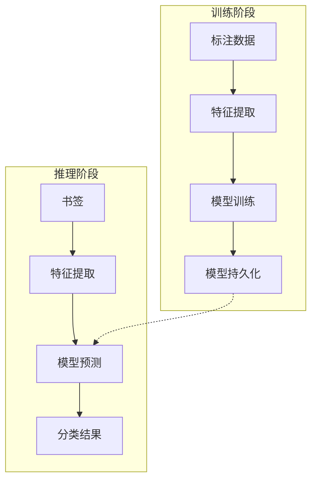
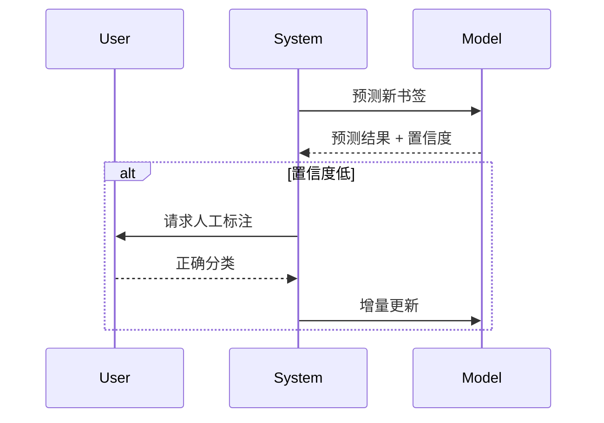

# ML 分类器

ML 分类器使用 **机器学习模型** 对书签进行分类，作为规则引擎的补充，处理规则无法覆盖的书签。

## 架构设计



## 特征工程

### 文本特征

从书签标题、URL、描述中提取特征：

```python
class BookmarkFeatures:
    """书签特征提取"""
    
    def extract(self, bookmark: Bookmark) -> np.ndarray:
        features = []
        
        # 1. TF-IDF 特征
        text = f"{bookmark.title} {bookmark.url} {bookmark.description}"
        tfidf = self.tfidf_vectorizer.transform([text])
        features.append(tfidf.toarray())
        
        # 2. 域名特征
        domain_features = self._extract_domain_features(bookmark.url)
        features.append(domain_features)
        
        # 3. 元数据特征
        meta_features = np.array([
            len(bookmark.title),
            len(bookmark.description),
            bookmark.url.count('/'),
            int(bookmark.url.startswith('https')),
        ])
        features.append(meta_features)
        
        return np.concatenate(features)
```

### 特征维度

| 特征类型 | 维度 | 说明 |
|----------|------|------|
| TF-IDF | 5000 | 文本向量化 |
| 域名编码 | 100 | 域名哈希特征 |
| 元数据 | 10 | 长度、深度等 |

## 模型选择

支持多种分类模型：

### 朴素贝叶斯

```python
from sklearn.naive_bayes import MultinomialNB

model = MultinomialNB(alpha=0.1)
```

**优点**：训练快、内存小  
**缺点**：特征独立假设过强

### 支持向量机

```python
from sklearn.svm import LinearSVC

model = LinearSVC(C=1.0, max_iter=1000)
```

**优点**：高维稀疏数据表现好  
**缺点**：大规模数据训练慢

### 随机森林

```python
from sklearn.ensemble import RandomForestClassifier

model = RandomForestClassifier(
    n_estimators=100,
    max_depth=20,
    n_jobs=-1,
)
```

**优点**：鲁棒性强、可解释性好  
**缺点**：推理较慢

## 增量学习

支持在线更新模型：

```python
class IncrementalTrainer:
    """增量训练器"""
    
    def partial_fit(self, X: np.ndarray, y: np.ndarray):
        """增量训练"""
        self.model.partial_fit(X, y, classes=self.classes_)
        
    def update_from_feedback(self, feedback: List[Feedback]):
        """从用户反馈更新"""
        X = [self.extract_features(f.bookmark) for f in feedback]
        y = [f.correct_category for f in feedback]
        self.partial_fit(X, y)
```

### 主动学习



```python
class ActiveLearningEngine:
    """主动学习引擎"""
    
    UNCERTAINTY_THRESHOLD = 0.7
    
    def should_request_feedback(self, result: ClassificationResult) -> bool:
        """判断是否需要请求用户反馈"""
        return result.confidence < self.UNCERTAINTY_THRESHOLD
    
    def select_samples(self, results: List[ClassificationResult]) -> List[int]:
        """选择最有价值的样本进行标注（熵采样）"""
        entropies = [self._entropy(r.probabilities) for r in results]
        return np.argsort(entropies)[-10:]  # 选择熵最高的 10 个
```

## 模型评估

### 评估指标

```python
from sklearn.metrics import classification_report

y_pred = model.predict(X_test)
print(classification_report(y_test, y_pred))
```

```
              precision    recall  f1-score   support

         开发       0.92      0.88      0.90       156
         设计       0.89      0.85      0.87        98
         学习       0.85      0.91      0.88       124
         工具       0.87      0.82      0.84        67

    accuracy                           0.87       445
   macro avg       0.88      0.87      0.87       445
weighted avg       0.87      0.87      0.87       445
```

### 交叉验证

```python
from sklearn.model_selection import cross_val_score

scores = cross_val_score(model, X, y, cv=5)
print(f"CV Accuracy: {scores.mean():.3f} (+/- {scores.std():.3f})")
```

## 置信度校准

使用 Platt Scaling 校准置信度：

```python
from sklearn.calibration import CalibratedClassifierCV

calibrated_model = CalibratedClassifierCV(
    base_estimator=model,
    method='sigmoid',
    cv='prefit',
)
calibrated_model.fit(X_calib, y_calib)
```

**校准前后对比**：
| 状态 | ECE (Expected Calibration Error) |
|------|----------------------------------|
| 校准前 | 0.12 |
| 校准后 | 0.04 |

## 性能基准

| 模型 | 训练时间 | 推理延迟 | 准确率 | 内存 |
|------|----------|----------|--------|------|
| Naive Bayes | 0.5s | 0.1ms | 82% | 5MB |
| Linear SVM | 2s | 0.2ms | 87% | 10MB |
| Random Forest | 10s | 1ms | 89% | 50MB |

## 相关文档

- [规则引擎](/zh/algorithms/rule-engine) - 规则分类
- [融合算法](/zh/algorithms/fusion) - 多分类器融合
- [语义分析器](/zh/algorithms/semantic-analyzer) - 语义特征
