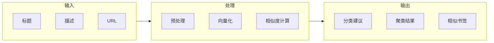
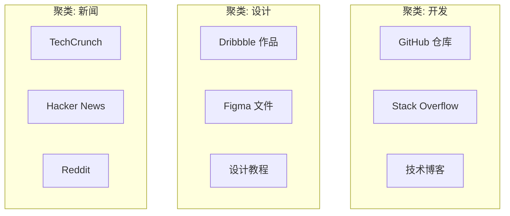

# 语义分析器

语义分析器通过 **TF-IDF** 或 **Sentence Transformers** 提取书签的语义特征，用于相似度计算和分类增强。

## 概述



## 向量化方法

### TF-IDF

传统词频统计方法：

```python
from sklearn.feature_extraction.text import TfidfVectorizer

class TFIDFAnalyzer:
    """TF-IDF 语义分析"""
    
    def __init__(self, max_features: int = 5000):
        self.vectorizer = TfidfVectorizer(
            max_features=max_features,
            ngram_range=(1, 2),  # 1-gram 和 2-gram
            min_df=2,
            max_df=0.95,
            sublinear_tf=True,   # 1 + log(tf)
        )
    
    def fit(self, texts: List[str]):
        """训练向量化器"""
        self.vectorizer.fit(texts)
    
    def transform(self, texts: List[str]) -> np.ndarray:
        """转换为 TF-IDF 向量"""
        return self.vectorizer.transform(texts)
    
    def similarity(self, vec1: np.ndarray, vec2: np.ndarray) -> float:
        """计算余弦相似度"""
        return cosine_similarity(vec1, vec2)[0][0]
```

**优点**：快速、可解释、无需 GPU  
**缺点**：无法捕获词序和语义

### Sentence Transformers

基于预训练模型的语义向量化：

```python
from sentence_transformers import SentenceTransformer

class EmbeddingAnalyzer:
    """Sentence Transformers 语义分析"""
    
    def __init__(self, model_name: str = "all-MiniLM-L6-v2"):
        self.model = SentenceTransformer(model_name)
    
    def encode(self, texts: List[str]) -> np.ndarray:
        """编码为语义向量"""
        return self.model.encode(
            texts,
            batch_size=32,
            show_progress_bar=False,
        )
    
    def similarity(self, emb1: np.ndarray, emb2: np.ndarray) -> float:
        """计算语义相似度"""
        return cosine_similarity([emb1], [emb2])[0][0]
```

**模型选择**：
| 模型 | 维度 | 速度 | 质量 |
|------|------|------|------|
| all-MiniLM-L6-v2 | 384 | 快 | 好 |
| all-mpnet-base-v2 | 768 | 中 | 很好 |
| paraphrase-multilingual | 768 | 中 | 多语言 |

## 语义特征提取

```python
class SemanticAnalyzer:
    """语义分析器"""
    
    def __init__(self, config: Dict):
        self.use_transformers = config.get("use_transformers", False)
        if self.use_transformers:
            self.encoder = EmbeddingAnalyzer()
        else:
            self.encoder = TFIDFAnalyzer()
    
    def extract_features(self, bookmark: Bookmark) -> np.ndarray:
        """提取书签语义特征"""
        # 组合文本
        text = self._combine_text(bookmark)
        
        # 向量化
        return self.encoder.encode([text])[0]
    
    def _combine_text(self, bookmark: Bookmark) -> str:
        """组合书签文本"""
        parts = [
            bookmark.title or "",
            bookmark.description or "",
            self._url_to_text(bookmark.url),
        ]
        return " ".join(filter(None, parts))
    
    def _url_to_text(self, url: str) -> str:
        """将 URL 转换为可读文本"""
        from urllib.parse import urlparse
        parsed = urlparse(url)
        # 提取域名和路径
        return f"{parsed.netloc} {parsed.path.replace('/', ' ')}"
```

## 聚类分析

使用语义向量进行书签聚类：

```python
from sklearn.cluster import KMeans, DBSCAN

class BookmarkClusterer:
    """书签聚类器"""
    
    def cluster_kmeans(
        self,
        embeddings: np.ndarray,
        n_clusters: int,
    ) -> np.ndarray:
        """K-Means 聚类"""
        kmeans = KMeans(
            n_clusters=n_clusters,
            random_state=42,
            n_init=10,
        )
        return kmeans.fit_predict(embeddings)
    
    def cluster_dbscan(
        self,
        embeddings: np.ndarray,
        eps: float = 0.5,
        min_samples: int = 5,
    ) -> np.ndarray:
        """DBSCAN 密度聚类"""
        dbscan = DBSCAN(eps=eps, min_samples=min_samples)
        return dbscan.fit_predict(embeddings)
```

### 聚类可视化



## 相似书签检测

```python
class SimilarityDetector:
    """相似书签检测器"""
    
    def __init__(self, threshold: float = 0.85):
        self.threshold = threshold
    
    def find_similar(
        self,
        target: Bookmark,
        candidates: List[Bookmark],
        top_k: int = 5,
    ) -> List[Tuple[Bookmark, float]]:
        """找出最相似的书签"""
        target_emb = self.analyzer.extract_features(target)
        
        similarities = []
        for candidate in candidates:
            cand_emb = self.analyzer.extract_features(candidate)
            sim = self.analyzer.similarity(target_emb, cand_emb)
            if sim >= self.threshold:
                similarities.append((candidate, sim))
        
        # 按相似度排序
        similarities.sort(key=lambda x: x[1], reverse=True)
        return similarities[:top_k]
```

## 用于分类增强

语义分析器可以为分类器提供额外特征：

```python
class SemanticEnhancedClassifier:
    """语义增强分类器"""
    
    def classify(self, bookmark: Bookmark) -> ClassificationResult:
        # 1. 基础分类
        base_result = self.base_classifier.classify(bookmark)
        
        # 2. 语义增强
        if base_result.confidence < 0.8:
            semantic_features = self.analyzer.extract_features(bookmark)
            semantic_result = self._classify_by_similarity(
                bookmark, semantic_features
            )
            
            # 融合结果
            return self._fuse_results(base_result, semantic_result)
        
        return base_result
    
    def _classify_by_similarity(
        self,
        bookmark: Bookmark,
        embedding: np.ndarray,
    ) -> ClassificationResult:
        """基于相似度的分类"""
        # 找到最相似的已标注书签
        similar = self.index.search(embedding, k=5)
        
        # 投票决定分类
        votes = {}
        for bm, score in similar:
            category = bm.category
            votes[category] = votes.get(category, 0) + score
        
        best_category = max(votes, key=votes.get)
        confidence = votes[best_category] / sum(votes.values())
        
        return ClassificationResult(best_category, confidence, "semantic")
```

## 性能对比

| 方法 | 向量维度 | 编码延迟 | 内存/书签 | 语义质量 |
|------|----------|----------|-----------|----------|
| TF-IDF | 5000 | 0.1ms | 40KB | 中 |
| MiniLM | 384 | 2ms | 3KB | 高 |
| MPNet | 768 | 5ms | 6KB | 很高 |

## 相关文档

- [ML 分类器](/zh/algorithms/ml-classifier) - 机器学习分类
- [融合算法](/zh/algorithms/fusion) - 多分类器融合
- [性能优化](/zh/performance/optimization) - 性能调优
