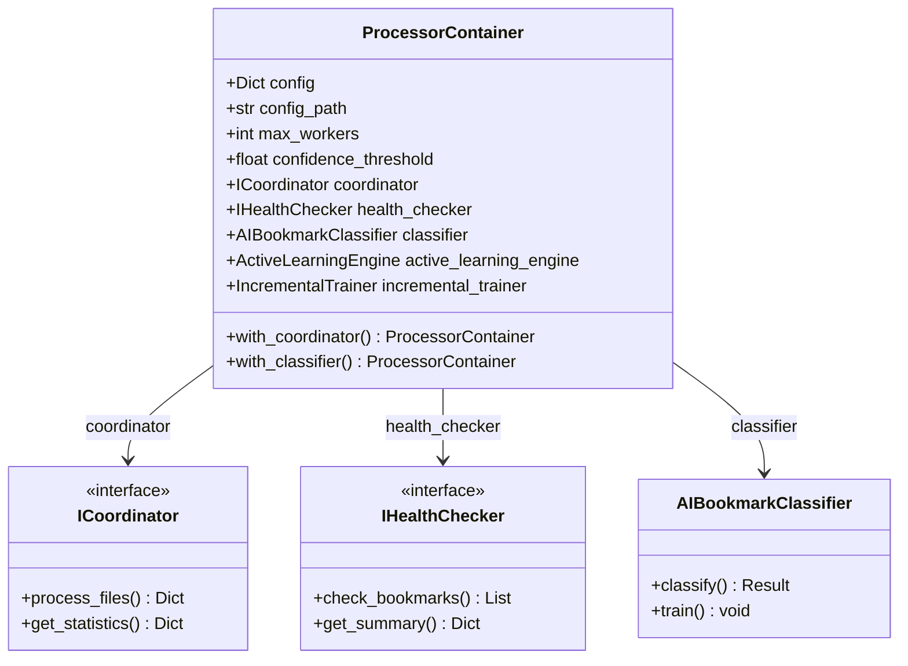
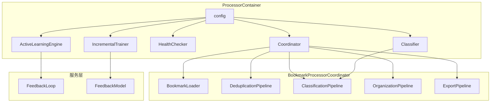
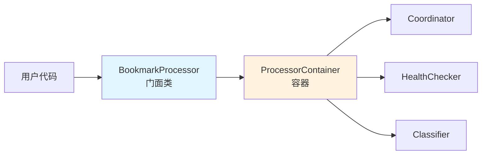

# 依赖注入容器

Bookmarks Cleaner 使用 **ProcessorContainer** 作为依赖注入容器，集中管理所有组件的生命周期和依赖关系。

## 设计理念

采用 **IoC（控制反转）** 模式，通过 `dataclass` 实现轻量级容器：

- **延迟创建**：组件按需初始化，减少启动开销
- **依赖注入**：组件间解耦，便于测试和替换
- **链式替换**：支持运行时组件替换

## 容器结构



## 核心实现

```python
@dataclasses.dataclass
class ProcessorContainer:
    """处理器组件容器"""
    
    # 配置
    config: Dict[str, Any]
    config_path: Optional[str] = None
    max_workers: int = 4
    confidence_threshold: Optional[float] = None
    
    # 可注入组件（延迟创建）
    _coordinator: Optional["ICoordinator"] = None
    _health_checker: Optional["IHealthChecker"] = None
    _classifier: Optional[Any] = None
    _active_learning_engine: Optional[Any] = None
    _incremental_trainer: Optional[Any] = None
    
    @property
    def coordinator(self) -> "ICoordinator":
        """获取协调器（延迟创建）"""
        if self._coordinator is None:
            from src.pipelines.coordinator import BookmarkProcessorCoordinator
            self._coordinator = BookmarkProcessorCoordinator(
                config=self.config,
                classifier=self.classifier,
                max_workers=self.max_workers,
            )
        return self._coordinator
```

## 使用示例

### 默认创建

```python
# 使用默认组件
container = ProcessorContainer(
    config={"category_rules": {...}},
    config_path="config.json",
)

# 访问组件
stats = container.coordinator.process_files(["bookmarks.html"])
```

### 依赖注入（测试）

```python
from unittest.mock import Mock

# 注入 Mock 组件
mock_coordinator = Mock()
mock_coordinator.process_files.return_value = {"processed": 100}

container = ProcessorContainer(
    config={},
    _coordinator=mock_coordinator,
)

# 使用 Mock
result = container.coordinator.process_files([])
assert result["processed"] == 100
```

### 链式替换

```python
# 链式替换组件
container = ProcessorContainer(config={}) \
    .with_coordinator(custom_coordinator) \
    .with_classifier(custom_classifier) \
    .with_health_checker(custom_checker)
```

## 组件依赖图



## 延迟初始化的优势

| 特性 | 说明 |
|------|------|
| 启动快 | 只加载必要组件，启动时间 < 100ms |
| 内存省 | 未使用的组件不占用内存 |
| 按需加载 | 可选组件（LLM、ML）仅在启用时加载 |
| 错误隔离 | 组件加载失败不影响其他组件 |

## 配置注入

```python
# 配置合并优先级
config = {
    "category_rules": {...},           # 必需
    "ai_settings": {
        "max_workers": 4,              # 默认
        "enable_learning": True,       # 默认
        "confidence_threshold": 0.7,   # 默认
    },
    "active_learning_settings": {...}, # 可选
    "feedback_loop": {...},            # 可选
}
```

## 与 BookmarkProcessor 的关系



`BookmarkProcessor` 是门面类，对外提供简洁 API，内部委托给 `ProcessorContainer` 管理的组件。

## 相关文档

- [Pipeline 架构](/zh/architecture/pipeline) - 处理管道设计
- [Protocol 接口](/zh/architecture/protocols) - 接口定义
- [ML 分类器](/zh/algorithms/ml-classifier) - 分类器实现
