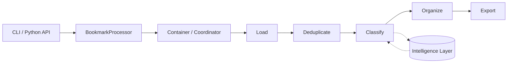
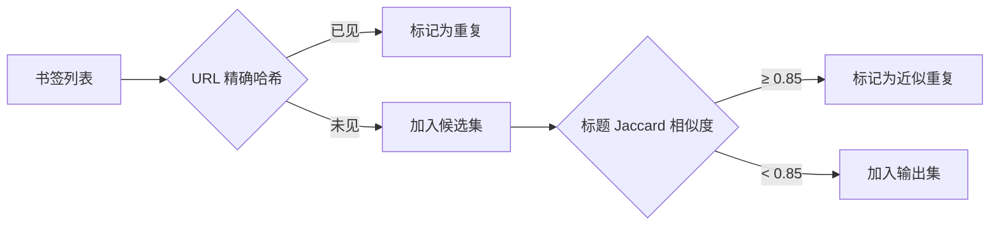
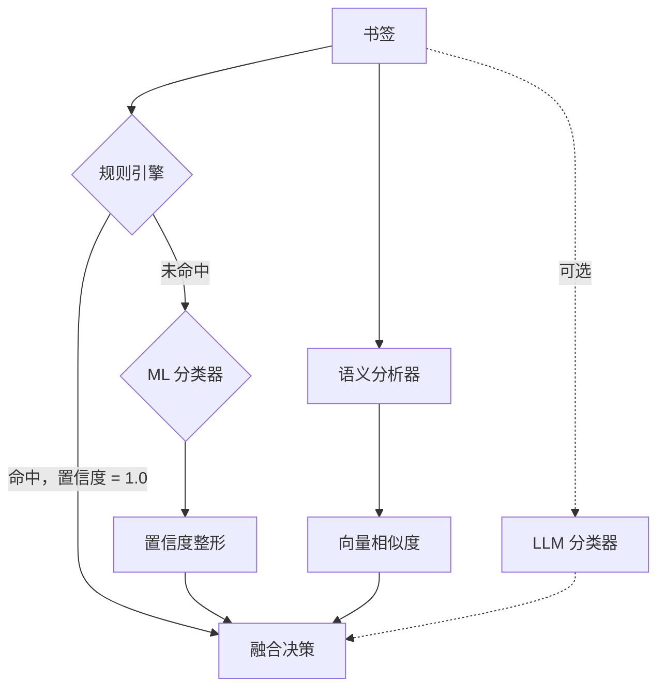
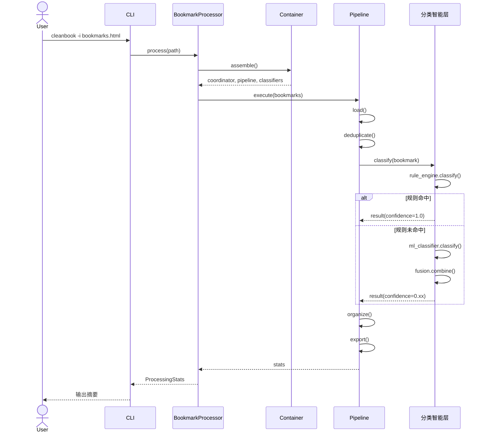

# Pipeline 架构

Bookmarks Cleaner 把处理流程当作一个运行时流水线，而不是一堆散落的工具函数。这一点非常关键，因为后续的可观测性、可扩展性和回退行为，都依赖于这些被清晰命名的交接点。

<PipelineVisualizer />

## 运行时分层

### 入口与协调

运行时从 CLI 或薄 Python 入口开始。`BookmarkProcessor` 负责承担门面角色，而容器与协调器负责组合依赖与调度执行顺序。这样做的好处是：即使内部执行图发生变化，对外入口仍然可以保持稳定。

### 处理流水线

维护中的处理阶段如下：

1. **加载**：把浏览器书签导出文件解析为统一内部表示。
2. **去重**：在分类之前先消除精确或近似重复，避免噪声被后续阶段放大。
3. **分类**：把书签送入规则优先的智能分类栈。
4. **组织**：把标签和置信度转换为目录结构决策。
5. **导出**：输出清洗后的 HTML、JSON 与 Markdown 工件。



### 智能层

分类被刻意与外层流水线拆分开，因为它是系统里变化最快的一层。规则引擎先处理已知模式，再由 ML、语义分析与可选 LLM 为不确定样本提供额外信号，最后由融合层把这些异构信号收束成一个决策包络。

### 输出层

输出层不只是序列化，它还是工具最重要的信任界面：

- **HTML** 方便人工检查；
- **JSON** 方便下游工具继续消费；
- **Markdown** 方便生成叙述型报告与仓库内审查材料。

## 阶段间数据契约

每个阶段都对输入和输出的数据形态有明确的约定。这些契约使得阶段内部实现可以被独立替换，而不会破坏整条流水线。

### 核心数据类型

```python
from dataclasses import dataclass, field
from typing import Optional

@dataclass
class Bookmark:
    """加载阶段输出，后续阶段的基础输入。"""
    url: str
    title: str
    description: str = ''
    add_date: Optional[int] = None          # Unix timestamp
    tags: list[str] = field(default_factory=list)

@dataclass
class ClassificationResult:
    """分类阶段输出，组织阶段的输入。"""
    bookmark: Bookmark
    category: str
    confidence: float                       # [0.0, 1.0] 校准后
    source: str                             # 'rule' | 'ml' | 'semantic' | 'llm' | 'fusion'
    alternatives: list[tuple[str, float]] = field(default_factory=list)

@dataclass
class OrganizedBookmark:
    """组织阶段输出，导出阶段的输入。"""
    result: ClassificationResult
    directory_path: list[str]               # ['开发', 'Python', '教程']
    is_duplicate: bool = False
```

### 阶段数据流动矩阵

| 阶段 | 输入类型 | 输出类型 | 关键操作 |
|------|---------|---------|---------|
| 加载 | `str` (文件路径) | `list[Bookmark]` | HTML 解析、URL 归一化 |
| 去重 | `list[Bookmark]` | `list[Bookmark]` | 哈希比对、相似度过滤 |
| 分类 | `list[Bookmark]` | `list[ClassificationResult]` | 智能栈调度、融合 |
| 组织 | `list[ClassificationResult]` | `list[OrganizedBookmark]` | 目录树决策 |
| 导出 | `list[OrganizedBookmark]` | `None` (写磁盘) | 序列化到 HTML/JSON/MD |

## 阶段详解

### 加载阶段

加载阶段的职责是把任意格式的书签导出文件，转换为系统内部可以安全处理的 `Bookmark` 对象列表。

```python
class BookmarkLoader:
    """基于 Protocol 的加载接口。"""

    def load(self, path: str) -> list[Bookmark]:
        suffix = Path(path).suffix.lower()
        if suffix == '.html':
            return self._parse_html(path)
        elif suffix == '.json':
            return self._parse_json(path)
        raise UnsupportedFormatError(f'Unsupported format: {suffix}')

    def _parse_html(self, path: str) -> list[Bookmark]:
        """使用 BeautifulSoup 解析 Netscape 书签格式。"""
        content = Path(path).read_text(encoding='utf-8', errors='replace')
        soup = BeautifulSoup(content, 'html.parser')
        return [
            Bookmark(
                url=a['href'],
                title=a.get_text(strip=True),
                add_date=int(a.get('add_date', 0) or 0),
            )
            for a in soup.find_all('a', href=True)
            if a.get('href', '').startswith(('http://', 'https://'))
        ]
```

**边界检查**：加载阶段只处理 `http://` 和 `https://` 协议，拒绝 `file://`、`javascript:` 等非 Web 书签。

### 去重阶段

去重阶段分两步进行：精确去重（URL 哈希）和近似去重（标题相似度）。



近似去重使用 Jaccard 相似度（分词后的 token 集合交集/并集），阈值默认为 0.85，用户可通过 `config.json` 调整。

### 分类阶段

分类阶段是整个流水线中最复杂的一段，它自身就是一个微型的多策略决策系统。详见 [融合算法](/zh/algorithms/fusion)。



规则引擎的短路优化是性能关键路径：一旦规则命中，系统直接跳过所有概率型分类器，节省约 65% 的平均单书签处理时间。

### 组织阶段

组织阶段把分类标签转换为目录树决策。它实现了两个子策略：

1. **深度优先**（默认）：按类别层级逐层深入，生成深目录。
2. **宽度优先**：展平目录层级，生成扁平结构。

```python
class BookmarkOrganizer:
    def organize(
        self,
        results: list[ClassificationResult],
        taxonomy: TaxonomyConfig,
        strategy: Literal['depth_first', 'breadth_first'] = 'depth_first',
    ) -> list[OrganizedBookmark]:
        ...
```

### 导出阶段

导出阶段实现了三种序列化后端：

| 格式 | 用途 | 实现特点 |
|------|------|---------|
| HTML | 直接导入浏览器 | 保留 Netscape 书签格式兼容性 |
| JSON | 机器消费 | 包含置信度、来源等元数据 |
| Markdown | 人工审查、仓库文档 | 树形目录 + 按分类排列的表格 |

## 序列图：从 CLI 到导出

以下序列图展示一次完整处理流的调用链：



## 故障隔离与回退

流水线同时也是故障边界：

- 输入格式异常，应在智能层启动之前暴露；
- 可选智能模块异常，应缩窄分类能力，而不是抹掉整个运行过程；
- 导出失败，应发生在"结果已经形成"之后，而不是反向污染前面阶段。

### 故障注入测试矩阵

| 故障场景 | 预期行为 | 测试覆盖 |
|---------|---------|---------|
| 文件不存在 | `FileNotFoundError` at load stage | `test_load_missing_file` |
| HTML 格式损坏 | 跳过无效条目，处理余下 | `test_load_malformed_html` |
| ML 模型文件缺失 | 降级至规则模式，发出警告 | `test_classify_no_ml_model` |
| LLM 端点超时 | 跳过 LLM 层，继续融合 | `test_llm_timeout_fallback` |
| 置信度全为 0 | 输出 `category='unknown'` | `test_all_zero_confidence` |
| 磁盘写入失败 | 导出阶段报错，前置结果保留 | `test_export_write_error` |

## 为什么这种形态重要

如果没有显式阶段，仓库最终就会回到上帝类模式：所有逻辑互相调用，测试成本飙升，任何改动都要求维护者重新理解整个程序。今天的 Pipeline 因而不只是一个实现细节，而是这个项目最重要的可维护性保证之一。

边界命名得越清楚，代码库就越容易被安全修改：

- 加载 bug 不应伪装成融合 bug；
- 导出问题不应反过来迫使维护者重读分类器实现；
- 新增分类器不应要求修改组织或导出逻辑。

参见 [演进思考](/zh/evolution) 了解从上帝类到当前形态的完整演化路径。
