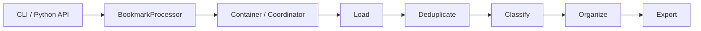

# Pipeline 架构

Bookmarks Cleaner 把处理流程当作一个运行时流水线，而不是一堆散落的工具函数。这一点非常关键，因为后续的可观测性、可扩展性和回退行为，都依赖于这些被清晰命名的交接点。

## 运行时分层

### 入口与协调

运行时从 CLI 或薄 Python 入口开始。`BookmarkProcessor` 负责承担门面角色，而容器与协调器负责组合依赖与调度执行顺序。这样做的好处是：即使内部执行图发生变化，对外入口仍然可以保持稳定。

### 处理流水线

维护中的处理阶段如下：

1. **加载**：把浏览器书签导出文件解析为统一内部表示。
2. **去重**：在分类之前先消除精确或近似重复，避免噪声被后续阶段放大。
3. **分类**：把书签送入规则优先的智能分类栈。
4. **组织**：把标签和置信度转换为目录结构决策。
5. **导出**：输出清洗后的 HTML、JSON 与 Markdown 工件。

### 智能层

分类被刻意与外层流水线拆分开，因为它是系统里变化最快的一层。规则引擎先处理已知模式，再由 ML、语义分析与可选 LLM 为不确定样本提供额外信号，最后由融合层把这些异构信号收束成一个决策包络。

### 输出层

输出层不只是序列化，它还是工具最重要的信任界面：

- **HTML** 方便人工检查；
- **JSON** 方便下游工具继续消费；
- **Markdown** 方便生成叙述型报告与仓库内审查材料。

## 数据交接

每个阶段都在缩窄或丰富数据：

| 阶段 | 输入形态 | 输出效果 |
|------|----------|----------|
| 加载 | 原始导出文件 | 归一化后的书签对象 |
| 去重 | 书签对象集合 | 更干净、更少噪声的数据集 |
| 分类 | 清洗后的书签 | 标签、置信度与来源信息 |
| 组织 | 已分类书签 | 目录放置决策 |
| 导出 | 结构化结果模型 | 可审计的最终工件 |

这套形态的意义在于约束问题定位范围。加载 bug 不应伪装成融合 bug，导出问题也不应反过来迫使维护者重读分类器实现。

## 故障隔离

流水线同时也是故障边界：

- 输入格式异常，应在智能层启动之前暴露；
- 可选智能模块异常，应缩窄分类能力，而不是抹掉整个运行过程；
- 导出失败，应发生在“结果已经形成”之后，而不是反向污染前面阶段。

边界命名得越清楚，代码库就越容易被安全修改。

## 为什么这种形态重要

如果没有显式阶段，仓库最终就会回到上帝类模式：所有逻辑互相调用，测试成本飙升，任何改动都要求维护者重新理解整个程序。今天的 Pipeline 因而不只是一个实现细节，而是这个项目最重要的可维护性保证之一。
