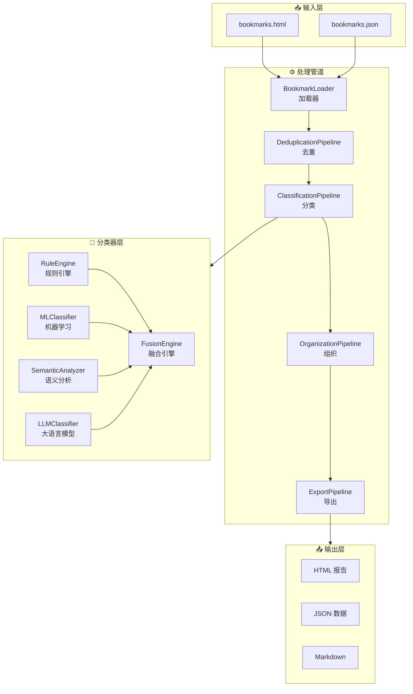
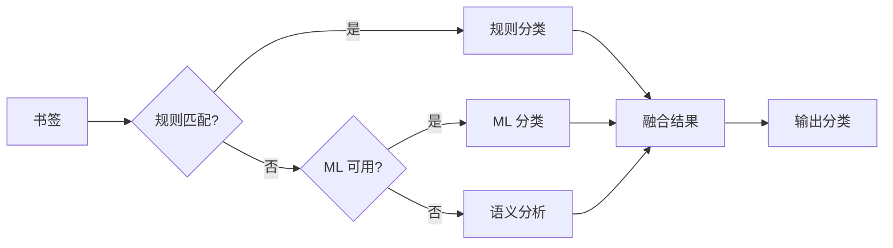
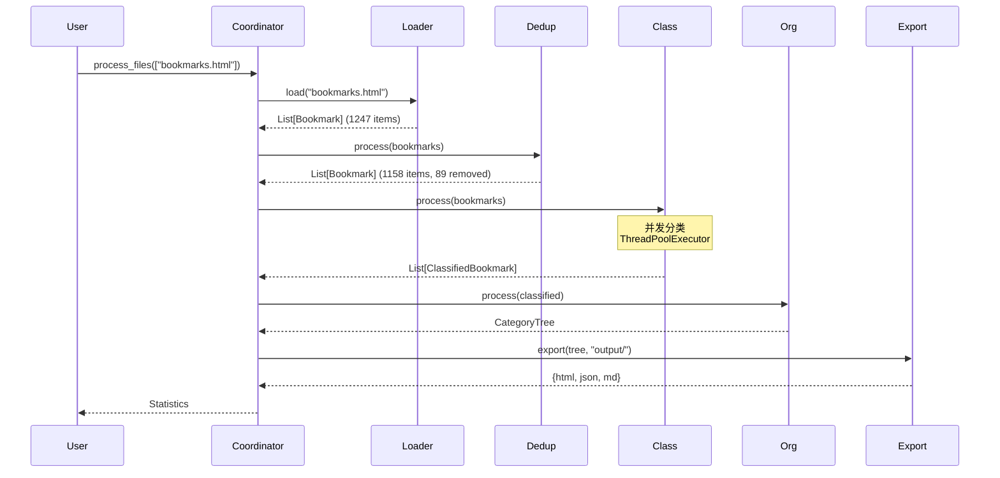

# Pipeline 架构

Bookmarks Cleaner 采用 **5 阶段 Pipeline 架构**，通过 `BookmarkProcessorCoordinator` 协调各个 Pipeline 的执行顺序和数据流转。

## 架构概览



## 5 阶段详解

### 1. BookmarkLoader（加载阶段）

**职责**：解析浏览器导出的书签文件，转换为统一的内部数据结构。

```python
class BookmarkLoader:
    def load(self, file_path: str) -> List[Dict]:
        """加载书签文件，支持 HTML/JSON 格式"""
        
    def _parse_html(self, content: str) -> List[Dict]:
        """解析 Netscape Bookmark 格式"""
        
    def _normalize(self, bookmarks: List[Dict]) -> List[Bookmark]:
        """标准化书签数据"""
```

**支持的格式**：
- Chrome/Edge HTML 导出
- Firefox JSON 备份
- Safari HTML 书签

### 2. DeduplicationPipeline（去重阶段）

**职责**：识别并处理重复书签，减少数据冗余。

```python
class DeduplicationPipeline:
    def process(self, bookmarks: List[Bookmark]) -> List[Bookmark]:
        """执行去重流程"""
        
    def _by_url(self, bookmarks: List[Bookmark]) -> List[Bookmark]:
        """URL 完全匹配去重"""
        
    def _by_similarity(self, bookmarks: List[Bookmark]) -> List[Bookmark]:
        """相似度去重（可选）"""
```

**去重策略**：
| 策略 | 描述 | 性能 |
|------|------|------|
| URL 精确匹配 | 比较规范化后的 URL | O(n) |
| 域名+路径匹配 | 忽略查询参数差异 | O(n) |
| 语义相似度 | 计算标题/描述相似度 | O(n²) |

### 3. ClassificationPipeline（分类阶段）

**职责**：为每个书签分配一个或多个分类标签。

```python
class ClassificationPipeline:
    def __init__(self, classifier: AIBookmarkClassifier):
        self.classifier = classifier
        
    def process(self, bookmarks: List[Bookmark]) -> List[ClassifiedBookmark]:
        """执行分类流程"""
        
    def _batch_classify(self, bookmarks: List[Bookmark]) -> List[Result]:
        """批量分类，利用并发加速"""
```

**分类流程**：


### 4. OrganizationPipeline（组织阶段）

**职责**：根据分类结果组织书签层级结构。

```python
class OrganizationPipeline:
    def process(self, bookmarks: List[ClassifiedBookmark]) -> Dict:
        """组织书签层级结构"""
        
    def _build_tree(self, bookmarks: List[Bookmark]) -> CategoryTree:
        """构建分类树"""
```

**输出结构**：
```
分类树/
├── 技术/
│   ├── 编程语言/
│   │   ├── Python/
│   │   └── JavaScript/
│   └── 框架/
├── 设计/
│   ├── UI/UX/
│   └── 图形设计/
└── 工具/
```

### 5. ExportPipeline（导出阶段）

**职责**：将处理结果导出为多种格式。

```python
class ExportPipeline:
    def export(self, organized: Dict, output_dir: str) -> Dict[str, str]:
        """导出处理结果"""
        
    def _to_html(self, data: Dict) -> str:
        """生成 HTML 报告"""
        
    def _to_json(self, data: Dict) -> str:
        """生成 JSON 数据"""
        
    def _to_markdown(self, data: Dict) -> str:
        """生成 Markdown 文档"""
```

## 数据流转



## 性能特性

| 指标 | 数值 | 说明 |
|------|------|------|
| 处理速度 | 500+ 书签/秒 | 单线程基准 |
| 并发加速 | 4x | 4 线程并发 |
| 内存占用 | < 100MB | 10,000 书签 |
| 启动时间 | < 100ms | 延迟初始化 |

## 扩展点

Pipeline 架构支持灵活扩展：

1. **自定义 Pipeline**：实现 `IPipeline` 接口
2. **中间件模式**：在 Pipeline 之间插入处理逻辑
3. **事件钩子**：`on_before_process`、`on_after_process`

```python
# 自定义 Pipeline 示例
class CustomPipeline(IPipeline):
    def process(self, bookmarks: List[Bookmark]) -> List[Bookmark]:
        # 自定义处理逻辑
        return processed_bookmarks
```

## 相关文档

- [依赖注入容器](/zh/architecture/container) - 组件管理和依赖注入
- [Protocol 接口](/zh/architecture/protocols) - 接口定义和契约
- [融合算法](/zh/algorithms/fusion) - 分类器融合机制
