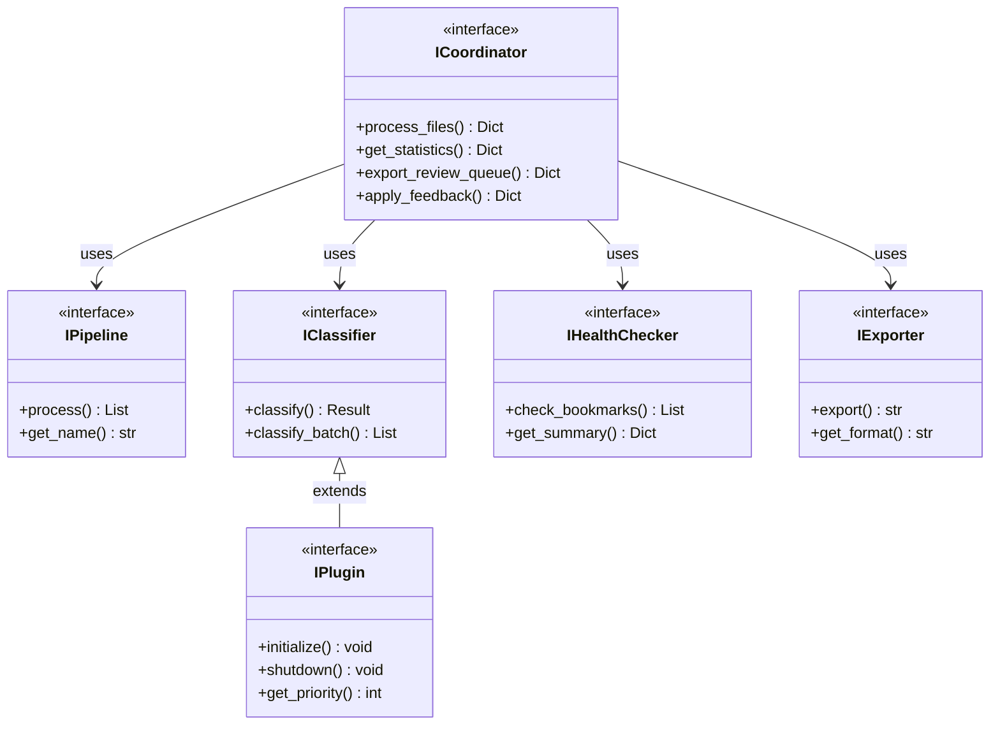
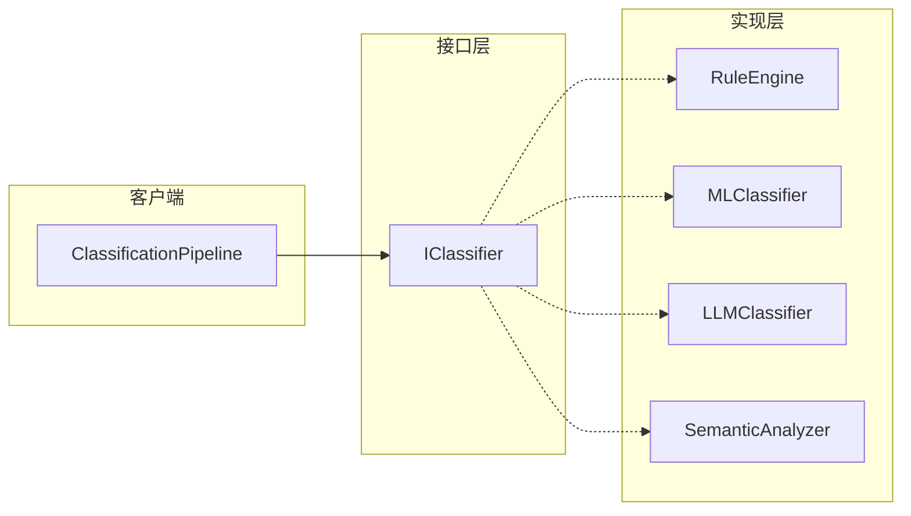

# Protocol 接口

Bookmarks Cleaner 使用 **Python Protocol** 定义核心接口，实现结构化子类型（Structural Subtyping），提供灵活的类型检查和解耦能力。

## 什么是 Protocol

Protocol 是 Python 3.8+ 引入的类型系统特性，允许基于方法/属性的存在与否进行类型检查，而非继承关系。

```python
from typing import Protocol

class IProcessor(Protocol):
    """处理器接口"""
    def process(self, data: List[Dict]) -> List[Dict]: ...
```

**优势**：
- 任何实现了 `process` 方法的类都自动满足 `IProcessor` 接口
- 无需显式继承，降低耦合
- 支持 IDE 自动补全和静态类型检查

## 核心接口定义

### 协调器接口

```python
class ICoordinator(Protocol):
    """处理器协调器接口"""
    
    def process_files(
        self,
        input_files: List[str],
        output_dir: str,
        train_models: bool,
        limit: int,
        review_queue_path: Optional[str],
    ) -> Dict[str, Any]:
        """处理书签文件"""
        ...
    
    def get_statistics(self) -> Dict[str, Any]:
        """获取处理统计"""
        ...
```

### Pipeline 接口

```python
class IPipeline(Protocol):
    """Pipeline 接口"""
    
    def process(self, bookmarks: List[Bookmark]) -> List[Bookmark]:
        """处理书签列表"""
        ...
    
    def get_name(self) -> str:
        """获取 Pipeline 名称"""
        ...
```

### 分类器接口

```python
class IClassifier(Protocol):
    """分类器接口"""
    
    def classify(self, bookmark: Bookmark) -> ClassificationResult:
        """分类单个书签"""
        ...
    
    def classify_batch(
        self, bookmarks: List[Bookmark]
    ) -> List[ClassificationResult]:
        """批量分类"""
        ...
```

### 健康检查接口

```python
class IHealthChecker(Protocol):
    """健康检查器接口"""
    
    def check_bookmarks(
        self, bookmarks: List[Dict]
    ) -> List[HealthCheckResult]:
        """检查书签链接可访问性"""
        ...
    
    def get_summary(
        self, results: List[HealthCheckResult]
    ) -> Dict[str, Any]:
        """生成检查摘要"""
        ...
```

## 接口关系图



## 实现示例

### Pipeline 实现

```python
class DeduplicationPipeline(IPipeline):
    """去重 Pipeline - 隐式实现 IPipeline 接口"""
    
    def __init__(self, config: Dict):
        self.config = config
    
    def process(self, bookmarks: List[Bookmark]) -> List[Bookmark]:
        seen = set()
        result = []
        for bm in bookmarks:
            key = self._normalize_url(bm.url)
            if key not in seen:
                seen.add(key)
                result.append(bm)
        return result
    
    def get_name(self) -> str:
        return "deduplication"
    
    def _normalize_url(self, url: str) -> str:
        # URL 规范化逻辑
        ...
```

### 分类器实现

```python
class RuleEngine(IClassifier):
    """规则引擎 - 隐式实现 IClassifier 接口"""
    
    def __init__(self, rules: Dict):
        self.rules = rules
        self._compiled = self._compile_rules(rules)
    
    def classify(self, bookmark: Bookmark) -> ClassificationResult:
        for pattern, category in self._compiled:
            if pattern.match(bookmark.url):
                return ClassificationResult(
                    category=category,
                    confidence=1.0,
                    source="rule",
                )
        return ClassificationResult(category="未分类", confidence=0.0)
    
    def classify_batch(
        self, bookmarks: List[Bookmark]
    ) -> List[ClassificationResult]:
        return [self.classify(bm) for bm in bookmarks]
```

## 类型检查

使用 `mypy` 进行静态类型检查：

```bash
mypy src/ --strict
```

```python
def process_with_container(container: ProcessorContainer) -> Dict:
    # 类型检查器知道 container.coordinator 满足 ICoordinator
    coordinator: ICoordinator = container.coordinator
    return coordinator.process_files([...])
```

## 接口与实现的解耦



**关键点**：
- 客户端仅依赖 `IClassifier` 接口
- 实现类无需显式声明实现关系
- 可以随时添加新的实现类

## 设计原则

### 接口隔离

每个接口专注于单一职责：

```python
# ❌ 不推荐：大而全的接口
class IBookmarkProcessor(Protocol):
    def load(self): ...
    def dedup(self): ...
    def classify(self): ...
    def export(self): ...
    def health_check(self): ...

# ✅ 推荐：小而专的接口
class ILoader(Protocol):
    def load(self): ...

class IClassifier(Protocol):
    def classify(self): ...

class IExporter(Protocol):
    def export(self): ...
```

### 依赖倒置

高层模块依赖抽象接口，而非具体实现：

```python
# ✅ 依赖抽象
class ClassificationPipeline:
    def __init__(self, classifier: IClassifier):
        self.classifier = classifier  # 任何 IClassifier 实现
    
    def process(self, bookmarks: List[Bookmark]) -> List:
        return self.classifier.classify_batch(bookmarks)
```

## 相关文档

- [Pipeline 架构](/zh/architecture/pipeline) - Pipeline 设计模式
- [依赖注入容器](/zh/architecture/container) - IoC 容器实现
