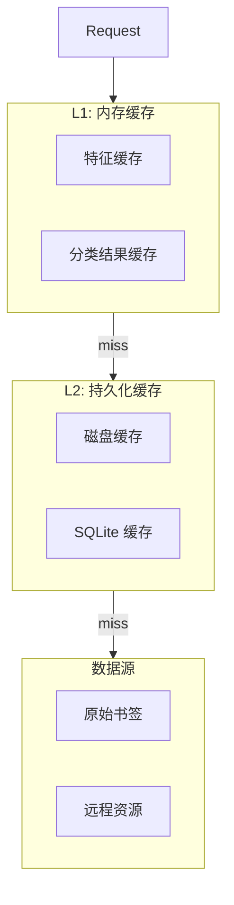

# 缓存策略

Bookmarks Cleaner 实现了多级缓存系统，包括特征缓存、分类结果缓存和嵌入向量缓存。

## 缓存架构



## 缓存类型

### 1. 特征缓存

缓存书签的特征向量：

```python
class FeatureCache:
    """特征缓存"""
    
    def __init__(self, ttl: int = 3600):
        self._cache = TTLCache(maxsize=10000, ttl=ttl)
    
    def get_or_compute(
        self,
        bookmark: Bookmark,
        compute_fn: Callable,
    ) -> np.ndarray:
        """获取或计算特征"""
        key = self._make_key(bookmark)
        
        if key in self._cache:
            return self._cache[key]
        
        features = compute_fn(bookmark)
        self._cache[key] = features
        return features
    
    def _make_key(self, bookmark: Bookmark) -> str:
        return f"{bookmark.url}:{hash(bookmark.title)}"
```

### 2. 分类结果缓存

缓存 LLM 分类结果：

```python
from cachetools import TTLCache

class ClassificationCache:
    """分类结果缓存"""
    
    def __init__(self, ttl_hours: int = 24):
        self._cache = TTLCache(
            maxsize=50000,
            ttl=ttl_hours * 3600,
        )
    
    def get(self, bookmark: Bookmark) -> Optional[ClassificationResult]:
        """获取缓存结果"""
        key = self._make_key(bookmark)
        return self._cache.get(key)
    
    def set(self, bookmark: Bookmark, result: ClassificationResult):
        """设置缓存"""
        key = self._make_key(bookmark)
        self._cache[key] = result
```

### 3. 嵌入向量缓存

缓存 Sentence Transformer 嵌入：

```python
class EmbeddingCache:
    """嵌入向量缓存"""
    
    def __init__(self, cache_dir: str = ".cache/embeddings"):
        self.cache_dir = Path(cache_dir)
        self.cache_dir.mkdir(parents=True, exist_ok=True)
    
    def get(self, text: str) -> Optional[np.ndarray]:
        """获取缓存的嵌入向量"""
        key = hashlib.md5(text.encode()).hexdigest()
        cache_file = self.cache_dir / f"{key}.npy"
        
        if cache_file.exists():
            return np.load(cache_file)
        return None
    
    def set(self, text: str, embedding: np.ndarray):
        """缓存嵌入向量"""
        key = hashlib.md5(text.encode()).hexdigest()
        cache_file = self.cache_dir / f"{key}.npy"
        np.save(cache_file, embedding)
```

## 淘汰策略

### LRU（最近最少使用）

```python
from cachetools import LRUCache

cache = LRUCache(maxsize=10000)
```

**适用场景**：特征缓存、分类结果缓存

### LFU（最不经常使用）

```python
from cachetools import LFUCache

cache = LFUCache(maxsize=5000)
```

**适用场景**：热点数据缓存

### TTL（时间到期）

```python
from cachetools import TTLCache

cache = TTLCache(maxsize=10000, ttl=3600)  # 1小时过期
```

**适用场景**：LLM 响应缓存

## 缓存管理器

```python
class CacheManager:
    """统一缓存管理器"""
    
    def __init__(self, config: Dict):
        self.feature_cache = FeatureCache(
            ttl=config.get("feature_ttl", 3600)
        )
        self.classification_cache = ClassificationCache(
            ttl_hours=config.get("classification_ttl_hours", 24)
        )
        self.embedding_cache = EmbeddingCache(
            cache_dir=config.get("cache_dir", ".cache")
        )
    
    def clear_all(self):
        """清空所有缓存"""
        self.feature_cache._cache.clear()
        self.classification_cache._cache.clear()
        # 删除磁盘缓存
        import shutil
        shutil.rmtree(self.embedding_cache.cache_dir, ignore_errors=True)
    
    def get_stats(self) -> Dict:
        """获取缓存统计"""
        return {
            "feature_cache_size": len(self.feature_cache._cache),
            "classification_cache_size": len(self.classification_cache._cache),
            "embedding_cache_files": len(list(
                self.embedding_cache.cache_dir.glob("*.npy")
            )),
        }
```

## 缓存命中统计

```
缓存统计报告
━━━━━━━━━━━━━━━━━━━━━━━━━━━━━━━━━━━━━━━━━
缓存类型        命中率    命中数    未命中数
━━━━━━━━━━━━━━━━━━━━━━━━━━━━━━━━━━━━━━━━━
特征缓存        78.5%    7,850     2,150
分类结果缓存    65.2%    6,520     3,480
嵌入向量缓存    92.1%    9,210       790
━━━━━━━━━━━━━━━━━━━━━━━━━━━━━━━━━━━━━━━━━
平均缓存延迟: 0.5ms
计算延迟节省: 85%
```

## 配置选项

```json
{
  "cache": {
    "enabled": true,
    "feature_ttl": 3600,
    "classification_ttl_hours": 24,
    "embedding_persistent": true,
    "cache_dir": ".cache",
    "max_memory_size_mb": 100
  }
}
```

## 相关文档

- [并发处理](/zh/performance/concurrency) - 并发优化
- [优化技巧](/zh/performance/optimization) - 性能调优
