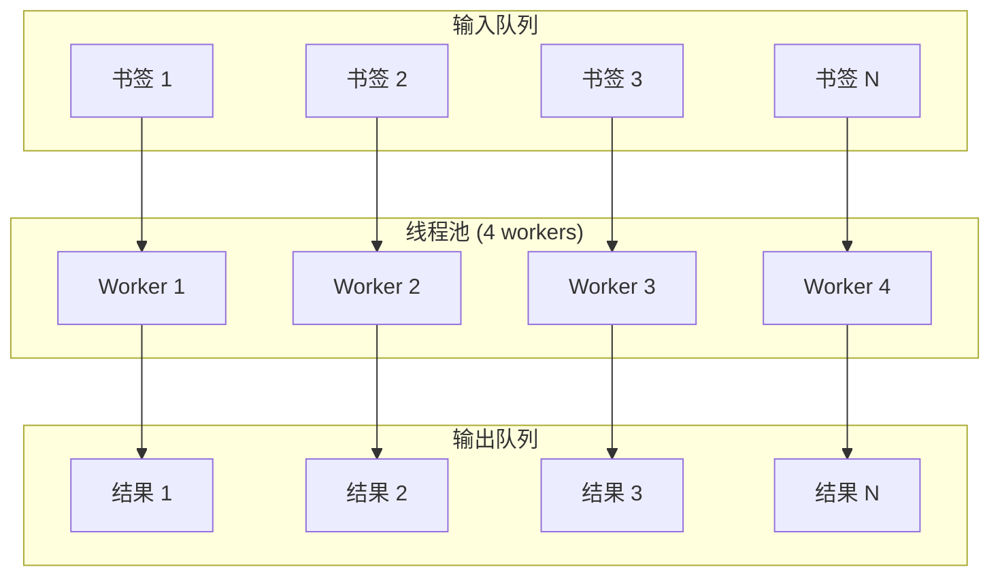

# 并发处理

Bookmarks Cleaner 使用 **ThreadPoolExecutor** 实现并发处理，显著提升大批量书签的处理速度。

## 并发模型



## 实现细节

### 线程池配置

```python
from concurrent.futures import ThreadPoolExecutor, as_completed

class ConcurrentProcessor:
    """并发处理器"""
    
    MAX_WORKERS_LIMIT = 32  # 硬限制
    
    def __init__(self, max_workers: int = 4):
        # 限制最大线程数
        self.max_workers = min(max_workers, self.MAX_WORKERS_LIMIT)
    
    def process_batch(
        self,
        bookmarks: List[Bookmark],
        process_fn: Callable[[Bookmark], Result],
    ) -> List[Result]:
        """并发处理书签批次"""
        results = [None] * len(bookmarks)
        
        with ThreadPoolExecutor(max_workers=self.max_workers) as executor:
            # 提交任务
            future_to_index = {
                executor.submit(process_fn, bm): i
                for i, bm in enumerate(bookmarks)
            }
            
            # 收集结果
            for future in as_completed(future_to_index):
                index = future_to_index[future]
                try:
                    results[index] = future.result()
                except Exception as e:
                    self.logger.error(f"Task {index} failed: {e}")
                    results[index] = Result(error=str(e))
        
        return results
```

### 批处理策略

```python
class BatchProcessor:
    """批处理器"""
    
    BATCH_SIZE = 100  # 每批处理数量
    
    def process_large_dataset(
        self,
        bookmarks: List[Bookmark],
        process_fn: Callable,
    ) -> List[Result]:
        """处理大数据集"""
        all_results = []
        
        # 分批处理
        for i in range(0, len(bookmarks), self.BATCH_SIZE):
            batch = bookmarks[i:i + self.BATCH_SIZE]
            results = self.concurrent_processor.process_batch(batch, process_fn)
            all_results.extend(results)
            
            # 批次间暂停，避免资源耗尽
            if i + self.BATCH_SIZE < len(bookmarks):
                time.sleep(0.1)
        
        return all_results
```

## 性能基准

| 线程数 | 处理速度 (书签/秒) | CPU 使用率 | 内存增量 |
|--------|-------------------|------------|----------|
| 1 | 120 | 25% | 基准 |
| 2 | 230 | 45% | +5% |
| 4 | 420 | 80% | +10% |
| 8 | 650 | 95% | +20% |
| 16 | 720 | 99% | +35% |

**结论**：4-8 线程为最佳性价比，16 线程以上收益递减。

## 线程安全

### 共享状态保护

```python
import threading

class ThreadSafeCounter:
    """线程安全计数器"""
    
    def __init__(self):
        self._value = 0
        self._lock = threading.Lock()
    
    def increment(self, delta: int = 1) -> int:
        with self._lock:
            self._value += delta
            return self._value
    
    def get(self) -> int:
        with self._lock:
            return self._value
```

### 缓存线程安全

```python
class ThreadSafeCache:
    """线程安全缓存"""
    
    def __init__(self, max_size: int = 10000):
        self._cache = {}
        self._lock = threading.RLock()
        self._max_size = max_size
    
    def get(self, key: str) -> Optional[Any]:
        with self._lock:
            return self._cache.get(key)
    
    def set(self, key: str, value: Any) -> None:
        with self._lock:
            if len(self._cache) >= self._max_size:
                # 简单 LRU：删除最早的一半
                keys = list(self._cache.keys())[:self._max_size // 2]
                for k in keys:
                    del self._cache[k]
            self._cache[key] = value
```

## 错误处理

### 超时控制

```python
from concurrent.futures import TimeoutError

def process_with_timeout(
    bookmark: Bookmark,
    timeout: float = 30.0,
) -> Result:
    """带超时的处理"""
    with ThreadPoolExecutor(max_workers=1) as executor:
        future = executor.submit(classify, bookmark)
        try:
            return future.result(timeout=timeout)
        except TimeoutError:
            future.cancel()
            return Result(error="timeout")
```

### 重试机制

```python
def process_with_retry(
    bookmark: Bookmark,
    max_retries: int = 3,
    backoff: float = 1.0,
) -> Result:
    """带重试的处理"""
    last_error = None
    
    for attempt in range(max_retries):
        try:
            return classify(bookmark)
        except Exception as e:
            last_error = e
            time.sleep(backoff * (2 ** attempt))
    
    return Result(error=str(last_error))
```

## 配置建议

```json
{
  "concurrency": {
    "max_workers": 4,
    "batch_size": 100,
    "task_timeout": 30,
    "retry_count": 3
  }
}
```

## 相关文档

- [缓存策略](/zh/performance/caching) - 缓存优化
- [优化技巧](/zh/performance/optimization) - 更多性能优化
