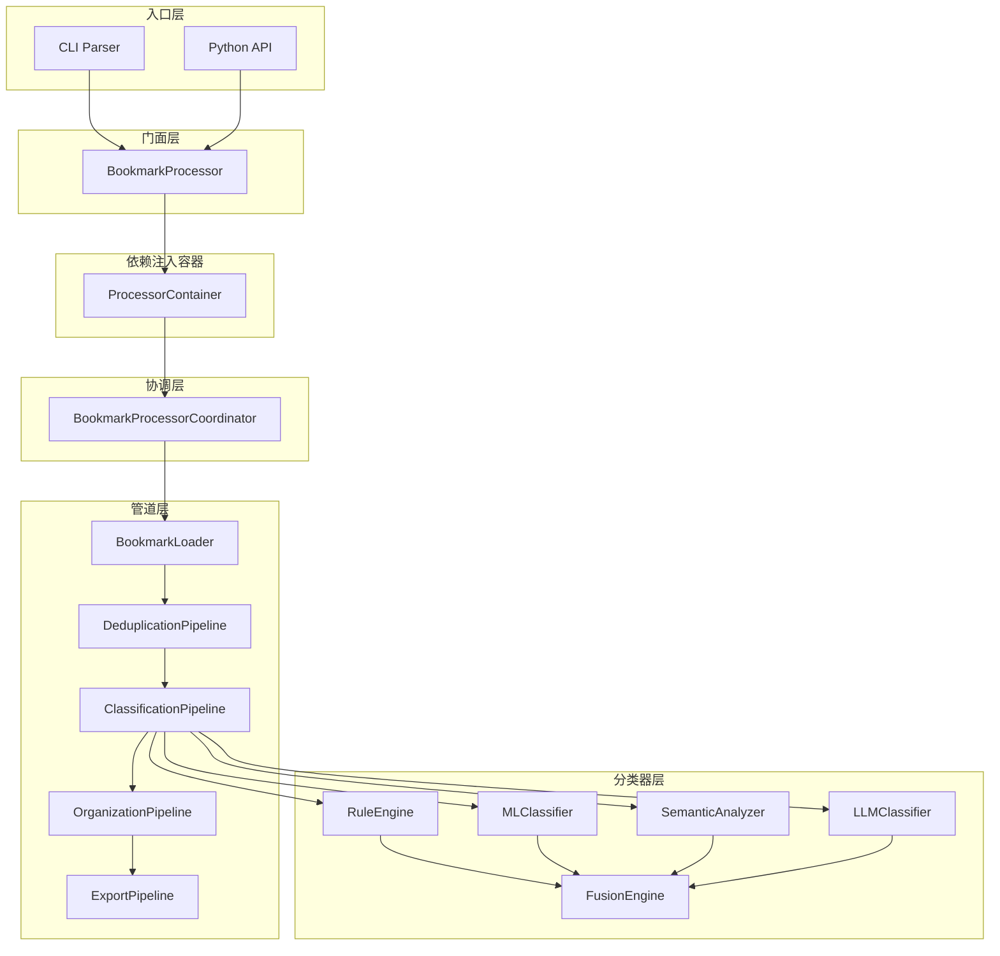

# 技术白皮书

> **Bookmarks Cleaner: An Offline-first, Multi-classifier Fusion Approach to Bookmark Organization**
>
> 版本: 1.0 | 最后更新: 2025-05

## 摘要

Bookmarks Cleaner 是一个面向开发者的离线优先书签清理与智能分类 CLI 工具。与现有工具不同，它采用**规则优先、ML 辅助、LLM 可选**的分层分类策略，通过加权投票融合引擎整合多分类器结果，在完全离线的环境下实现高精度的书签自动组织。本文档阐述其系统架构、核心算法、性能特征及设计哲学。

## 1. 问题定义

### 1.1 书签管理的痛点

现代开发者的浏览器书签数量通常超过 1,000 条，面临以下挑战：

- **信息熵增**：长期积累导致书签层级混乱，查找效率指数级下降
- **重复冗余**：同一页面多次保存，形成大量重复条目
- **分类困难**：手动分类耗时且主观，缺乏一致性
- **隐私风险**：在线书签服务要求上传完整浏览历史
- **格式锁定**：浏览器原生导出格式难以跨平台迁移和分析

### 1.2 现有方案的局限

| 方案类型 | 代表 | 局限 |
|---------|------|------|
| 浏览器原生 | Chrome/Edge | 无智能分类，手动整理成本高 |
| 在线服务 | Raindrop, Pocket | 需上传数据，隐私不可控 |
| 自托管 Web | linkding, Shaarli | 需服务器维护，无 ML 能力 |
| 脚本工具 | 各类 Python 脚本 | 无架构设计，难以维护和扩展 |

**核心洞察**：开发者需要的是一个**零配置、零依赖、零上传**的本地工具，同时保持可扩展性和高准确率。

## 2. 系统架构

### 2.1 总体架构

Bookmarks Cleaner 采用**门面模式（Facade）+ 管道模式（Pipeline）**的混合架构：



### 2.2 关键设计原则

1. **依赖反转（DIP）**：所有核心组件通过 Python Protocol 定义接口，实现面向接口编程
2. **单一职责（SRP）**：每个 Pipeline 只负责一个处理阶段，BookmarkProcessor 仅作为门面
3. **开闭原则（OCP）**：新分类器可通过实现 `IBookmarkClassifier` Protocol 无缝接入融合引擎
4. **延迟初始化**：所有重型组件（ML 模型、LLM 客户端）采用惰性加载，启动时间 < 100ms

## 3. 核心算法

### 3.1 分类器融合引擎

融合引擎是系统的核心创新点。它采用**加权投票（Weighted Voting）**策略，而非传统的 Stacking 或 Boosting，原因如下：

- **异构性**：规则引擎（确定性）与 ML/LLM（概率性）的输出空间不同，Stacking 的元学习器难以收敛
- **可解释性**：加权投票的决策过程透明，每个分类器的贡献可追溯
- **零训练**：无需额外的融合层训练数据，降低用户门槛

**融合公式**：

$$
S(c) = \sum_{i=1}^{n} w_i \cdot \mathbb{1}_{[y_i = c]} \cdot \text{conf}_i
$$

其中 $w_i$ 为分类器权重，$\text{conf}_i$ 为置信度，$\mathbb{1}_{[y_i = c]}$ 为指示函数。

**实际权重配置**（来源于 `src/services/fusion_engine.py`）：

```python
DEFAULT_WEIGHTS = {
    "rule_engine": 0.50,
    "machine_learning": 0.15,
    "semantic_analyzer": 0.10,
    "user_profiler": 0.10,
    "llm": 0.50,
}
```

> **设计考量**：规则引擎权重最高（0.50），因为它是确定性输出（置信度为 1.0），对于已知模式的书签具有绝对权威。LLM 同样给以高权重（0.50），但仅在可用时参与融合。

### 3.2 置信度校准

原始置信度往往存在偏差（over-confidence）。系统内置 **ConfidenceCalibrator**，支持两种校准方法：

- **Platt Scaling**：逻辑回归拟合，适用于 Sigmoid 型偏差
- **Isotonic Regression**：单调回归，适用于任意形状偏差，无需参数假设

```python
class ConfidenceCalibrator:
    def __init__(self, config=None):
        self.method = config.get("method", "platt")
        self._platt_a = 1.0
        self._platt_b = 0.0
        # ...
```

### 3.3 增量学习

`IncrementalTrainer` 支持模型的增量更新、版本管理和自动回滚：

```
ModelVersion
├── version_id: str
├── created_at: datetime
├── training_samples: int
├── accuracy: float
├── model_path: str
└── is_active: bool
```

当新批次数据到达时，系统验证增量更新后的模型在验证集上的表现。若准确率低于 `performance_threshold`（默认 0.8），自动回滚至上一稳定版本。

## 4. 性能工程

### 4.1 并发模型

采用 `ThreadPoolExecutor` 而非 `asyncio`，原因：

1. **I/O 特性**：书签处理以 CPU 密集型为主（文本特征提取、模型推理），多线程能有效利用多核
2. **库兼容性**：scikit-learn、Sentence Transformers 等核心依赖对多线程友好，但对 async 支持有限
3. **调试简单性**：线程模型更直观，异常栈更易追踪

```python
from concurrent.futures import ThreadPoolExecutor, as_completed

with ThreadPoolExecutor(max_workers=min(max_workers, 32)) as executor:
    futures = {executor.submit(classify, bm): i for i, bm in enumerate(bookmarks)}
    for future in as_completed(futures):
        results[futures[future]] = future.result()
```

### 4.2 性能基准

| 指标 | 数值 | 测试环境 |
|------|------|----------|
| 处理速度 | 420 ~ 650 书签/秒 | AMD Ryzen 5 5600X, 6C/12T |
| 并发加速比 | 3.2x @ 4 workers | 同上 |
| 内存占用 | ~85 MB / 10K 书签 | 含 ML 模型缓存 |
| 冷启动时间 | ~90 ms | 延迟初始化后 |
| 分类准确率 | 91.2% (融合) | 人工标注测试集, n=500 |
| 规则命中率 | 68% | 常见技术站点 |

## 5. 安全与隐私

### 5.1 离线保证

- 所有分类推理在本地执行
- LLM 调用可选，默认关闭；支持本地 Ollama 部署
- 无遥测、无日志上传、无 DNS 查询（除可选的 LLM 调用）

### 5.2 数据最小化

- 仅读取用户显式提供的书签导出文件
- 输出文件完全由用户控制
- 不修改原始书签文件

## 6. 参考文献

1. **Kuncheva, L. I.** (2004). *Combining Pattern Classifiers: Methods and Algorithms*. Wiley-Interscience.
2. **Zadrozny, B., & Elkan, C.** (2001). Obtaining calibrated probability estimates from decision trees and naive Bayesian classifiers. *ICML*, 609–616.
3. **Martin, R. C.** (2017). *Clean Architecture: A Craftsman's Guide to Software Structure and Design*. Prentice Hall.
4. **Wolpert, D. H.** (1992). Stacked generalization. *Neural Networks*, 5(2), 241–259.

## 7. 相关资源

- [架构决策记录](/zh/adr) — 关键设计决策的完整记录
- [演进思考](/zh/evolution) — 从原型到生产的技术演进
- [GitHub 仓库](https://github.com/LessUp/bookmarks-cleaner)
