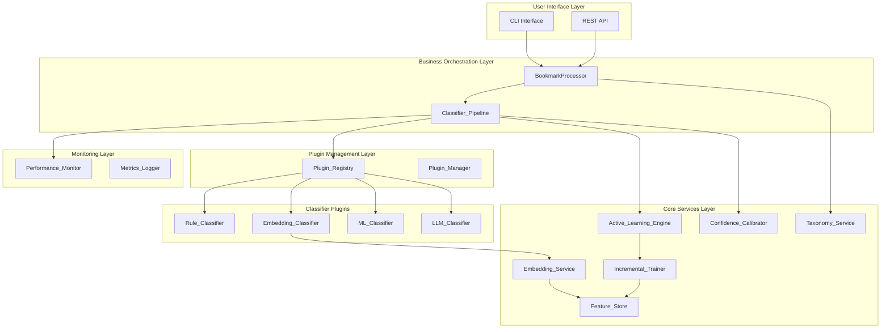
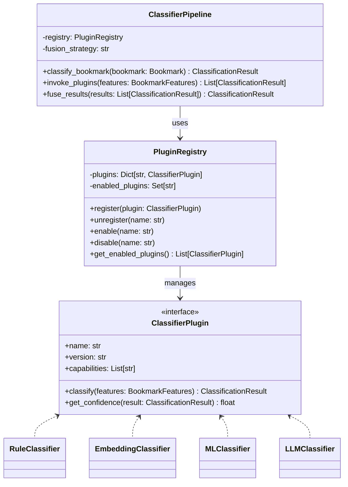

# Design: Architecture Algorithm Upgrade

## Context

The CleanBook system processes browser bookmarks using multiple classification methods. The architecture needs to support:

- Hot-pluggable classifiers without system restart
- Multi-method result fusion with configurable strategies
- Graceful degradation when optional dependencies are unavailable
- Comprehensive performance monitoring

## Goals

1. **Extensibility**: Support hot-pluggable classifiers, exporters, and feature extractors
2. **Accuracy**: Introduce Transformer embeddings and multi-method fusion
3. **Adaptability**: Implement active learning and incremental learning
4. **Performance**: Optimize through feature caching and intelligent scheduling
5. **Observability**: Comprehensive monitoring metrics

## Non-Goals

- REST API (separate change)
- Database persistence (separate change)
- Real-time streaming classification

## Architecture

### Overall Architecture



### Plugin Architecture



## Core Components

### 1. Plugin Registry (`src/plugins/registry.py`)

Manages registration, discovery, and lifecycle of classifier plugins.

**Features:**
- Registration with name, version, capability metadata
- Plugin validation against required interfaces
- Runtime enable/disable without restart
- Configuration-based loading at startup

### 2. Embedding Service (`src/services/embedding_service.py`)

Provides text vectorization using pre-trained multilingual Transformer models.

**Features:**
- sentence-transformers model support
- Dense vector embeddings for titles and URLs
- Caching in Feature_Store
- Graceful degradation to TF-IDF

### 3. Active Learning Engine (`src/services/active_learning.py`)

Identifies low-confidence samples and requests user labeling.

**Features:**
- Configurable confidence threshold
- Queue management for user review
- Entropy-based uncertainty sampling
- Session request limiting

### 4. Incremental Trainer (`src/services/incremental_trainer.py`)

Supports online learning and hot model updates.

**Features:**
- `partial_fit` for online learning
- Configurable batch size trigger
- Model version history for rollback
- Automatic rollback on performance degradation
- Atomic model serialization

### 5. Feature Store (`src/services/feature_store.py`)

Caches and manages feature vectors.

**Features:**
- Persistent vectors with configurable TTL
- Cache lookup to avoid recomputation
- Approximate nearest neighbor search
- LRU eviction policy
- Cache hit rate monitoring

### 6. Confidence Calibrator (`src/services/confidence_calibrator.py`)

Applies calibration to confidence scores.

**Features:**
- Platt scaling and isotonic regression
- Multi-method fusion integration

### 7. Taxonomy Service (`src/services/taxonomy_service.py`)

Manages controlled vocabularies and category mappings.

**Features:**
- YAML configuration loading
- Runtime category addition
- Name validation
- Category rename/merge with propagation

### 8. Performance Monitor (`src/services/performance_monitor.py`)

Tracks comprehensive performance metrics.

**Features:**
- Latency percentiles (p50, p95, p99)
- Per-method accuracy tracking
- Prometheus-compatible export
- Daily quality reports

## Data Models

```python
@dataclass
class BookmarkFeatures:
    url: str
    title: str
    description: Optional[str] = None
    tags: List[str] = field(default_factory=list)
    embedding: Optional[np.ndarray] = None
    extracted_features: Dict[str, Any] = field(default_factory=dict)

@dataclass
class ClassificationResult:
    category: str
    confidence: float
    method: str
    alternatives: List[Tuple[str, float]] = field(default_factory=list)
    metadata: Dict[str, Any] = field(default_factory=dict)
```

## Correctness Properties

1. **Plugin Registration Consistency**: Registered plugin immediately available
2. **Plugin Invocation Order**: Configured priority order
3. **Plugin Failure Isolation**: Failure doesn't affect other plugins
4. **Cache TTL Expiration**: Features expire after TTL
5. **LRU Eviction**: LRU entries evicted first
6. **Embedding Dimensionality**: Same model = same dimensions
7. **Cache Round-Trip**: Cached = computed
8. **Cosine Similarity**: Confidence proportional to similarity
9. **Low-Confidence Detection**: Below threshold = queued
10. **Uncertainty Sampling**: Lower confidence = higher priority
11. **Session Request Limit**: Requests ≤ limit
12. **Feedback Persistence**: Feedback stored for retraining
13. **Incremental Update Trigger**: Batch size triggers update
14. **Model Version History**: All versions maintained
15. **Atomic Serialization**: Updates don't corrupt files
16. **Fusion Strategy**: Applied to all results
17. **Dynamic Weight Adjustment**: Higher accuracy = higher weight
18. **Taxonomy YAML Round-Trip**: Load/save identical
19. **Category Name Validation**: Invalid names rejected
20. **Category Rename Propagation**: Historical classifications updated
21. **Category Merge Completeness**: All bookmarks reassigned
22. **Latency Percentile Accuracy**: Accurate calculation
23. **Latency Alert**: Threshold exceeded = alert
24. **Prometheus Format**: Valid export format
25. **Daily Report Completeness**: All metrics included

## Error Handling

| Error Type | Severity | Recovery |
|------------|----------|----------|
| PluginLoadFailure | High | Log, skip, continue |
| EmbeddingComputationFailure | Medium | Fallback to TF-IDF |
| CacheCorruption | Critical | Rebuild cache |
| ModelUpdateFailure | High | Rollback |
| TaxonomyLoadFailure | Critical | Use default, alert |
| PerformanceDegradation | Medium | Trigger rollback/retrain |

## Risks & Trade-offs

| Risk | Mitigation |
|------|------------|
| Transformer model memory | Lazy loading, TF-IDF fallback |
| Plugin incompatibility | Interface validation at registration |
| Cache inconsistency | TTL + version stamps |
| Model drift | Active learning + monitoring |
