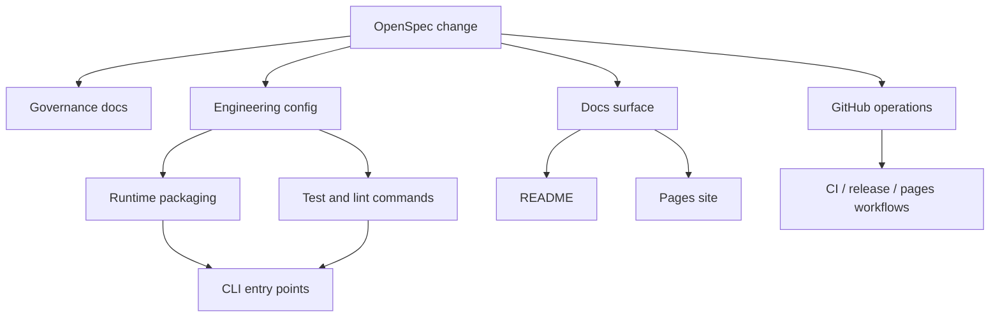

## Context

The repository already contains the core bookmark-classification architecture from RFC 0001 (`src/ai_classifier.py`, `src/bookmark_processor.py`, `src/plugins/`, `src/services/`), but the project surface around that core has drifted. Governance documents disagree on process, legacy `specs/` still compete with `openspec/specs/`, documentation has sprawled, and GitHub automation is noisy while still allowing false-green outcomes. This change is a cross-cutting closeout pass that must simplify the repository without destabilizing the CLI.

## Goals / Non-Goals

**Goals:**
- Make `openspec/` the only active specification workflow.
- Encode a single-maintainer, direct-push development model across project instructions.
- Reduce documentation and automation to a small, high-signal set of maintained assets.
- Ensure packaging, runtime paths, and quality checks reflect the actual supported product.
- Keep existing CLI behavior stable while fixing validated defects found during the closeout sweep.

**Non-Goals:**
- Introduce new end-user product features.
- Build the planned REST API or database layers.
- Preserve redundant docs or automation for archival nostalgia.

## Decisions

### 1. Use one umbrella closeout change, then implement in backlog order
This cleanup spans governance, docs, GitHub, and runtime validation. A single change keeps the rationale, risks, and spec deltas together while the SQL backlog still preserves execution order.

**Alternative considered:** Multiple concurrent changes. Rejected because this closeout pass touches shared files (`README`, `.github/`, specs, tooling configs) and would create unnecessary merge churn.

### 2. Treat OpenSpec as the only normative requirements source
`openspec/specs/` remains authoritative. Legacy `specs/` becomes migration residue only and may be removed or reduced to a breadcrumb.

**Alternative considered:** Keep dual documentation systems. Rejected because it caused the current process drift.

### 3. Optimize for single-maintainer direct push, not PR-first workflows
Governance docs, contributor instructions, and GitHub automation will default to direct pushes on the default branch. Temporary branches or worktrees stay optional for risky refactors only.

**Alternative considered:** Preserve a PR-first process for theoretical future contributors. Rejected because it adds maintenance overhead to a project entering closeout.

### 4. Fail loudly on quality gates
CI, release validation, and local verification guidance must not hide failures with `|| true`. The repository should prefer fewer checks with accurate signal over more checks with weak enforcement.

**Alternative considered:** Keep soft-failing scans for convenience. Rejected because it masks real defects and defeats closeout readiness.

### 5. Collapse docs into a small public surface
README becomes the concise repository entry point; GitHub Pages becomes a product landing page plus essential docs; contributor-facing details live in a minimal set of governance files.

**Alternative considered:** Keep the current large VitePress tree and keep polishing it. Rejected because the maintenance burden is too high for the project's end state.

## Risks / Trade-offs

- **[Risk] Over-pruning useful docs or workflows** → Mitigation: keep only assets that map to a defined capability or active operational need; preserve breadcrumbs where migration context is necessary.
- **[Risk] Runtime regressions while simplifying packaging** → Mitigation: validate CLI entry points, supported sample runs, and targeted tests before closing runtime tasks.
- **[Risk] Spec updates drift from implementation** → Mitigation: update tasks immediately after implementation and align changed files to the new capabilities.
- **[Risk] GitHub automation changes break releases or Pages** → Mitigation: keep workflows minimal, testable, and scoped to current project needs only.

## Migration Plan

1. Update governance artifacts and retire conflicting spec/process guidance.
2. Prune low-value docs and legacy spec residues.
3. Simplify engineering config, editor guidance, and AI instructions.
4. Rebuild GitHub workflows and repository metadata around low-noise closeout operations.
5. Rework README/Pages and fix validated runtime defects.
6. Re-run tests and quality checks, then archive the change when all tasks are complete.

Rollback is file-based: revert the specific governance, workflow, or docs changes that prove incorrect while keeping the OpenSpec artifacts intact as the decision record.

## Open Questions

- Whether `release.yml` should stay as a manual release path or be reduced further after packaging validation.
- Which tracked model artifacts are truly required for the maintained CLI distribution.

## Correctness Properties to Maintain

1. The `cleanbook` CLI MUST remain installable and runnable from supported entry points.
2. Quality checks MUST fail on real errors instead of reporting success-shaped output.
3. Project instructions MUST point to one consistent development workflow.
4. Public docs MUST describe only supported, maintained behavior.
5. Repository automation MUST be understandable and low-noise for a single maintainer.
