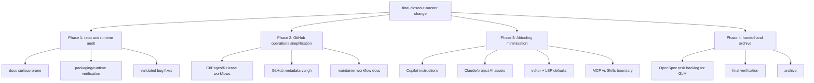

## Context

CleanBook already has a largely usable maintained CLI surface, a normalized OpenSpec baseline, and reduced GitHub automation. The remaining work is not greenfield feature delivery; it is a final closeout pass across repository surface, runtime coherence, GitHub presentation, and AI/developer tooling so the project can reach an archive-ready, low-noise state without destabilizing the bookmark-classification pipeline from archived RFC 0001.

Affected components from RFC 0001 and later closeout work include:

- `main.py`
- `src/bookmark_processor.py`
- `src/ai_classifier.py`
- `src/plugins/`
- `src/services/`
- `src/resource_loader.py`
- `pyproject.toml`
- `README.md`, `README.zh-CN.md`
- `docs/`, `docs/.vitepress/`
- `.github/`
- `.claude/`, `.vscode/`

## Repository Inventory Snapshot

| Surface | Current state | Closeout decision |
| --- | --- | --- |
| Root docs (`README*`, `AGENTS.md`, `CLAUDE.md`, `CONTRIBUTING.md`, `CHANGELOG.md`) | Already relatively small and aligned | Keep, then tighten wording only where workflow/handoff rules still drift |
| `openspec/` | No active change before this work; core capability specs already exist | Keep as sole normative system and hang this final pass off `final-closeout-master` |
| `docs/` source pages | Small but still includes outdated deep technical reports | Keep landing/guide/reference pages, remove stale deep pages, preserve only maintained product docs |
| `docs/node_modules`, `docs/.vitepress/dist` | Present locally, but not tracked as maintained source | Keep ignored/untracked; do not treat as repo source artifacts |
| `.github/workflows/` | Already reduced to CI / Pages / Release | Re-audit for trigger and matrix noise, but prefer incremental simplification over churn |
| `.claude/` and project AI assets | Large asset surface with both project workflow assets and likely generic residue | Keep repository workflow assets, reduce generic local plugin surface, and default against new MCP/Opencode additions |
| `.vscode/` | Minimal Python defaults exist | Keep and tighten toward the maintained Python stack |
| `src/`, `main.py`, packaging files | Maintained CLI works, but version/dependency/runtime drift still needs audit | Preserve CLI contract, fix concrete drift, avoid speculative rewrites |

## Goals / Non-Goals

**Goals:**
- Drive one umbrella closeout change that covers the remaining architecture, docs, GitHub, and tooling drift.
- Reduce the repository to a small, intentional, and verifiable maintained surface for the offline-first CLI.
- Remove generated assets, stale tooling residue, and redundant configuration that do not belong in source control or in the final maintainer workflow.
- Keep packaging, runtime paths, CLI entry points, and verification commands aligned with real supported behavior.
- Produce a structured, execution-ready backlog suitable for GLM handoff without re-discovery.

**Non-Goals:**
- Add new end-user product features.
- Introduce API, database, or cloud-platform scope.
- Preserve historical complexity for completeness when it no longer serves active maintenance.
- Expand AI tooling simply because a platform supports it.

## Decisions

### 1. Use one umbrella change with strict internal phase ordering
The user explicitly wants one master change instead of multiple serial change names. We will preserve that high-level shape, but execution remains strictly ordered by dependency: Phase 1 establishes the repository truth, Phase 2 updates GitHub operations against that truth, Phase 3 minimizes AI/tooling around the stabilized surface, and Phase 4 emits the final backlog and archives the change.

**Alternative considered:** Split into multiple sequential changes. Rejected for this engagement because the user requested one master plan and the affected files overlap heavily.

### 2. Prefer subtraction over redesign
This pass treats every asset as guilty until proven useful. Generated artifacts (`docs/node_modules`, `docs/.vitepress/dist`), stale docs, redundant AI assets, and excess workflow complexity will be removed unless they are required for the maintained product story or the verification baseline.

**Alternative considered:** Keep the broad surface and merely polish it. Rejected because it leaves maintenance burden in place.

### 3. Preserve the maintained CLI contract while auditing internals aggressively
The public contract remains: `cleanbook` is the primary packaged CLI, `python main.py` remains the documented compatibility path, runtime resources resolve predictably, and rules-first / ML-assisted / LLM-optional behavior remains intact. Internal cleanup is allowed only when that contract is preserved or clarified.

**Alternative considered:** Large-scale codebase reshaping first. Rejected because it raises regression risk before the closeout surface is stabilized.

### 4. Treat GitHub metadata as part of the product surface
Repository description, homepage, Pages URL, and topics are not “nice to have”; they are part of the maintained public entry experience and must match README and Pages after the local surface is finalized.

**Alternative considered:** Limit work to repository files only. Rejected because the user explicitly requested deep GitHub integration and final-state polish.

### 5. AI/tooling governance must be project-specific and minimal
`AGENTS.md`, `CLAUDE.md`, `.github/copilot-instructions.md`, `.claude/`, `.vscode/`, and any future Opencode/MCP settings will be judged by one standard: do they directly improve closeout work on this repository? If not, they are removed or reduced. The default answer for new MCPs, plugins, or agent layers is “no” unless they unlock a concrete recurring repository workflow.

**Alternative considered:** Keep all discovered AI assets for optional future use. Rejected because it increases context noise and contradicts the closeout goal.

## Risks / Trade-offs

- **[Risk] Useful historical docs or local AI assets get removed too aggressively** → Mitigation: require each retained asset to map to an active spec capability, maintainer workflow, or user-facing story; preserve short breadcrumbs when removal could confuse future maintainers.
- **[Risk] Runtime or packaging regressions appear while simplifying the surface** → Mitigation: use `tests/test_runtime_paths.py`, maintained CLI smoke paths, and full pytest runs as gates for packaging/runtime changes.
- **[Risk] Remote GitHub metadata changes diverge from local docs again** → Mitigation: perform `gh` updates only after README/Pages content is finalized in this change.
- **[Risk] Phase 3 becomes a tooling rabbit hole** → Mitigation: force every tooling decision to answer “what exact repeated repository task becomes cheaper or safer?”

## Migration Plan

1. Create and complete this umbrella OpenSpec change with proposal, design, specs, and tasks.
2. Inventory the current repository surface and classify each asset as retain, simplify, remove, or externalize.
3. Execute repository-facing cleanup first: docs surface, generated assets, runtime/package drift, dependency normalization, and validated bug fixes.
4. Simplify GitHub workflows and sync remote repository metadata to the stabilized product story.
5. Minimize AI/tooling and editor configuration around the new final surface.
6. Generate the GLM handoff backlog, run final verification, then archive the change.

Rollback is layered: revert the affected file group (docs, workflows, AI configs, runtime fixes) without discarding the OpenSpec artifact history that explains why the change was made.

## Verification Anchors

- `tests/test_runtime_paths.py` is the primary guard for runtime-resource and documented-entry-path changes.
- `pytest -q` is the maintained whole-repository regression baseline.
- Workflow, packaging, and tooling edits must also be checked against the local commands mirrored by the maintained CI configuration.

## Resolved Notes

- Tracked `.claude/skills/` assets remain because they serve the repository's OpenSpec/BMad workflow surface; generic plugin-creation enablement was removed from local settings.
- `release.yml` remains as the minimal tag/manual release path; CI and Pages already form the low-noise workflow minimum for maintained operations.
- The outdated advanced technical report pages were retired, leaving the docs tree focused on landing, guide, and reference content only.

## Correctness Properties to Maintain

1. `cleanbook` MUST remain the canonical packaged CLI entry point.
2. `python main.py` MUST continue to behave as a maintained compatibility entry path if it remains documented.
3. Runtime config and taxonomy resources MUST remain discoverable from supported execution paths.
4. Required verification commands MUST fail loudly on real errors.
5. README, Pages, and GitHub metadata MUST tell one consistent product story.
6. Maintainer instruction files MUST agree on one OpenSpec-first, direct-push workflow.
