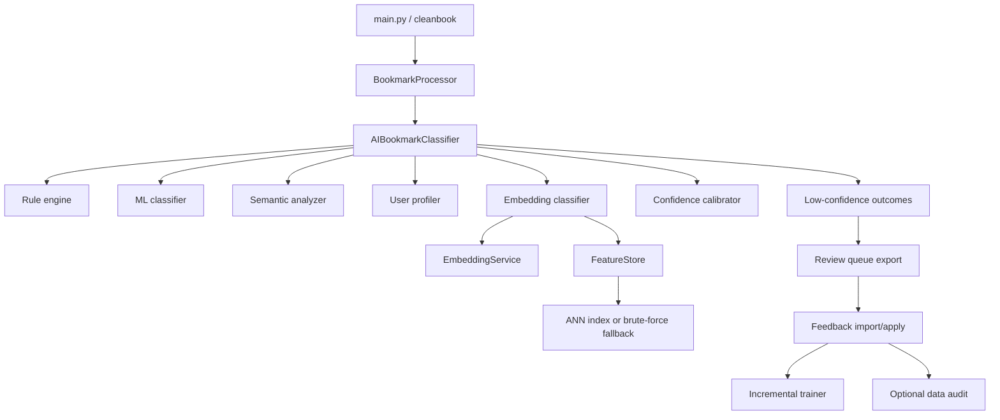

## Context

CleanBook already has a stable maintained runtime path centered on `main.py`, `src/bookmark_processor.py`, and `src/ai_classifier.py`, while several stronger classification services exist only as latent seams. This change intentionally upgrades the existing rules-first CLI path instead of replacing it with the plugin pipeline as the primary runtime.

Affected components from archived RFC 0001 and later closeout work:

- `main.py`
- `src/bookmark_processor.py`
- `src/ai_classifier.py`
- `src/plugins/`
- `src/services/`
- `src/resource_loader.py`
- `pyproject.toml`
- `tests/`

## Goals / Non-Goals

**Goals:**
- Add ANN-assisted similarity infrastructure without making new dependencies mandatory.
- Integrate embedding-based classification into the maintained ensemble path while preserving rules-first behavior.
- Calibrate final confidence before abstention/reporting and route low-confidence outcomes into an offline review loop.
- Add a file-based feedback/import/training/audit flow that remains compatible with the closeout CLI surface.
- Expand verification so ANN fallback, calibration, embedding participation, and feedback-loop behavior are regression-tested.

**Non-Goals:**
- Re-architect the runtime around `src/plugins/pipeline.py`.
- Introduce a database, daemon, REST API, or always-online enrichment workflow.
- Replace the current rules-first product story with a semantic-first or LLM-first product.
- Make optional ANN, embedding, or audit tooling part of the required baseline install.

## Decisions

### 1. Keep the maintained orchestration path and wire services into it directly
`AIBookmarkClassifier` remains the runtime orchestrator. The embedding classifier, calibrated confidence, and review-loop triggers will be attached to that path rather than migrating the whole product to the plugin pipeline first.

**Why:** this minimizes regression risk on the maintained CLI contract.

**Alternative considered:** switching runtime orchestration to `ClassifierPipeline`. Rejected because it is a larger architectural rewrite than the selected Phase 1-2 scope requires.

### 2. Implement ANN as an optional acceleration layer behind `FeatureStore`
`FeatureStore.find_similar()` will prefer an ANN index when available and fall back to the existing brute-force path when optional ANN dependencies are unavailable, uninitialized, or unsuitable for the request.

**Why:** the service already exposes the seam and the product boundary favors graceful degradation over hard dependency growth.

**Alternative considered:** always use brute force. Rejected because it leaves the highest-value Phase 1 performance improvement unrealized.

### 3. Treat embedding classification as a secondary ensemble signal
The embedding classifier will contribute to final scoring only when its backend is available and initialized. Rules remain the strongest signal, and embedding-based similarity improves recall, near-duplicate handling, and low-confidence ranking rather than replacing rule matches.

**Why:** this aligns with the rules-first product story and preserves explainability.

**Alternative considered:** embedding-first routing. Rejected because it changes the product contract and increases sensitivity to optional model/runtime availability.

### 4. Calibrate confidence before abstention and review routing
The final ensemble output will be calibrated before threshold-based abstention, report generation, and review-queue decisions. Calibration artifacts and metrics will be surfaced through targeted verification and exported statistics.

**Why:** the current weighted score is useful but heuristic; calibration makes abstention and feedback collection more trustworthy.

**Alternative considered:** preserve raw weighted confidence. Rejected because it weakens the value of Phase 1 and leaves review prioritization less reliable.

### 5. Keep the feedback loop file-based and offline
Low-confidence classifications will produce review artifacts that can be exported, edited, and re-applied locally. Feedback application feeds the incremental trainer and optional audit tooling without adding any service or database dependency.

**Why:** the repository explicitly optimizes for offline-first CLI workflows and closeout simplicity.

**Alternative considered:** add a local database-backed queue. Rejected because it broadens the runtime surface unnecessarily.

## Risks / Trade-offs

- **[Risk] Optional ANN and audit dependencies complicate packaging** → Mitigation: keep them behind optional extras and test fallback behavior explicitly.
- **[Risk] Embedding-based signals over-influence rules** → Mitigation: preserve rules-first weighting and treat embedding classification as additive, not primary.
- **[Risk] Calibration quality is poor with limited labeled data** → Mitigation: allow no-op fallback and verify calibration behavior with targeted regression fixtures before making it authoritative.
- **[Risk] Review/import/train commands widen the CLI surface too much** → Mitigation: expose only the minimal maintained commands or flags necessary for the file-based loop.
- **[Risk] Phase 2 blurs into broader taxonomy or content-enrichment work** → Mitigation: keep taxonomy discovery, web enrichment, and document extraction outside this change.

## Migration Plan

1. Create the OpenSpec deltas for `bookmark-classifier`, `classification-testing`, and `classification-feedback-loop`.
2. Implement Phase 1 first: ANN path, embedding runtime improvements, calibrated confidence, and verification hooks.
3. Land Phase 2 on top of the stabilized Phase 1 core: embedding ensemble contribution, review export/import, incremental training, and audit wiring.
4. Run the maintained baseline plus targeted new tests for fallback, calibration, embedding participation, and feedback-loop behavior.
5. Archive the change only after the maintained CLI path remains coherent with optional dependencies absent.

Rollback strategy: revert the affected Phase 1 or Phase 2 file groups independently while preserving the OpenSpec artifact trail for the adopted behavior.

## Open Questions

- No blocking design questions remain. Command names and exact file formats can be finalized during implementation as long as they preserve the offline-first CLI boundary and satisfy the spec scenarios.

## Correctness Properties to Maintain

- The maintained CLI path continues to work without optional ANN, embedding, or audit dependencies.
- Rules-first classification remains the dominant decision strategy.
- Calibrated confidence stays within `[0.0, 1.0]` and is used consistently for abstention and review routing.
- Review/export/import artifacts are deterministic and can be applied without external services.
- Incremental training preserves version history and rollback safety.
