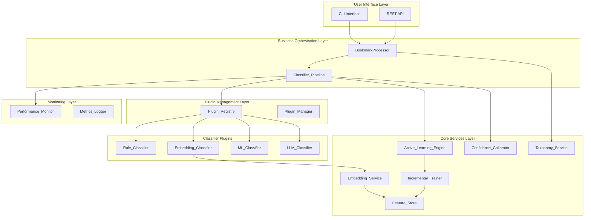
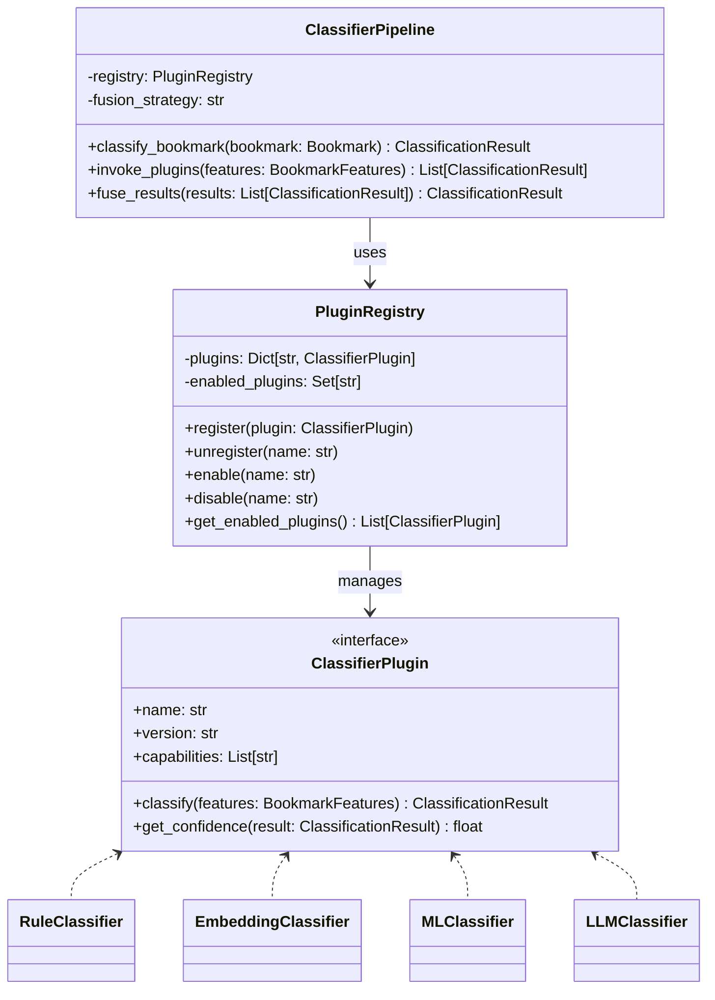

# RFC 0001: Architecture Algorithm Upgrade

## Status
**Status:** Partially Implemented  
**Created:** 2025  
**Last Updated:** 2026-04-17

## Overview

This RFC describes the architecture upgrade plan for the CleanBook intelligent bookmark classification system, evolving from a monolithic architecture to a modular, extensible plugin-based architecture, while introducing advanced classification algorithms (Transformer embeddings, active learning, incremental learning) to improve classification accuracy and system performance.

## Design Goals

1. **Extensibility**: Support hot-pluggable classifiers, exporters, and feature extractors through plugin architecture
2. **Accuracy**: Introduce Transformer embeddings and multi-method fusion optimization to improve classification precision
3. **Adaptability**: Implement active learning and incremental learning for continuous model improvement
4. **Performance**: Optimize processing speed through feature caching and intelligent scheduling
5. **Observability**: Comprehensive monitoring metrics and performance tracking

## Current Architecture Analysis

The existing system uses a layered architecture:
- `EnhancedClassifier`: Main classifier integrating rule engine, ML classifier, LLM classifier
- `RuleEngine`: Rule-based fast classification
- `MLBookmarkClassifier`: Machine learning classification based on sklearn
- `TaxonomyStandardizer`: Classification system standardization

**Key Limitations:**
- Hard-coded classifiers, difficult to extend
- No unified plugin management mechanism
- Feature extraction and classification are coupled
- Lacks active learning and incremental update capabilities

## Proposed Architecture

### Overall Architecture Diagram



### Plugin Architecture Design

The system implements a plugin-based architecture where classifiers, exporters, and feature extractors can be dynamically registered and managed:



## Core Components

### 1. Plugin Registry (`src/plugins/registry.py`)

Manages registration, discovery, and lifecycle of classifier plugins.

**Key Features:**
- Registration interface with name, version, and capability metadata
- Plugin validation against required interfaces
- Runtime enable/disable without system restart
- Configuration-based plugin loading at startup

### 2. Embedding Service (`src/services/embedding_service.py`)

Provides text vectorization capabilities using pre-trained multilingual Transformer models.

**Key Features:**
- Support for sentence-transformers models
- Dense vector embeddings for bookmark titles and URLs
- Caching computed embeddings in Feature_Store
- Graceful degradation to TF-IDF vectorization when Transformer model unavailable
- Cosine similarity-based classification

### 3. Active Learning Engine (`src/services/active_learning.py`)

Identifies low-confidence samples and requests user labeling to improve model accuracy.

**Key Features:**
- Configurable confidence threshold for low-confidence detection
- Queue management for user review
- Uncertainty sampling (entropy-based prioritization)
- Session request limiting to avoid user fatigue
- Labeled sample storage for model retraining

### 4. Incremental Trainer (`src/services/incremental_trainer.py`)

Supports online learning and model hot updates without full retraining.

**Key Features:**
- partial_fit for online learning on new labeled samples
- Configurable batch size trigger for incremental updates
- Model version history for rollback capability
- Automatic rollback when performance degrades below threshold
- Scheduled full retraining with accumulated samples
- Atomic model serialization to prevent corruption

### 5. Feature Store (`src/services/feature_store.py`)

Caches and manages extracted bookmark feature vectors.

**Key Features:**
- Persistent feature vectors with configurable TTL
- Cache lookup to avoid recomputation
- Approximate nearest neighbor search for similar bookmarks
- LRU eviction policy when cache size exceeds limit
- Cache hit rate monitoring and warnings
- Cache warming from historical classification data

### 6. Confidence Calibrator (`src/services/confidence_calibrator.py`)

Applies Platt scaling or isotonic regression to calibrate confidence scores.

**Key Features:**
- Confidence score calibration for multi-method fusion
- Support for different calibration methods
- Integration with classifier pipeline

### 7. Taxonomy Service (`src/services/taxonomy_service.py`)

Manages controlled vocabularies and faceted classification mappings.

**Key Features:**
- Load category hierarchy from YAML configuration files
- Runtime category addition without restart
- Category name validation against naming conventions
- Category renaming with historical classification updates
- Category merging with automatic bookmark reassignment
- Export taxonomy changes as migration scripts

### 8. Performance Monitor (`src/services/performance_monitor.py`)

Tracks comprehensive performance metrics for system health monitoring.

**Key Features:**
- Classification latency percentiles (p50, p95, p99)
- Per-method accuracy and confidence distribution
- Latency threshold warning alerts
- Prometheus-compatible metric format export
- Daily classification quality reports
- Cache hit rate and memory usage tracking

## Data Models

### Bookmark Features

```python
@dataclass
class BookmarkFeatures:
    url: str
    title: str
    description: Optional[str] = None
    tags: List[str] = field(default_factory=list)
    embedding: Optional[np.ndarray] = None
    extracted_features: Dict[str, Any] = field(default_factory=dict)
```

### Classification Result

```python
@dataclass
class ClassificationResult:
    category: str
    confidence: float
    method: str
    alternatives: List[Tuple[str, float]] = field(default_factory=list)
    metadata: Dict[str, Any] = field(default_factory=dict)
```

## Correctness Properties

The system must maintain the following correctness properties:

1. **Plugin Registration Consistency**: A registered plugin must be immediately available for classification
2. **Plugin Invocation Order**: Plugins must be invoked in configured priority order
3. **Plugin Failure Isolation**: A plugin failure must not affect other plugins in the pipeline
4. **Cache TTL Expiration**: Cached features must expire after configured TTL
5. **LRU Eviction Policy**: Least recently used entries must be evicted first
6. **Embedding Dimensionality Consistency**: All embeddings for the same model must have identical dimensions
7. **Cache Round-Trip**: Cached embeddings must be identical to freshly computed embeddings
8. **Cosine Similarity Classification**: Classification confidence must be proportional to cosine similarity
9. **Low-Confidence Detection**: Bookmarks with confidence below threshold must be queued for review
10. **Uncertainty Sampling Priority**: Lower confidence samples must be prioritized for user review
11. **Session Request Limit**: Feedback requests per session must not exceed configured limit
12. **Feedback Persistence**: User feedback must be stored for model retraining
13. **Incremental Update Trigger**: Model updates must trigger when new samples exceed batch size
14. **Model Version History**: All model versions must be maintained for rollback
15. **Atomic Model Serialization**: Model updates must not corrupt model files
16. **Fusion Strategy Application**: Fusion strategy must be applied to all classifier results
17. **Dynamic Weight Adjustment**: Method weights must be adjusted based on historical accuracy
18. **Taxonomy YAML Round-Trip**: Taxonomy loaded and saved must be identical
19. **Category Name Validation**: Invalid category names must be rejected
20. **Category Rename Propagation**: All historical classifications must be updated on rename
21. **Category Merge Completeness**: Merged categories must include all bookmarks from source categories
22. **Latency Percentile Accuracy**: Latency percentiles must be accurately calculated
23. **Latency Alert Emission**: Alerts must be emitted when latency exceeds threshold
24. **Prometheus Format Validity**: Exported metrics must be valid Prometheus format
25. **Daily Report Completeness**: Daily reports must include all tracked metrics

## Error Handling Taxonomy

| Error Type | Severity | Recovery Action |
|------------|----------|-----------------|
| PluginLoadFailure | High | Log error, skip plugin, continue |
| EmbeddingComputationFailure | Medium | Fallback to TF-IDF |
| CacheCorruption | Critical | Rebuild cache from scratch |
| ModelUpdateFailure | High | Rollback to previous version |
| TaxonomyLoadFailure | Critical | Use default taxonomy, alert user |
| PerformanceDegradation | Medium | Trigger model rollback or retraining |

## Testing Strategy

1. **Property-Based Testing**: Each component has property tests verifying universal correctness properties
2. **Unit Testing**: Specific example and boundary condition tests for each component
3. **Integration Testing**: End-to-end tests for complete classification pipeline
4. **Performance Testing**: Benchmark tests for processing speed and memory usage
5. **A/B Testing**: Support for comparing different fusion strategies

## Implementation Progress

See `specs/product/bookmark-classifier-system.md` for implementation task tracking.

**Current Status:**
- ✅ Plugin architecture infrastructure (Tasks 1-2)
- ✅ Feature store and caching system (Task 3)
- ✅ Embedding service (Task 4)
- ✅ Multi-method fusion optimization (Task 6, partial)
- ✅ Active learning engine (Tasks 7-8)
- ✅ Incremental trainer (Task 9)
- ✅ Taxonomy service (Tasks 10-11)
- ✅ Performance monitor (Task 12)
- ✅ Legacy classifier migration (Task 13)
- ⏳ Integration and E2E testing (Task 14)
- ⏳ A/B testing support (Task 6.6)

**Test Summary:** 58 passed, 23 skipped (optional dependencies: joblib, sentence_transformers, sklearn)

## Migration Path

The upgrade will be implemented gradually:
1. Build plugin infrastructure alongside existing system
2. Migrate existing classifiers to plugins
3. Introduce new services incrementally
4. Update EnhancedClassifier to use new architecture
5. Deprecate old monolithic components

## References

- Original requirements: `specs/product/bookmark-classifier-system.md`
- Implementation tasks: Tracked in project task management
- Current architecture: `docs/architecture/`
